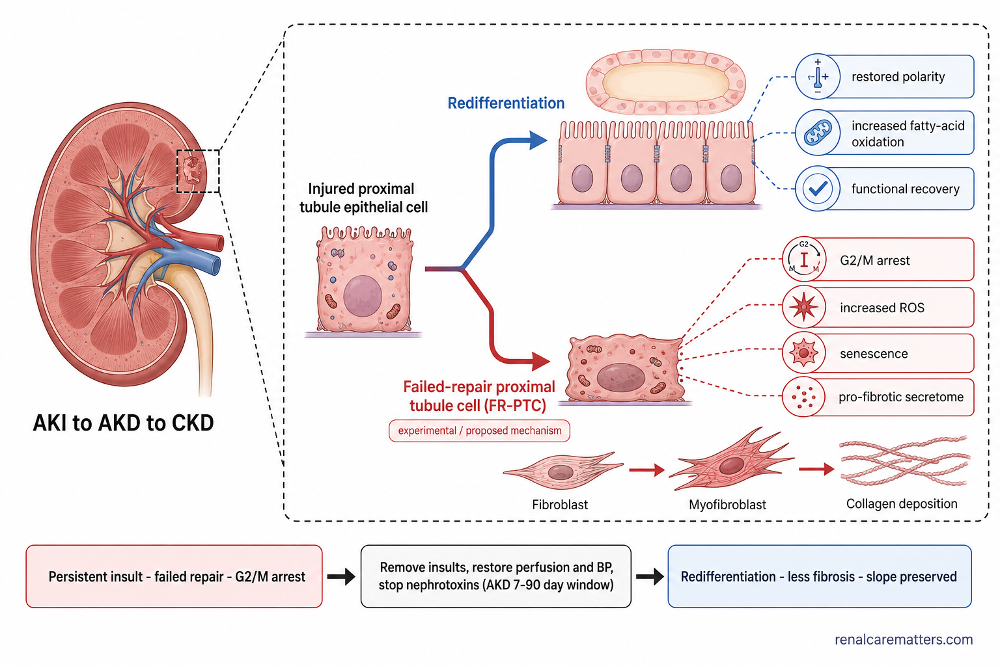

# Silent Kidney / Renal Plasticity — Image Production Plan

**Guides:** `why-kidney-disease-is-silent.html` (patient) · `renal-plasticity-clinician.html` (clinician)
**Compiled:** 2026-08-05 · **For production in:** ChatGPT Image Generator GPT — https://chatgpt.com/g/g-pmuQfob8d-image-generator
**Authoring skills used:** `williamriveromd-hero-vignette` (heroes) · `williamriveromd-infographic-skill` (OG cards) · `williamriveromd-simple-figure` (in-body figures) · `williamriveromd-biomedical-mechanism-figure` (tubular-repair mechanism) · Constitution v1.0 anatomical rules for any kidney rendering.

---

## How to use this file

1. Open the Image Generator GPT (link above).
2. For each image below, paste **only the `PROMPT:` block** (through the negative line). One image per generation.
3. Save the output as the exact **FILE NAME** into the repo `images/` folder, then make a WebP twin (`cwebp -q 82 name.png -o name.webp`) — the guides load `<source ... .webp>` with the `.png` as fallback.
4. Copy the **ALT TEXT** into the guide's `` if it differs from the placeholder already in the HTML (the placeholders are finding-based and can stay).
5. OG cards (`*-og.png`) are already wired in each guide's `<head>` — just drop the file in.

### Global house rules baked into every prompt
- **Light background only** — white / off-white / soft gray / faint teal tint. Never navy, charcoal, or black.
- **Fonts:** on-image text uses **Inter / Manrope / Nunito Sans / IBM Plex Sans** only — never a serif or decorative face.
- **Attribution:** small semi-transparent navy `renalcarematters.com`, bottom-right (bottom-center on portrait). Never omitted.
- **No journal / guideline / brand names on the image** (no "KDIGO", "NEJM", "AJKD", "Jardiance") — use plain-language labels; end every figure prompt with the no-brand disclaimer.
- **Only verified numbers** appear on-image (drawn from the guide's confirmed evidence set). No fabricated axis values or thresholds.
- **Mobile-readable at 375 px**, generous whitespace, palette: navy `#0f1e2e` · teal `#1a6b72` · renal green `#1f7a4d` · amber `#b8860b` · clinical red `#b91c1c` · soft purple `#6c3d8e`.

---

## PART 1 — Image plan blueprint (architecture)

### Patient mode — `why-kidney-disease-is-silent.html`

| # | File name | Placement (anchor) | Skill / archetype | Dimensions | Purpose |
|---|---|---|---|---|---|
| P-01 | `why-kidney-disease-is-silent-hero.png` | Hero vignette | hero-vignette · Scaffold A (people) | 2048×2048 | The visual thesis: a normal number over abnormal effort |
| P-02 | `why-kidney-disease-is-silent-og.png` | Social share card | infographic · OG card | 1200×630 | Link-preview card, "87% don't know" hook |
| P-03 | `why-kidney-disease-is-silent-01-four-layers.png` | `#how-it-hides` | simple-figure · one-panel diagram | 1792×1024 | The four layers of concealment (signature Act I graphic) |
| P-04 | `why-kidney-disease-is-silent-03-flat-curve.png` | `#creatinine-lies` | simple-figure · mechanism/chart | 1792×1024 | Flattened creatinine curve + tubular hypersecretion inset |
| P-05 | `why-kidney-disease-is-silent-04-tradeoff.png` | `#the-price` | simple-figure · mechanism/chart | 1792×1024 | Phosphate flat while FGF23 rises — the trade-off |
| P-06 | `why-kidney-disease-is-silent-05-four-windows.png` | `#four-windows` | simple-figure · horizontal timeline | 1792×1024 | The four healing windows, reversibility gradient |
| P-07 | `why-kidney-disease-is-silent-06-dip-diverge.png` | `#the-dip` | simple-figure · comparison/chart | 1792×1024 | Dip-then-diverge — the anti-discontinuation asset |
| P-08 | `why-kidney-disease-is-silent-08-akd-timeline.png` | `#after-aki` | simple-figure · sequence | 1792×1024 | AKI → AKD → CKD timeline, 7–90 d window highlighted |

### Clinician mode — `renal-plasticity-clinician.html`

| # | File name | Placement (anchor) | Skill / archetype | Dimensions | Purpose |
|---|---|---|---|---|---|
| C-01 | `renal-plasticity-clinician-hero.png` | Hero vignette | hero-vignette · Scaffold C (anatomy) | 2048×2048 | Concept hero: nephron behind concealment veils |
| C-02 | `renal-plasticity-clinician-og.png` | Social share card | infographic · OG card | 1200×630 | Specialist link-preview card |
| C-03 | `renal-plasticity-clinician-01-four-layers.png` | `#thesis` | simple-figure · one-panel diagram | 1792×1024 | Four-layer concealment model (clinician labels) |
| C-04 | `renal-plasticity-clinician-07-detection-gap.png` | `#detection` | simple-figure · comparison | 1792×1024 | uACR ordering + undetected:detected ratios |

### Optional enhancements (recommended — require adding a `<figure>` to the guide)

| # | File name | Suggested placement | Skill | Dimensions | Purpose |
|---|---|---|---|---|---|
| C-05 | `renal-plasticity-clinician-09-tubular-repair.png` | `#axes` (axis 2/3) | biomedical-mechanism-figure | 1792×1024 | Adaptive vs maladaptive proximal-tubule repair fork |
| X-10 | `silent-kidney-10-therapy-stack.png` | both, `#five-levers` / `#pharmacology` | infographic · layered stack | 1792×1024 | RASi + SGLT2i foundation → nsMRA/GLP-1 → lifestyle base |

> **Note on the shared four-layers figure.** P-03 and C-03 are the same composition with different label registers (plain-language vs clinical). Generate both, or render P-03 once and reuse it for C-03 by re-pointing the clinician `` — your call. The prompts below give each its own labels.

---

## PART 2 — PATIENT MODE PROMPTS

### P-01 — Patient hero (circular vignette)

```
FILE NAME: why-kidney-disease-is-silent-hero.png
IMAGE TYPE: Circular vignette hero v3 — Scaffold A (clinical people)
ASPECT RATIO: 1:1 (displayed inside an 85–90% inscribed circle with a white margin)
PIXEL DIMENSIONS: 2048 × 2048
COMPOSITION ARCHETYPE: A — Editorial Portrait
CAMERA: environmental portrait, slight over-the-shoulder
AUDIENCE: patients / families
VISUAL GOAL: a calm person reading a normal-looking lab report while a soft cutaway kidney behind them strains — a normal number over abnormal effort.

PROMPT:
Square 1:1 photorealistic editorial photograph on a 2048×2048 canvas, composed to be displayed inside a CIRCULAR vignette occupying 85–90% of the canvas diameter with a visible WHITE BORDER around the full circle (the circle must never touch the canvas edges). Composition archetype: Editorial Portrait. Camera: environmental portrait, gentle over-the-shoulder framing.

Subject: a Filipino patient in their late 30s to 40s — androgynous-to-feminine presentation, oval face, warm mid-brown skin, shoulder-length dark hair loosely tied, wearing a soft rust-terracotta blouse — seated by a bright window in a clean modern Philippine home, calmly looking at a printed laboratory report held in both hands. The report looks reassuringly normal. Softly integrated into the blurred background over the person's shoulder, a semi-photorealistic cutaway of a single kidney glows faintly, its internal filtering units subtly enlarged and working hard (gentle warm-red highlight) — present as mood, not a diagram, no leader lines. Soft natural daylight, shallow depth of field.

Visual hierarchy: the person occupies 60–70% of the circle; the faint kidney motif and window light are 20–30% supporting context; reserve a 20–25% TITLE SAFE ZONE of soft out-of-focus wall / window light on the upper-left (no faces, anatomy, or objects there) so the page title can sit beside the disc.

Calm, reassuring, documentary-realistic colour grade harmonizing with clinical teal #1a6b72 and navy #0f1e2e on a light, airy background. Soft edge falloff toward a slightly deeper neutral at the rim. Full-bleed within the inscribed circle, no rectangular borders or banners.

Absolutely NO text of any kind: no title, subtitle, caption, label, logo, or watermark.

NEGATIVE INSTRUCTIONS: Avoid busy layouts, collage, floating panels, more than the one supporting motif, icons, tiny labels, duplicated people, cropped circle, objects touching the border, content in the title-safe zone, baked-in text/titles/logos/watermarks, rectangular frames, dark/charcoal/black backgrounds, cartoon/neon/HDR/over-saturation, distorted hands or faces.
```

**ALT TEXT:** A Filipino patient looking calmly at a normal-looking lab report while, behind them, a cutaway kidney shows enlarged, straining filters — a normal number over abnormal effort.

---

### P-02 — Patient OG / social share card

```
FILE NAME: why-kidney-disease-is-silent-og.png
IMAGE TYPE: OG / social share card
ASPECT RATIO: 1.91:1
PIXEL DIMENSIONS: 1200 × 630
OG WIDTH: 1200
OG HEIGHT: 630
AUDIENCE: patients / mixed
VISUAL GOAL: a scroll-stopping link card built on the "87% don't know" hook.

PROMPT:
Open Graph social share card, exactly 1200×630, clean modern nephrology-education aesthetic on a white (#ffffff) background with a faint teal-tint (#eef6f7) panel. Left two-thirds: bold headline in navy (#0f1e2e), set in Inter — "Why Kidney Disease Is Silent" — with a teal (#1a6b72) sub-line beneath in Manrope — "and where the hope is". Below the headline, one calm stat chip on a soft gray card: large navy numerals "87%" with a small caption "don't know they have it". Right third: a simple semi-photorealistic 3D pair of human kidneys in restrained renal-red, anatomically correct (convex border lateral, hilum medial, not mirrored), one kidney faintly glowing to suggest quiet overwork, floating on the light background with a soft shadow. Generous negative space, strong hierarchy, mobile-legible. Small semi-transparent navy "renalcarematters.com" in the bottom-right corner.

No journal names, guideline acronyms, brand names, or extra watermarks.

NEGATIVE INSTRUCTIONS: Avoid cartoon style, clutter, tiny unreadable labels, AI gibberish text, unrealistic anatomy, overprocessed HDR, excessive saturation, stock-photo blandness. NEVER use dark, navy, charcoal, or black backgrounds — light only. Use ONLY Inter / Manrope / Nunito Sans / IBM Plex Sans. Never omit the renalcarematters.com attribution.
```

**ALT TEXT:** Share card: "Why Kidney Disease Is Silent — and where the hope is," with the statistic that about 87% of people with kidney disease don't know they have it, beside a pair of kidneys.

---

### P-03 — The four layers of concealment

```
FILE NAME: why-kidney-disease-is-silent-01-four-layers.png
IMAGE TYPE: Single one-panel concept diagram (simple-figure Scaffold D)
ASPECT RATIO: 16:9
PIXEL DIMENSIONS: 1792 × 1024
AUDIENCE: patients
VISUAL GOAL: four translucent "veils" stacking over a kidney, each making it harder to see the disease.

PROMPT:
Clean patient-education concept diagram, medical graphical-abstract style, on a white (#ffffff) background. Title at top-centre in bold navy (#0f1e2e), set in Inter: "Four ways your kidneys hide the problem." Centre-left: a single semi-photorealistic 3D kidney in restrained renal-red, anatomically correct (convex border lateral, hilum medial, upper pole more medial, not mirrored), its internal filtering units faintly glowing to suggest overwork. Over the kidney, four progressively stacked translucent "veils" or soft frosted panels, each a different tint of the palette, drift from the kidney toward the right — each veil labelled in a small rounded card in Manrope with a plain-language line and a simple icon:
1. teal veil — "Spends its reserve first" (piggy-bank / savings icon)
2. amber veil — "Survivors work overtime" (up-arrow / gauge icon)
3. purple veil — "Fools the blood test" (magnifier over a lab tube)
4. gray veil — "Cannot signal pain" (muted bell / no-pain icon)
Each veil sits slightly more opaque than the last so the kidney becomes progressively harder to see left-to-right. Bottom strip on soft gray: "Feeling fine is the compensation working — not the absence of disease." in navy. Generous whitespace, mobile-readable, colour used with pattern+label (never colour alone). Small semi-transparent navy "renalcarematters.com" bottom-right.

No journal names, guideline acronyms, brand names, or extra watermarks.

NEGATIVE INSTRUCTIONS: Avoid cartoon style, clutter, tiny labels, AI gibberish text, mirrored or implausible kidney anatomy, calyces draining outward, dark backgrounds. Use ONLY Inter / Manrope / Nunito Sans / IBM Plex Sans. Never omit the renalcarematters.com attribution.
```

**ALT TEXT:** The four layers of concealment stack like veils over a kidney: the reserve is spent first, surviving filters magnify their output, the blood test is distorted, and there is no pain nerve to raise the alarm.

---

### P-04 — The flattened creatinine curve

```
FILE NAME: why-kidney-disease-is-silent-03-flat-curve.png
IMAGE TYPE: Single mechanism/chart figure (simple-figure Scaffold D)
ASPECT RATIO: 16:9
PIXEL DIMENSIONS: 1792 × 1024
AUDIENCE: patients
VISUAL GOAL: creatinine barely moves while true filtering falls, then rises steeply — with a tubular-hypersecretion inset flattening it further.

PROMPT:
Clean patient-education line-diagram, medical graphical-abstract style, white (#ffffff) background. Title top-centre in bold navy (#0f1e2e), Inter: "Why a normal creatinine can mislead." A single large stylised curve on labelled axes (Manrope labels): x-axis "True kidney filtering rate" (arrow pointing left = worse), y-axis "Blood creatinine." The curve stays almost FLAT across the early/high-filtering zone (this zone softly shaded teal and labelled "most early disease lives here — the number barely moves"), then rises STEEPLY at the low-filtering end (labelled "late — small losses move it a lot"). A small dashed inset box (lower-right) shows a simple tubule actively pushing extra creatinine into the urine, with a short caption "the kidney secretes extra creatinine — the blood level looks ~64% better than the true rate," and a small arrow showing the flat part being pushed even lower. Stylised curve — no numeric tick values on the axes except the single verified "~64%" callout. Generous whitespace, mobile-readable. Small semi-transparent navy "renalcarematters.com" bottom-right.

No journal names, guideline acronyms, brand names, or extra watermarks.

NEGATIVE INSTRUCTIONS: Avoid cartoon style, clutter, tiny labels, AI gibberish numbers, fabricated axis values, dense grids, dark backgrounds. Use ONLY Inter / Manrope / Nunito Sans / IBM Plex Sans. Never omit the renalcarematters.com attribution.
```

**ALT TEXT:** Creatinine barely moves while true kidney function falls through its early range, then climbs steeply late; an inset shows tubules secreting extra creatinine, flattening the early signal by roughly 64%.

---

### P-05 — The trade-off (phosphate flat, FGF23 rising)

```
FILE NAME: why-kidney-disease-is-silent-04-tradeoff.png
IMAGE TYPE: Single mechanism/chart figure (simple-figure Scaffold D)
ASPECT RATIO: 16:9
PIXEL DIMENSIONS: 1792 × 1024
AUDIENCE: patients
VISUAL GOAL: the blood phosphate line stays flat and normal while a hidden hormone rises steeply beneath it to hold it there.

PROMPT:
Clean patient-education line-diagram, medical graphical-abstract style, white (#ffffff) background. Title top-centre bold navy (#0f1e2e), Inter: "A normal number, held up by hidden effort." Three stylised lines share one panel, x-axis labelled "Kidney function declining →" (Manrope): (1) a FLAT green line sitting inside a soft green "normal range" band, labelled "Blood phosphate — looks normal"; (2) a STEEPLY RISING red line beneath it, labelled "FGF23 hormone — climbs early and hard"; (3) a gently rising amber line between them, labelled "Parathyroid hormone — rises later." A short leader connects the flat phosphate line to a callout: "The normal phosphate is being held up by the rising hormones — that effort is the disease." Relationship shown by line shape and label only — NO numeric axis values (the exact crossover points are deliberately not shown). Generous whitespace, mobile-readable, colour paired with label. Small semi-transparent navy "renalcarematters.com" bottom-right.

No journal names, guideline acronyms, brand names, or extra watermarks.

NEGATIVE INSTRUCTIONS: Avoid cartoon style, clutter, tiny labels, AI gibberish numbers, fabricated thresholds or eGFR values, dark backgrounds. Use ONLY Inter / Manrope / Nunito Sans / IBM Plex Sans. Never omit the renalcarematters.com attribution.
```

**ALT TEXT:** As kidney function declines, the blood phosphate line stays flat inside the normal range while the FGF23 line rises steeply beneath it and parathyroid hormone rises later — the normal phosphate held up by rising hormones.

---

### P-06 — The four healing windows

```
FILE NAME: why-kidney-disease-is-silent-05-four-windows.png
IMAGE TYPE: Horizontal timeline (simple-figure Scaffold C)
ASPECT RATIO: 16:9
PIXEL DIMENSIONS: 1792 × 1024
AUDIENCE: patients
VISUAL GOAL: four healing windows on a minutes-to-years timeline, shading from fully reversible to barely reversible, with a fixed-at-birth footer.

PROMPT:
Clean patient-education horizontal timeline infographic, white (#ffffff) background. Title top-centre bold navy (#0f1e2e), Inter: "The four healing windows." A left-to-right time axis in Manrope: "minutes → weeks → months → years." Four rounded band-cards along the axis, each with a small icon, a plain title, and a one-line reversibility tag; fill shades from solid to hatched/dashed to encode reversibility (never colour alone):
1. solid green — "Pressure & flow — fully reversible" (valve icon)
2. lighter green — "Cell repair — mostly reversible" (regrowing-cell icon)
3. hatched amber — "Early scarring — partly reversible" (mesh icon)
4. dashed gray — "Established scar — only if the cause is fully removed" (brick icon)
A full-width footer strip in soft gray beneath the timeline reads, in navy: "Nephron number is fixed at birth (about 34–36 weeks of pregnancy) — only per-nephron health recovers." Generous whitespace, mobile-readable. Small semi-transparent navy "renalcarematters.com" bottom-right.

No journal names, guideline acronyms, brand names, or extra watermarks.

NEGATIVE INSTRUCTIONS: Avoid cartoon style, clutter, tiny labels, AI gibberish text, dark backgrounds, colour as the only cue. Use ONLY Inter / Manrope / Nunito Sans / IBM Plex Sans. Never omit the renalcarematters.com attribution.
```

**ALT TEXT:** A timeline from minutes to years with four healing windows shading from solid (fully reversible pressure and flow) to dashed (established scar, reversible only if the cause is fully removed); a footer notes nephron number is fixed at birth.

---

### P-07 — Dip-then-diverge

```
FILE NAME: why-kidney-disease-is-silent-06-dip-diverge.png
IMAGE TYPE: Two-line comparison chart (simple-figure Scaffold D)
ASPECT RATIO: 16:9
PIXEL DIMENSIONS: 1792 × 1024
AUDIENCE: patients
VISUAL GOAL: the treated eGFR dips slightly then declines slowly and ends ahead of the untreated line.

PROMPT:
Clean patient-education two-line comparison chart, medical graphical-abstract style, white (#ffffff) background. Title top-centre bold navy (#0f1e2e), Inter: "Why your eGFR dipped when you started a new medicine." x-axis "Time (years)", y-axis "Kidney filtering (eGFR)" in Manrope. Two stylised lines: a gray "Not treated" line that starts higher and declines steeply; a teal "On kidney-protective medicine" line that steps DOWN slightly at the start (small labelled notch: "small dip ≈ 2 points — the pressure switched off on purpose") then declines much more gently and CROSSES ABOVE the gray line, ending higher (labelled "≈ half the yearly decline"). A crossover point marked with a soft dot. Bottom strip in soft gray, navy text: "The dip is the price of the benefit — do not stop; call your doctor." Only the two verified callouts ("≈ 2 points", "≈ half"); no other numeric ticks. Generous whitespace, mobile-readable. Small semi-transparent navy "renalcarematters.com" bottom-right.

No journal names, guideline acronyms, brand names, or extra watermarks.

NEGATIVE INSTRUCTIONS: Avoid cartoon style, clutter, tiny labels, AI gibberish numbers, fabricated axis values, dark backgrounds. Use ONLY Inter / Manrope / Nunito Sans / IBM Plex Sans. Never omit the renalcarematters.com attribution.
```

**ALT TEXT:** Two eGFR lines over years: the treated line dips slightly at the start then declines about half as fast and crosses above the untreated line, ending higher — the early dip is the cost of the later gain.

---

### P-08 — AKI → AKD → CKD timeline

```
FILE NAME: why-kidney-disease-is-silent-08-akd-timeline.png
IMAGE TYPE: Three-band sequence (simple-figure Scaffold C)
ASPECT RATIO: 16:9
PIXEL DIMENSIONS: 1792 × 1024
AUDIENCE: patients
VISUAL GOAL: the 7–90 day window after a sudden injury is where the trajectory is set.

PROMPT:
Clean patient-education horizontal timeline, white (#ffffff) background. Title top-centre bold navy (#0f1e2e), Inter: "After a sudden kidney injury: the 90-day window." Three connected band-cards left to right along a day axis (Manrope):
1. "Days 0–7 — the injury" (soft red band, small lightning/impact icon)
2. "Days 7–90 — the window where the trajectory is set" (bright teal band, ENLARGED and visually emphasised, a small toolbox/repair icon, one line: "remove insults, restore BP & fluid, stop kidney-toxic drugs")
3. "Day 90 onward — becomes chronic kidney disease" (soft gray band, small clock icon)
The middle band is clearly the hero — larger, brighter, with a subtle glow. Bottom strip soft gray, navy: "A normal creatinine here does not prove full recovery — repeat the urine test too." Generous whitespace, mobile-readable. Small semi-transparent navy "renalcarematters.com" bottom-right.

No journal names, guideline acronyms, brand names, or extra watermarks.

NEGATIVE INSTRUCTIONS: Avoid cartoon style, clutter, tiny labels, AI gibberish text, dark backgrounds. Use ONLY Inter / Manrope / Nunito Sans / IBM Plex Sans. Never omit the renalcarematters.com attribution.
```

**ALT TEXT:** A timeline in three bands — days 0–7 the injury, days 7–90 (highlighted) the window where follow-up changes the trajectory, and day 90 onward chronic kidney disease.

---

## PART 3 — CLINICIAN MODE PROMPTS

### C-01 — Clinician hero (circular vignette, anatomy)

```
FILE NAME: renal-plasticity-clinician-hero.png
IMAGE TYPE: Circular vignette hero v3 — Scaffold C (calm 3D anatomy)
ASPECT RATIO: 1:1 (displayed inside an 85–90% inscribed circle with a white margin)
PIXEL DIMENSIONS: 2048 × 2048
COMPOSITION ARCHETYPE: F — Anatomy
CAMERA: three-quarter, soft studio
AUDIENCE: clinicians
VISUAL GOAL: a single nephron rendered cleanly, half-obscured by soft concealment veils, half showing plasticity recovery — wordless.

PROMPT:
Square 1:1 semi-photorealistic 3D medical illustration on a 2048×2048 canvas, composed to be displayed inside a CIRCULAR vignette occupying 85–90% of the canvas diameter with a visible WHITE BORDER around the full circle (never touching the edges). Composition archetype: Anatomy. Camera: three-quarter view, soft studio lighting.

Subject: a single anatomically accurate nephron (glomerulus with afferent/efferent arterioles, proximal and distal tubules, loop, collecting duct) rendered in restrained clinical colour (renal reds, teal accents) floating on a soft off-white to faint-teal background. Across the left half of the nephron drift a few soft translucent frosted "veils," partially obscuring it (the concealment motif); the right half is clean and luminous, one tubular segment softly re-greening to suggest repair (the plasticity motif). Present purely as mood — NO leader lines, NO labels, NO callouts.

Visual hierarchy: the nephron occupies 60–70% of the circle; the veils and the faint repair glow are 20–30%; reserve a 20–25% TITLE SAFE ZONE of empty soft background on the upper-left (no anatomy, veils, or marks there). Soft falloff at the rim.

Absolutely NO text, labels, leader lines, callouts, titles, logos, or watermark — clean render only. Full-bleed within the inscribed circle, no rectangular borders.

NEGATIVE INSTRUCTIONS: Avoid busy layouts, multiple structures competing, icons, tiny labels, cropped circle, anatomy touching the border, content in the title-safe zone, baked-in text/labels/logos/watermarks, rectangular frames, dark/charcoal/black backgrounds, cartoon/neon/HDR, implausible nephron anatomy.
```

**ALT TEXT:** A single nephron rendered cleanly, half-obscured by soft concealment veils and half showing a tubular segment recovering — the guide's concealment-and-plasticity thesis as one wordless image.

---

### C-02 — Clinician OG / social share card

```
FILE NAME: renal-plasticity-clinician-og.png
IMAGE TYPE: OG / social share card
ASPECT RATIO: 1.91:1
PIXEL DIMENSIONS: 1200 × 630
OG WIDTH: 1200
OG HEIGHT: 630
AUDIENCE: clinicians
VISUAL GOAL: a specialist-register link card.

PROMPT:
Open Graph social share card, exactly 1200×630, restrained clinical aesthetic on a white (#ffffff) background with a faint teal-tint (#eef6f7) panel. Left two-thirds: bold navy (#0f1e2e) headline in Inter — "The Silent Kidney" — with a teal (#1a6b72) sub-line in Manrope — "Compensation, concealment & renal plasticity." A single quiet line of three small monochrome chips beneath (Manrope, navy on soft gray): "reserve · magnification · hypersecretion." Right third: a clean semi-photorealistic 3D single nephron in restrained renal-red/teal, anatomically correct, floating with a soft shadow, a faint frosted veil across part of it. Generous negative space, strong hierarchy, mobile-legible. Small semi-transparent navy "renalcarematters.com" bottom-right.

No journal names, guideline acronyms, brand names, or extra watermarks.

NEGATIVE INSTRUCTIONS: Avoid cartoon style, clutter, tiny unreadable labels, AI gibberish text, unrealistic anatomy, HDR, excessive saturation. NEVER use dark, navy, charcoal, or black backgrounds — light only. Use ONLY Inter / Manrope / Nunito Sans / IBM Plex Sans. Never omit the renalcarematters.com attribution.
```

**ALT TEXT:** Share card: "The Silent Kidney — compensation, concealment and renal plasticity," with the tags reserve, magnification and hypersecretion beside a single nephron.

---

### C-03 — Four-layer concealment model (clinician labels)

```
FILE NAME: renal-plasticity-clinician-01-four-layers.png
IMAGE TYPE: Single one-panel diagram (simple-figure Scaffold D)
ASPECT RATIO: 16:9
PIXEL DIMENSIONS: 1792 × 1024
AUDIENCE: clinicians
VISUAL GOAL: the four-layer concealment model in clinical register.

PROMPT:
Clean clinician concept diagram, medical graphical-abstract style, white (#ffffff) background. Title top-centre bold navy (#0f1e2e), Inter: "Four layers of concealment." Centre-left: a semi-photorealistic 3D nephron in restrained renal-red (glomerulus, tubules, correct segments). Four stacked translucent veils drift rightward off the nephron, each a labelled rounded card in Manrope:
1. teal — "Reserve depletion" · "recruitable GFR spent before resting GFR moves"
2. amber — "Nephron magnification" · "↑ single-nephron GFR; plasma normal because per-nephron work is abnormal"
3. purple — "Tubular creatinine hypersecretion" · "fractional clearance rises as GFR falls"
4. gray — "No medullary nociceptive route" · "atrophy, not distension → no symptom"
Each veil more opaque than the last so the nephron is progressively obscured. Bottom strip soft gray, navy: "Asymptomatic by mechanism, not by chance." Generous whitespace, mobile-readable, colour paired with label. Small semi-transparent navy "renalcarematters.com" bottom-right.

No journal names, guideline acronyms, brand names, or extra watermarks.

NEGATIVE INSTRUCTIONS: Avoid cartoon style, clutter, tiny labels, AI gibberish text, implausible nephron anatomy, dark backgrounds. Use ONLY Inter / Manrope / Nunito Sans / IBM Plex Sans. Never omit the renalcarematters.com attribution.
```

**ALT TEXT:** The four-layer concealment model over a nephron: reserve depletion, nephron magnification, tubular creatinine hypersecretion, and the absent medullary nociceptive route — CKD asymptomatic by mechanism.

---

### C-04 — The detection gap

```
FILE NAME: renal-plasticity-clinician-07-detection-gap.png
IMAGE TYPE: Side-by-side comparison (simple-figure Scaffold B)
ASPECT RATIO: 16:9
PIXEL DIMENSIONS: 1792 × 1024
AUDIENCE: clinicians
VISUAL GOAL: uACR ordered far less in hypertension than diabetes, and albuminuria far more often undetected.

PROMPT:
Clean clinician comparison infographic, medical graphical-abstract style, white (#ffffff) background. Title top-centre bold navy (#0f1e2e), Inter: "The detection gap." A soft dashed vertical divider splits the canvas into two labelled panels (Manrope). LEFT panel header teal (#1a6b72): "Diabetes" — a simple bar showing "urine albumin test ordered ≈ 52%" and a small ratio badge "undetected : detected ≈ 1.8 : 1". RIGHT panel header amber (#b8860b): "Hypertension, no diabetes" — a much shorter bar "urine albumin test ordered ≈ 5%" and a bold red ratio badge "undetected : detected ≈ 19.5 : 1". A slim centre caption in navy: "The test that sees through the silence is rarely ordered in the population that most needs it." Only these verified figures on-image; simple bars, not dense charts. Generous whitespace, mobile-readable. Small semi-transparent navy "renalcarematters.com" bottom-right.

No journal names, guideline acronyms, brand names, or extra watermarks.

NEGATIVE INSTRUCTIONS: Avoid cartoon style, clutter, tiny labels, AI gibberish numbers, fabricated values beyond those given, dark backgrounds. Use ONLY Inter / Manrope / Nunito Sans / IBM Plex Sans. Never omit the renalcarematters.com attribution.
```

**ALT TEXT:** A two-panel comparison: the urine albumin test is ordered in about 52% of at-risk patients with diabetes but only about 5% of those with hypertension alone, and undetected-to-detected albuminuria runs 1.8:1 versus 19.5:1.

---

## PART 4 — OPTIONAL ENHANCEMENTS (recommended)

> These two are in the blueprint's figure set but are **not yet referenced** in the guide HTML. To use them, add a `<figure>` block at the suggested anchor (I can wire these in on request). Prompts are production-ready.

### C-05 — Adaptive vs maladaptive tubular repair (mechanism figure)

```
FILE NAME: renal-plasticity-clinician-09-tubular-repair.png
IMAGE TYPE: Biomedical mechanism schematic (biomedical-mechanism-figure skill)
ASPECT RATIO: 16:9
PIXEL DIMENSIONS: 1792 × 1024
AUDIENCE: clinicians
VISUAL GOAL: the injured proximal tubule cell at a fork — redifferentiation vs failed-repair driving fibrosis.

PROMPT:
Publication-grade biomedical mechanism schematic, scientific review-article style, flat vector illustration with soft semi-3D shading on a white background, muted clinical palette, clean sans-serif labels in Inter.

Organ-level panel (left): a simplified kidney cross-section labelled "AKI → AKD → CKD," a small dashed connector box pointing to the magnified panel.

Magnified functional-unit panel (centre, dashed border): an injured proximal tubule epithelial cell at a FORK with two paths:
- upper path (blue, protective) → "Redifferentiation" → healthy re-epithelialised tubule; callouts: "restored polarity", "↑ FAO / PGC-1α", "functional recovery"
- lower path (red, injury) → "Failed-repair proximal tubule cell (FR-PTC)"; callouts: "G2/M arrest", "↑ ROS", "senescence", "pro-fibrotic secretome" → a small fibroblast becoming a myofibroblast depositing collagen.

Bottom summary flow (left → right): pale-pink pathology box "Persistent insult · failed repair · G2/M arrest" → centre box "Remove insults, restore perfusion/BP, stop nephrotoxins (AKD 7–90 d window)" → pale-blue benefit box "Redifferentiation · less fibrosis · slope preserved." Use ↓/↑ arrows for pathway directionality. Flag FR-PTC targeting as an experimental/proposed mechanism where shown. White background, thin dashed connectors, generous whitespace, no photorealism, no dark background. Small semi-transparent navy "© renalcarematters.com" bottom-right.

No journal names, guideline acronyms, brand names, or extra watermarks.

NEGATIVE INSTRUCTIONS: Avoid photorealism, dark backgrounds, decorative effects, overcrowding, invented numeric thresholds, cartoon styling. Use ONLY Inter / Manrope / Nunito Sans / IBM Plex Sans. Never omit the renalcarematters.com attribution.
```

**ALT TEXT:** An injured proximal tubule cell at a fork — one path redifferentiates to a healthy tubule, the other becomes a failed-repair cell in G2/M arrest that drives a fibroblast to lay down scar — with the 7–90-day window as the intervention point.

**To place (clinician guide, inside `#axes`):**
```html
<figure class="guide-fig">
<picture>
<source srcset="../images/renal-plasticity-clinician-09-tubular-repair.webp" type="image/webp">

</picture>
<figcaption><p class="fig-desc">[ALT TEXT above]</p>
<dl class="fig-abbrevs"><dt>FR-PTC</dt><dd>Failed-repair proximal tubule cell.</dd><dt>AKD</dt><dd>Acute kidney disease (7–90 days).</dd><dt>FAO</dt><dd>Fatty-acid oxidation.</dd></dl></figcaption>
</figure>
```

### X-10 — The layered therapy stack (both modes)

```
FILE NAME: silent-kidney-10-therapy-stack.png
IMAGE TYPE: Layered stack infographic (infographic-skill)
ASPECT RATIO: 16:9
PIXEL DIMENSIONS: 1792 × 1024
AUDIENCE: mixed
VISUAL GOAL: lifestyle base → RAS-blockade + SGLT2i foundation → nsMRA / GLP-1 layered above.

PROMPT:
Clean layered-stack education infographic, medical graphical-abstract style, white (#ffffff) background. Title top-centre bold navy (#0f1e2e), Inter: "How treatment redirects the same machinery." A horizontal stacked stack of rounded bands, bottom to top (Manrope labels):
- base band, renal green — "Lifestyle: cut ultra-processed food, move, don't smoke, avoid new hits"
- foundation band, teal — "Foundation: RAS blockade + SGLT2 inhibitor"
- upper band, amber — "Add if protein leak persists: non-steroidal MRA and/or GLP-1-based therapy"
Each band labelled with a short plain line and a small icon; a slim right-side arrow labelled "each layer takes pressure off the surviving filters." A soft footer note in navy: "Layers, not a hierarchy — build up from the base." Avoid implying an official 'pillars' framework. Generous whitespace, mobile-readable. Small semi-transparent navy "renalcarematters.com" bottom-right.

No journal names, guideline acronyms, brand names, or extra watermarks.

NEGATIVE INSTRUCTIONS: Avoid cartoon style, clutter, tiny labels, AI gibberish text, dark backgrounds, drug brand names. Use ONLY Inter / Manrope / Nunito Sans / IBM Plex Sans. Never omit the renalcarematters.com attribution.
```

**ALT TEXT:** A layered stack — lifestyle at the base, RAS blockade plus an SGLT2 inhibitor as the foundation, and a non-steroidal MRA or GLP-1-based therapy layered on top when protein leak persists — each layer taking pressure off the surviving filters.

---

## PART 5 — Production checklist

- [ ] Generate P-01…P-08 and C-01…C-04 (12 required images); optionally C-05 and X-10.
- [ ] Save each as its exact `FILE NAME` in `images/`, then create the `.webp` twin (both are referenced by the guides' `<picture>` blocks).
- [ ] OG cards: `*-og.png` — already wired in each guide's `<head>`; just drop the file in. (Both guides' `og:image` already points to the `.png`; swap to `.webp` if you prefer — update `og:image` + add `og:image:type`.)
- [ ] Heroes render inside the CSS circular vignette — the 2048² square with its own white margin is intentional (a framed-portrait look inside the CSS circle).
- [ ] Keep the `` in sync with the delivered pixel size if you change aspect (current figure placeholders are 1400×… hints; 1792×1024 renders fine but update the attrs to avoid layout shift if you want pixel-perfect reserved space).
- [ ] Re-run `python3 patch_hero_fetchpriority.py --guide <file>` and `patch_hero_maxwidth.py --guide <file>` after the hero lands (idempotent).
- [ ] Every image carries `renalcarematters.com` bottom-right and uses an approved sans-serif — reject and regenerate any output with a serif face, a dark background, gibberish text, or a mirrored/implausible kidney.
- [ ] Alt text: the guide `<figcaption class="fig-desc">` placeholders are already finding-based; keep or replace with the ALT TEXT above.

**Evidence guardrail:** every on-image number here is from the guide's confirmed evidence set (≈64% creatinine overestimate; 52% vs 5% uACR ordering; 1.8:1 vs 19.5:1; ≈2-point dip and ≈half the decline; nephron number fixed at ~34–36 weeks). Do **not** let the generator invent axis values, eGFR thresholds, or the FGF23/PTH crossover points — those are deliberately shown as shapes, not numbers.
