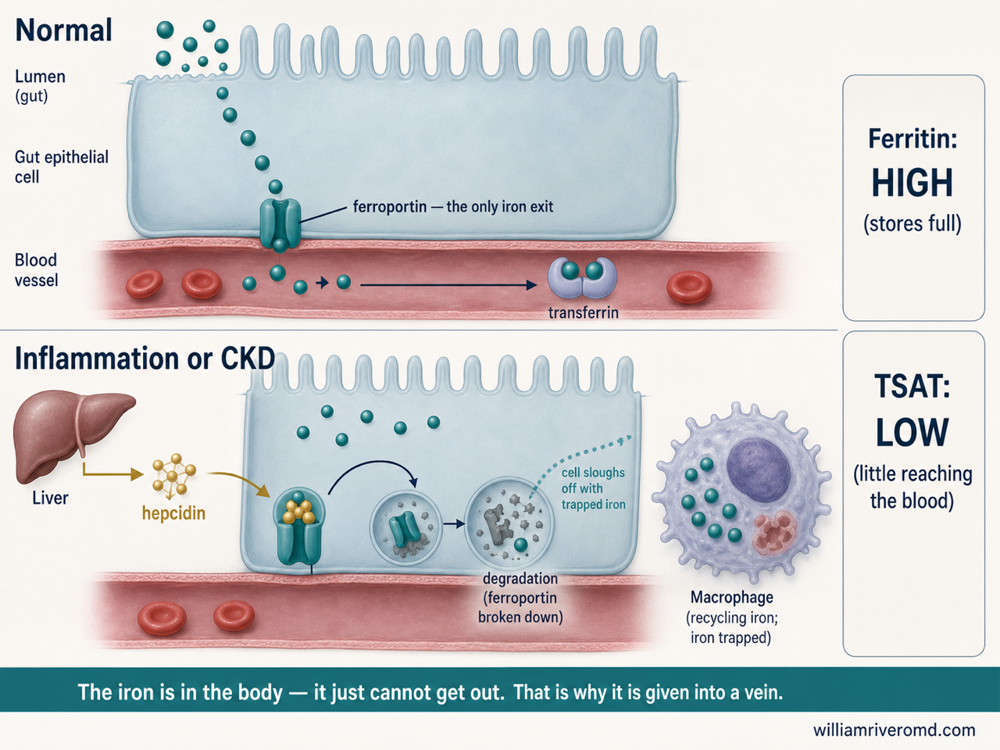
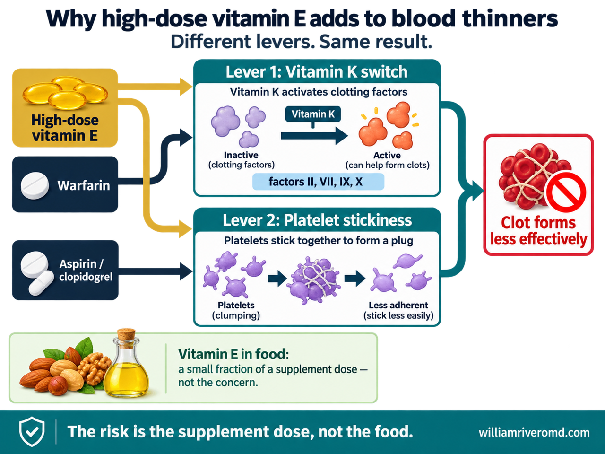
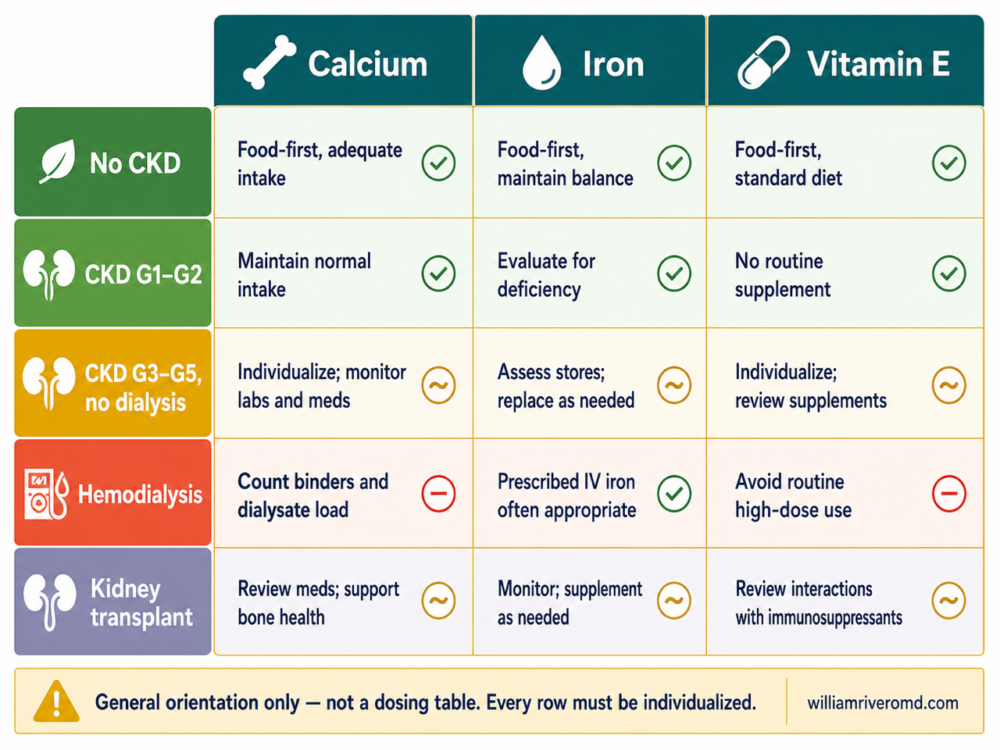
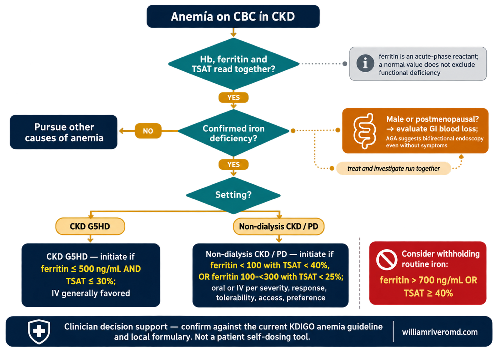

# IMAGE PLAN — Calcium, Iron & Vitamin E: When Supplements Help and When They Can Harm

**Guide:** `guides/calcium-iron-vitamin-e-safety.html`
**Live URL:** https://renalcarematters.com/guides/calcium-iron-vitamin-e-safety.html
**Slug prefix:** `calcium-iron-vitamin-e-safety`
**Total assets:** 8 (1 hero · 5 in-body · 1 clinician flowchart · 1 OG card)
**Visual anchor:** `ckd-understanding-overview.webp`
**Guide shape:** dual-mode, 17 sections (12 patient + 5 clinician)
**Generated:** 2026-08-17

---

## Architecture rationale

The planner rubric puts an 11+ section guide at 4–6 images, then adds one
`ALGORITHM_FLOWCHART` per clinician management pathway. This guide is dual-mode with
17 sections, so the set lands at **6 in-guide images + 1 clinician flowchart + 1 OG card**.

Images are assigned to *thematic clusters*, not to sections. The three clusters that carry
the guide's actual teaching load each get one figure:

| Cluster | Sections covered | Teaching job the image must do |
|---|---|---|
| **Age is not the variable** | `#start`, `#age65`, `#six-checks` | Move the reader off "dangerous at 65" onto the six real determinants |
| **The three supplements** | `#calcium`, `#iron`, `#vitamin-e` | One mechanism figure each — the physiology that earns the recommendation |
| **CKD changes the equation** | `#kidney`, `#interactions`, `#labels` | Show that the same supplement has different answers by stage |

`#warning`, `#action`, `#qa` are deliberately **unillustrated** — they are already
high-contrast triage cards, a numbered algorithm card, and an accordion. Adding raster
images there would duplicate live HTML that already reads better and prints better.

### Deliberate spec override — the hero

The planner's default hero is a 1536×1024 `COMPREHENSIVE_INFOGRAPHIC`. **That is wrong for
this guide.** The HTML hero is a circular vignette (`figure.hero-figure > .hero-vignette`),
so the hero follows the **hero-vignette v3 spec instead**: square 2048×2048, an inscribed
circle at 85–90% with a white margin, a reserved title-safe zone, and **zero baked-in text**
(the `<h1>` already sits beside the disc in HTML). A landscape infographic hero would be
mask-cropped into a circle and its title would collide with the live heading.

---

## Asset register

| # | Filename (no extension) | Placement | Style | Dimensions | Status |
|---|---|---|---|---|---|
| 1 | `-vignette-hero` | Hero disc | Vignette v3 — clinical people | 2048 × 2048 | slot wired |
| 2 | `-01-six-risk-factors` | `#age65` | CLINICAL_FLAT_VECTOR | 1200 × 800 | slot wired |
| 3 | `-02-elemental-calcium` | `#calcium` | CLINICAL_FLAT_VECTOR | 1200 × 800 | slot wired |
| 4 | `-03-hepcidin-gate` | `#iron` | MINIMAL_MEDICAL_3D | 1280 × 960 | **needs HTML slot** |
| 5 | `-04-vitamin-e-bleeding` | `#vitamin-e` | CLINICAL_FLAT_VECTOR | 1280 × 960 | **needs HTML slot** |
| 6 | `-05-ckd-stage-matrix` | `#kidney` | CLINICAL_FLAT_VECTOR (ref card) | 1280 × 960 | **needs HTML slot** |
| 7 | `-md-01-iron-threshold-algorithm` | `#md-iron` | ALGORITHM_FLOWCHART | 1400 × 1000 | **needs HTML slot** |
| 8 | `-og` | `<meta og:image>` | Share card | 1200 × 630 | slot wired |

Save every asset as **both** `images/<name>.png` and `images/<name>.webp`.

---

## IMAGE 1 — HERO (circular vignette)

**Placement:** hero disc, beside the `<h1>`
**Style:** Vignette v3, Scaffold A (clinical people) — a real medication-review moment; the
guide opens on a bag of bottles emptied onto a table, so the hero should be that table.
**Filename:** `calcium-iron-vitamin-e-safety-vignette-hero.png`
**Variation vs. previous guide** (`plant-forward-renal-diet` used a top-down food still-life,
no people): this switches to people, hands-only framing, indoor clinic — differing in presence
of people, body part shown, age, sex, skin texture, accessories, clothing, clothing colour,
posture, hand position, camera angle, environment, activity, framing distance.

```
Square 1:1 photorealistic editorial photograph on a 2048×2048 canvas, composed to be displayed
inside a CIRCULAR vignette occupying 85–90% of the canvas diameter with a visible WHITE BORDER
around the full circle (the circle must never touch the canvas edges). Composition archetype:
H — Clinical. Camera: hands-only composition, high three-quarter angle looking down across a
consultation table.

Subject: only the HANDS of two people over a pale wooden consultation table in a bright modern
Philippine clinic. The elderly Filipina patient's hands — warm brown skin with visible age spots
and prominent veins, short unpolished nails, a thin gold wedding band and a woven abaca bracelet,
one cuff of a soft coral blouse visible — are pushing a small cluster of supplement bottles
forward. The clinician's hands — younger, unadorned, pale-blue rolled shirt cuff — are gently
sorting the bottles into two loose groups. Between them sit six to eight ordinary white and amber
supplement bottles and a blister strip, plus a folded paper lab slip. Soft natural daylight from
a window at the left, gentle shallow depth of field, background clinic softly blurred.

Visual hierarchy: hands and bottles occupy 60–70% of the circle in the lower and left portion;
2–4 supporting context elements (lab slip, blurred clinic chair, water glass) 20–30%; reserve the
UPPER-RIGHT 20–25% of the circle as a TITLE SAFE ZONE of soft out-of-focus warm wall and window
light — no hands, no bottles, no labels, no objects inside that zone.

Calm, reassuring, documentary-realistic colour grade harmonizing with clinical teal #1a6b72 and
navy #0f1e2e on a light, airy background. Edge falloff toward a slightly deeper neutral at the rim.
Full-bleed within the inscribed circle, no rectangular borders, frames, or banners.

Absolutely NO text of any kind: bottle labels must be blank or illegibly soft — no readable
packaging copy, no brand names, no title, subtitle, caption, logo, or watermark.

NEGATIVE: busy layouts; collage overload; dozens of icons; infographic clutter; duplicated people;
cropped circle; edge clipping; objects touching the circular border; content inside the title-safe
zone; baked-in text, titles, captions, logos, watermarks; rectangular borders or banners; dark,
charcoal or black backgrounds; cartoon, neon, HDR, over-saturation; distorted hands or faces.
Hands must be anatomically correct with exactly five fingers each — no extra or fused fingers.
```

---

## IMAGE 2 — The six checks (`#age65`)

**Placement:** after the "65 is not an on–off switch" copy — slot already in the HTML.
**Style:** CLINICAL_FLAT_VECTOR — six parallel determinants, ideal for a radial panel layout.
**Filename:** `calcium-iron-vitamin-e-safety-01-six-risk-factors.png`

```
1. IMAGE TYPE: Inline educational diagram
2. PRIMARY VISUAL STYLE: CLINICAL_FLAT_VECTOR
3. SUBJECT: The six factors that actually determine whether a supplement is safe — with age
   pointedly absent from the list
4. COMPOSITION: Radial. One neutral, blank-labelled supplement bottle dead centre as a simple
   semi-realistic vector object in soft grey and white. Six evenly spaced circular icon nodes
   ring it, each joined to the centre by a thin teal connector line:
   (1) a pair of kidneys — "Kidney function"
   (2) a tablet split in half beside a small measuring scale — "Dose"
   (3) a plate with fish, milk and greens — "What food already gives"
   (4) a laboratory tube and result slip — "Lab results"
   (5) three assorted blister strips — "Other medicines"
   (6) a clipboard with a checkmark — "A real diagnosis"
   One centred caption line beneath, in smaller type, reading exactly:
   "Age is not on this list — it only makes each of these six more likely to matter."
5. BACKGROUND: Clean white
6. LIGHTING: Flat, no directional light
7. COLOR PALETTE: Navy #0f1e2e labels, teal #1a6b72 connectors and icon strokes, soft teal tint
   fills, white ground, gold #d4af4f only as a subtle accent ring on the central bottle. No red.
8. MEDICAL DETAILS: Anatomically correct kidney silhouettes; realistic tablet and blister
   geometry. Avoid any milligram value, dosing number, or drug brand name anywhere in the frame.
9. MOOD: Calm, clarifying, quietly corrective
10. DIMENSIONS: 1200 × 800
11. NEGATIVE PROMPTS: cartoon appearance, anime style, distorted anatomy, smiling organs, extra
    fingers, plastic skin, visual clutter, tiny unreadable text, chaotic infographic density,
    rainbow gradients, neon colors, fear-inducing imagery, stock-photo corporate aesthetic,
    dosing numbers, brand names, uneven grid, floating elements without containers.
    Include a small "williamriveromd.com" attribution bottom-right in light grey.
```

---

## IMAGE 3 — Tablet weight vs. elemental calcium (`#calcium`)

**Placement:** after the calcium algorithm card — slot already in the HTML.
**Style:** CLINICAL_FLAT_VECTOR — a two-state comparison plus a small absorption inset.
**Filename:** `calcium-iron-vitamin-e-safety-02-elemental-calcium.png`

```
1. IMAGE TYPE: Inline comparison diagram
2. PRIMARY VISUAL STYLE: CLINICAL_FLAT_VECTOR
3. SUBJECT: The number on the front of the bottle is not the calcium you actually absorb
4. COMPOSITION: Split into two clearly separated halves by a thin vertical rule.
   LEFT, headed "What the front of the bottle says": a simple semi-realistic white supplement
   bottle, front-facing, large bold label number reading "500 mg" with smaller "CALCIUM
   CARBONATE" beneath. A soft amber caution ring surrounds this half.
   RIGHT, headed "What you actually absorb": the same bottle turned to a clean simplified
   "Supplement Facts" panel with one row highlighted in a teal box reading "Elemental calcium
   200 mg". A short arrow runs from that row to a small intestinal-wall inset showing two entry
   routes — a larger one labelled "active door — limited, needs vitamin D" and a smaller one
   labelled "passive gap — slow" — with a green check on the active door.
   Full-width caption strip along the bottom reading exactly:
   "Only the elemental figure counts toward your daily total — and toward the 500 mg per-dose limit."
5. BACKGROUND: Clean white
6. LIGHTING: Flat, no directional light
7. COLOR PALETTE: Navy #0f1e2e headings, teal #1a6b72 highlight and active route, amber #c47f17
   for the left caution ring only, renal green #1f7a4d for the check, white ground
8. MEDICAL DETAILS: Intestinal wall cross-section must be anatomically plausible — villi visible,
   correct orientation, lumen on the correct side. The Supplement Facts panel should read as a
   genuine US/PH-style panel but contain only the lines specified. No real brand names.
9. MOOD: Practical, undeceiving, shopper-facing
10. DIMENSIONS: 1200 × 800
11. NEGATIVE PROMPTS: cartoon appearance, anime style, distorted anatomy, smiling organs, real
    brand names, tiny unreadable text, visual clutter, additional dosing advice text, rainbow
    gradients, neon colors, stock-photo aesthetic, uneven panels.
    Include a small "williamriveromd.com" attribution bottom-right in light grey.
```

---

## IMAGE 4 — The hepcidin gate (`#iron`) · NEW

**Placement:** in `#iron`, immediately after the "Why the iron tablet sometimes stops working —
the gate" explainer paragraph.
**Style:** MINIMAL_MEDICAL_3D — this is the guide's single best physiology moment and it is
cellular. Restrained 3D carries a gate/transporter far better than flat vector.
**Filename:** `calcium-iron-vitamin-e-safety-03-hepcidin-gate.png`
**Why it matters:** it is the mechanism that explains the whole CKD iron section — why oral iron
fails, why ferritin misleads, and why IV iron is chosen. Currently taught in text alone.

```
1. IMAGE TYPE: Inline mechanism diagram
2. PRIMARY VISUAL STYLE: MINIMAL_MEDICAL_3D
3. SUBJECT: Hepcidin closing the ferroportin gate — why swallowed iron cannot reach the blood in
   inflammation and CKD, producing high ferritin with low TSAT
4. COMPOSITION: Two stacked horizontal bands sharing one continuous cell membrane motif.
   TOP BAND, labelled "Normal": a simplified 3D gut-lining cell with a clearly rendered channel
   protein in its basal membrane, labelled "ferroportin — the only iron exit". Small teal iron
   spheres pass from the gut lumen, through the cell, out through the open channel into a blood
   vessel below, where they attach to a simplified transferrin carrier. Route drawn as a clean
   continuous arrow.
   BOTTOM BAND, labelled "Inflammation or CKD": the same cell, but a labelled "hepcidin" molecule
   from a small liver icon at the left binds the channel, which is shown internalised and
   degrading. The iron spheres are visibly stuck inside the cell, with a small greyed arrow
   showing them shed away as the cell sloughs. A parallel macrophage at the right is likewise
   full of trapped iron spheres.
   RIGHT MARGIN, a small two-row result panel: "Ferritin: HIGH (stores full)" over
   "TSAT: LOW (little reaching the blood)".
   Bottom teal footer banner, single line: "The iron is in the body — it just cannot get out.
   That is why it is given into a vein."
5. BACKGROUND: Soft off-white with a very subtle navy vignette; no scene, no environment
6. LIGHTING: Ambient soft 3D studio light, restrained shadows
7. COLOR PALETTE: Teal #1a6b72 iron spheres and channel, navy #0f1e2e labels, muted blue-teal
   cell bodies, gold #d4af4f only on the hepcidin molecule, grey for the degraded channel,
   white ground, teal footer with white text
8. MEDICAL DETAILS: Ferroportin sits on the BASOLATERAL membrane (blood side), not the luminal
   brush border — the exit must face the vessel. Hepcidin is made by the liver, so the liver icon
   must be the source. Show internalisation and degradation, not a simple mechanical "door shut".
   Macrophage iron is recycled from senescent red cells — include one faint red-cell cue.
   Do NOT depict hepcidin blocking absorption at the luminal surface; that is the common error.
9. MOOD: Explanatory, unhurried, quietly revelatory
10. DIMENSIONS: 1280 × 960
11. NEGATIVE PROMPTS: hyperrealism, photorealistic tissue, cartoon appearance, anime style,
    smiling cells, sci-fi interfaces, fake holograms, neon colors, rainbow gradients, glowing
    energy effects, tiny unreadable text, chaotic density, fantasy anatomy, molecular structures
    drawn as literal keys and padlocks, chemical formulas, fear-inducing imagery.
    Include a small "williamriveromd.com" attribution bottom-right in light grey.
```

**HTML block to paste when the asset exists** — insert directly after the closing `</p>` of the
"the gate" explainer paragraph in `#iron`:

```html
<figure>
  <picture>
    <source srcset="../images/calcium-iron-vitamin-e-safety-03-hepcidin-gate.webp" type="image/webp">
    
  </picture>
  <figcaption>
    <p class="fig-desc">Iron leaves a gut lining cell through a single kind of exit called ferroportin. In inflammation or kidney disease the liver releases more hepcidin, which latches onto that exit and destroys it. The iron you swallowed still enters the cell but can no longer reach the blood, so it is lost when the lining is shed a few days later — and the iron already in storage stays locked away too. That is why ferritin can read high while TSAT reads low, and why iron is often given into a vein instead.</p>
    <dl class="fig-abbrevs">
      <dt>TSAT</dt><dd>Transferrin saturation — the share of iron-carrying protein actually loaded with iron.</dd>
      <dt>CKD</dt><dd>Chronic kidney disease.</dd>
      <dt>Ferroportin</dt><dd>The only known protein that exports iron out of a cell.</dd>
      <dt>Hepcidin</dt><dd>A liver hormone that shuts down ferroportin and so blocks iron release.</dd>
    </dl>
  </figcaption>
</figure>
```

---

## IMAGE 5 — Vitamin E and the clotting levers (`#vitamin-e`) · NEW

**Placement:** in `#vitamin-e`, after the plain-language bleeding-mechanism paragraph and before
the red bleeding-risk alert.
**Style:** CLINICAL_FLAT_VECTOR — the teaching point is convergence of three agents on two
shared pathways, which reads best as a clean converging schematic.
**Filename:** `calcium-iron-vitamin-e-safety-04-vitamin-e-bleeding.png`

```
1. IMAGE TYPE: Inline mechanism diagram
2. PRIMARY VISUAL STYLE: CLINICAL_FLAT_VECTOR
3. SUBJECT: Why high-dose vitamin E adds to blood thinners — it pushes the same two levers they
   already push
4. COMPOSITION: Converging schematic, left to right. THREE labelled source chips on the left,
   stacked: "High-dose vitamin E" (gold), "Warfarin" (navy), "Aspirin / clopidogrel" (navy).
   They feed into TWO large labelled lever panels in the centre:
   LEVER 1 — "Vitamin K switch": a simplified clotting-factor icon shown being switched from an
   inactive to an active state, labelled "factors II, VII, IX, X". Arrows into it come from both
   vitamin E and warfarin.
   LEVER 2 — "Platelet stickiness": simplified platelets shown clumping, becoming less adherent.
   Arrows into it come from both vitamin E and aspirin/clopidogrel.
   Both levers converge right into one outcome box: "Clot forms less effectively".
   Small separate footnote panel, visually set apart at bottom-left, showing a handful of nuts
   and a bottle of cooking oil with the line "Vitamin E in food: a small fraction of a supplement
   dose — not the concern."
   Bottom teal footer banner: "The risk is the supplement dose, not the food."
5. BACKGROUND: Clean white, panel-grid
6. LIGHTING: Flat, no directional light
7. COLOR PALETTE: Navy #0f1e2e for drug chips and body text, gold #d4af4f for the vitamin E chip
   and its arrows so its contribution is traceable, teal #1a6b72 panel headers, restrained
   clinical red only inside the final outcome box, soft green on the food footnote panel
8. MEDICAL DETAILS: Vitamin K activates clotting factors by γ-carboxylation — depict as an
   activation switch, never as vitamin K "thinning" blood. Warfarin and vitamin E must both point
   at the vitamin K lever; aspirin and clopidogrel must point only at the platelet lever, with
   vitamin E pointing at both. Do not imply DOACs act on the vitamin K pathway — omit DOACs from
   this figure entirely rather than misplacing them.
9. MOOD: Clarifying, non-alarming, precise
10. DIMENSIONS: 1280 × 960
11. NEGATIVE PROMPTS: cartoon appearance, anime style, blood splatter, gore, fear-inducing
    imagery, dramatic red washes, sci-fi interfaces, neon colors, rainbow gradients, tiny
    unreadable text, chaotic density, chemical structural formulas, real drug brand names,
    smiling cells, distorted anatomy.
    Include a small "williamriveromd.com" attribution bottom-right in light grey.
```

**HTML block to paste when the asset exists** — insert after the bleeding-mechanism `</p>` in
`#vitamin-e`:

```html
<figure>
  <picture>
    <source srcset="../images/calcium-iron-vitamin-e-safety-04-vitamin-e-bleeding.webp" type="image/webp">
    
  </picture>
  <figcaption>
    <p class="fig-desc">High-dose vitamin E is not doing anything exotic. It presses on the same two levers your blood-thinning medicines already press: the vitamin K step that switches clotting factors on, and the stickiness of platelets. Warfarin pushes the first lever, aspirin and clopidogrel push the second, and vitamin E pushes both — so the effects add up. Vitamin E from nuts and cooking oil is a small fraction of a supplement dose and is not the concern.</p>
    <dl class="fig-abbrevs">
      <dt>Vitamin K</dt><dd>The vitamin the liver needs to switch clotting factors into their working form.</dd>
      <dt>Platelet</dt><dd>The small blood cell that clumps to plug a bleeding point.</dd>
    </dl>
  </figcaption>
</figure>
```

---

## IMAGE 6 — Same supplement, different answer by stage (`#kidney`) · NEW

**Placement:** in `#kidney`, after the stage-sensitive table and its "general orientation only"
caveat line, before the calculator link cards.
**Style:** CLINICAL_FLAT_VECTOR reference card — the guide's stage table is the densest thing a
patient must carry into a consultation; a card version is what actually gets screenshotted.
**Filename:** `calcium-iron-vitamin-e-safety-05-ckd-stage-matrix.png`

```
1. IMAGE TYPE: Reference card
2. PRIMARY VISUAL STYLE: CLINICAL_FLAT_VECTOR
3. SUBJECT: How the answer for calcium, iron and vitamin E changes across CKD stages — a
   general-orientation matrix, explicitly not a dosing table
4. COMPOSITION: Clean 3-column × 5-row matrix on a panel grid. Column headers as teal header bars
   with a small icon each: "Calcium" (bone), "Iron" (blood drop), "Vitamin E" (capsule).
   Row labels down the left as a vertical severity ladder with colored bands:
   "No CKD" (green) · "CKD G1–G2" (green) · "CKD G3–G5, no dialysis" (amber) ·
   "Hemodialysis" (red-orange) · "Kidney transplant" (violet-grey).
   Each of the 15 cells holds one short phrase of 3–7 words maximum, plus one tiny status glyph:
   a green check for "reasonable", an amber tilde for "individualize", a red minus for "not
   routinely". No cell may contain a number, a milligram value, or a threshold.
   A prominent bordered strip across the very bottom, in navy on pale amber, reading exactly:
   "General orientation only — not a dosing table. Every row must be individualized."
5. BACKGROUND: White with soft panel fills
6. LIGHTING: Flat, no directional light
7. COLOR PALETTE: Teal #1a6b72 column headers with white text, navy #0f1e2e cell text, severity
   ladder green → amber → red-orange → violet-grey down the left edge, gold #d4af4f hairline
   grid rules, pale amber caveat strip
8. MEDICAL DETAILS: The hemodialysis calcium cell must reference calcium-based binders and the
   dialysate as part of total calcium load. The hemodialysis iron cell must read as prescribed IV
   iron being commonly appropriate — this figure must NOT discourage unit-administered iron. No
   ferritin or TSAT thresholds anywhere; those live in the clinician tab only.
9. MOOD: Organised, reassuring, consultation-ready
10. DIMENSIONS: 1280 × 960
11. NEGATIVE PROMPTS: cartoon appearance, anime style, tiny unreadable text, more than seven
    words in a cell, any milligram or threshold number, chaotic density, uneven grid, missing
    header bars, rainbow gradients, neon colors, fear-inducing red washes, stock-photo aesthetic.
    Include a small "williamriveromd.com" attribution bottom-right in light grey.
```

**HTML block to paste when the asset exists** — insert after the "General orientation only"
paragraph in `#kidney`:

```html
<figure>
  <picture>
    <source srcset="../images/calcium-iron-vitamin-e-safety-05-ckd-stage-matrix.webp" type="image/webp">
    
  </picture>
  <figcaption>
    <p class="fig-desc">The same three supplements get different answers depending on where your kidneys are. Read down the left for your situation, then across for each supplement. On dialysis, calcium counts your phosphate binders and your dialysate too, and prescribed iron into a vein is commonly the right treatment — this card is not a reason to stop it. It carries no doses or thresholds on purpose: it is a conversation aid, not a dosing table.</p>
    <dl class="fig-abbrevs">
      <dt>CKD</dt><dd>Chronic kidney disease.</dd>
      <dt>G1–G5</dt><dd>CKD stages by kidney filtering rate, G1 mildest to G5 kidney failure.</dd>
      <dt>Dialysate</dt><dd>The fluid used during dialysis; it contains calcium and adds to your total.</dd>
    </dl>
  </figcaption>
</figure>
```

---

## IMAGE 7 — Iron initiation and withholding thresholds (`#md-iron`) · NEW · CLINICIAN TAB

**Placement:** in `#md-iron`, replacing nothing — insert after the thresholds table, before the
"Route" paragraph.
**Style:** ALGORITHM_FLOWCHART — this is the guide's one genuine decision tree, and the clinician
tab is the only place the thresholds are allowed to appear.
**Filename:** `calcium-iron-vitamin-e-safety-md-01-iron-threshold-algorithm.png`
**Guardrail:** this asset is clinician-facing by design. It must never be surfaced in the patient
tab, and the numbers on it must not be reproduced in patient-facing copy.

```
1. IMAGE TYPE: Clinician flowchart
2. PRIMARY VISUAL STYLE: ALGORITHM_FLOWCHART
3. SUBJECT: Iron assessment and initiation in CKD — confirm, investigate, then decide route and
   threshold, with an explicit withholding branch
4. COMPOSITION: Vertical KDIGO-style flow, single column with side branches.
   ENTRY (navy rounded rectangle): "Anemia on CBC in CKD".
   NODE 1 (teal diamond): "Hb, ferritin and TSAT read together?" — a side note in grey reads
   "ferritin is an acute-phase reactant; a normal value does not exclude functional deficiency".
   NODE 2 (teal diamond): "Confirmed iron deficiency?" → NO branch exits left to a navy box
   "Pursue other causes of anemia".
   NODE 3 (amber parallel branch, drawn alongside not below, to show it runs in parallel):
   "Male or postmenopausal? → evaluate GI blood loss; AGA suggests bidirectional endoscopy even
   without symptoms" with a small caption "treat and investigate run together".
   NODE 4 (teal diamond): "Setting?" splitting into two navy action boxes:
     · "CKD G5HD — initiate if ferritin ≤ 500 ng/mL AND TSAT ≤ 30%; IV generally favored"
     · "Non-dialysis CKD / PD — initiate if ferritin < 100 with TSAT < 40%, OR ferritin 100–<300
        with TSAT < 25%; oral or IV per severity, response, tolerability, access, preference"
   TERMINAL STOP NODE (red rounded rectangle, visually distinct): "Consider withholding routine
   iron: ferritin > 700 ng/mL OR TSAT ≥ 40%".
   FOOTER STRIP (navy, white text): "Clinician decision support — confirm against the current
   KDIGO anemia guideline and local formulary. Not a patient self-dosing tool."
5. BACKGROUND: Clean white
6. LIGHTING: Flat, no directional light
7. COLOR PALETTE: Teal #1a6b72 decision diamonds, navy #0f1e2e action boxes with white text,
   amber #c47f17 for the parallel investigation branch, restrained clinical red for the
   withholding node only, grey for advisory side notes, gold #d4af4f hairline connectors
8. MEDICAL DETAILS: Reproduce every threshold EXACTLY as written above — these are the values in
   the guide and must not be rounded, merged, or altered. The GI-evaluation branch must render as
   parallel to treatment, never as a prerequisite that delays it. Units are ng/mL for ferritin and
   percent for TSAT. Do not add ESA guidance, iron product names, or dose amounts.
9. MOOD: Precise, clinical, unambiguous
10. DIMENSIONS: 1400 × 1000
11. NEGATIVE PROMPTS: cartoon appearance, anime style, patient-friendly illustration style,
    decorative anatomy, tiny unreadable text, crossing or tangled connectors, ambiguous branch
    labels, altered or rounded threshold numbers, drug brand names, dose amounts, sci-fi
    interfaces, neon colors, rainbow gradients, chaotic density.
    Include a small "williamriveromd.com" attribution bottom-right in light grey.
```

**HTML block to paste when the asset exists** — insert in `#md-iron` after the thresholds
`</div>` closing the `table-wrap`. Note it carries **no** `data-lang` spans; the clinician tab is
English-only by design:

```html
<figure>
  <picture>
    <source srcset="../images/calcium-iron-vitamin-e-safety-md-01-iron-threshold-algorithm.webp" type="image/webp">
    
  </picture>
  <figcaption>
    <p class="fig-desc">Iron decision support for CKD. Treatment and cause-investigation run in parallel rather than in sequence. Initiation thresholds differ between G5HD and non-dialysis CKD or PD, and the withholding branch applies when ferritin exceeds 700 ng/mL or TSAT reaches 40%. Confirm against the current KDIGO anemia guideline before applying.</p>
    <dl class="fig-abbrevs">
      <dt>Hb</dt><dd>Hemoglobin.</dd>
      <dt>TSAT</dt><dd>Transferrin saturation.</dd>
      <dt>G5HD</dt><dd>CKD stage 5 on hemodialysis.</dd>
      <dt>PD</dt><dd>Peritoneal dialysis.</dd>
      <dt>AGA</dt><dd>American Gastroenterological Association.</dd>
      <dt>CBC</dt><dd>Complete blood count.</dd>
    </dl>
  </figcaption>
</figure>
```

---

## IMAGE 8 — OG / social share card

**Placement:** `<meta property="og:image">` and `twitter:image` — already pointed at this path.
**Style:** Share card — the only asset in the set that carries baked-in text.
**Filename:** `calcium-iron-vitamin-e-safety-og.png`

```
Professional medical editorial share card, 1200×630 landscape, light background.

LEFT TWO-THIRDS: bold headline text on a soft off-white panel reading exactly
"Three Common Supplements: Helpful, Harmful, or Simply Unnecessary?"
with a smaller deck line beneath reading exactly
"Calcium, iron, and vitamin E — what to check before the next dose."
and a small credential line at the bottom reading exactly
"W.G.M. Rivero, MD · FPCP · DPSN · renalcarematters.com"

RIGHT THIRD: a clean photorealistic still-life of three unlabelled supplement bottles — one
white, one amber, one clear with capsules visible — beside a folded laboratory result slip, on a
pale teal-tinted surface with soft daylight and shallow depth of field. Bottles must have blank
labels.

Color palette: navy #0f1e2e headline type, teal #1a6b72 accent rule between the two zones, gold
#d4af4f underline under the headline, off-white background. Typography: strong clean sans-serif,
headline readable at thumbnail size, nothing closer than 60px to any edge.

NEGATIVE: readable brand names on bottles, any text beyond the three specified lines, cartoon
style, clutter, watermarks other than the credential line, distorted objects, dark backgrounds.
```

---

## Batch generation plan

The `/generate-image` endpoint allows **5 requests per 60 seconds**. Eight assets → two batches.

**Batch 1** (submit together, then wait a full 60 s):
1. `-vignette-hero` — hero first
2. `-01-six-risk-factors`
3. `-02-elemental-calcium`
4. `-03-hepcidin-gate`
5. `-04-vitamin-e-bleeding`

**Batch 2** (after the 60 s pause):
6. `-05-ckd-stage-matrix`
7. `-md-01-iron-threshold-algorithm`
8. `-og`

If a rate-limit error returns mid-batch, pause 60 s and retry before continuing.

---

## Implementation notes

**Existing slots.** Three image slots are already wired in the guide HTML and currently render
broken until generated: the hero vignette, `-01-six-risk-factors`, and `-02-elemental-calcium`.
The OG meta tag is likewise pointed at `-og`. Generating those four clears every broken reference.

**New slots.** Images 4–7 have **no HTML slot yet** — this is deliberate, so the guide does not
ship with four more broken images. Each section above carries a ready-to-paste `<figure>` block;
add it only once its asset exists in `images/`.

**Figure contract (CLAUDE.md rule 11).** Every pasted block already includes the required
`<p class="fig-desc">` plain-language description and a `<dl class="fig-abbrevs">` list, because
the lightbox reads both into its caption panel. A copyright-only figcaption leaves that panel
blank.

**Language contract.** Patient-tab figcaptions are currently English-only in the blocks above.
Before publishing, add the `tl` / `ceb` / `kap` sibling spans to the `.fig-desc` text of images
4, 5 and 6 to match the rest of the patient tab. Image 7 is clinician-tab and stays English-only.

**Post-generation commands:**

```bash
python3 patch_hero_fetchpriority.py --guide calcium-iron-vitamin-e-safety.html
python3 patch_hero_fullwidth.py --guide calcium-iron-vitamin-e-safety.html
python3 patch_hero_maxwidth.py --guide calcium-iron-vitamin-e-safety.html
python3 patch_image_lightbox.py --guide calcium-iron-vitamin-e-safety.html
```

**Clinical review gate before publishing any asset.** Three prompts encode claims that must be
visually correct or they will teach the wrong thing:
- **Image 4** — ferroportin must sit on the blood-facing membrane, not the gut-facing brush border.
- **Image 5** — vitamin E must point at *both* levers; aspirin and clopidogrel at the platelet
  lever only; DOACs are omitted rather than misplaced on the vitamin K pathway.
- **Image 7** — thresholds must be reproduced verbatim, and the GI-evaluation branch must read as
  parallel to treatment, not as a gate in front of it.

**Sections intentionally left unillustrated:** `#six-checks`, `#interactions`, `#labels`,
`#warning`, `#action`, `#qa`, and all clinician sections other than `#md-iron`. These are already
served by live HTML components (checklist, tables, triage cards, algorithm card, accordion) that
outperform a raster image on mobile, in print, and for screen readers.
