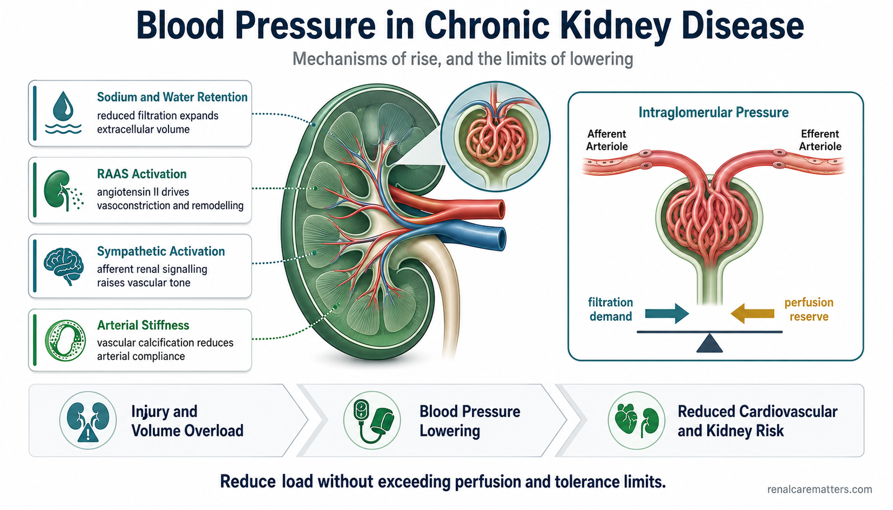
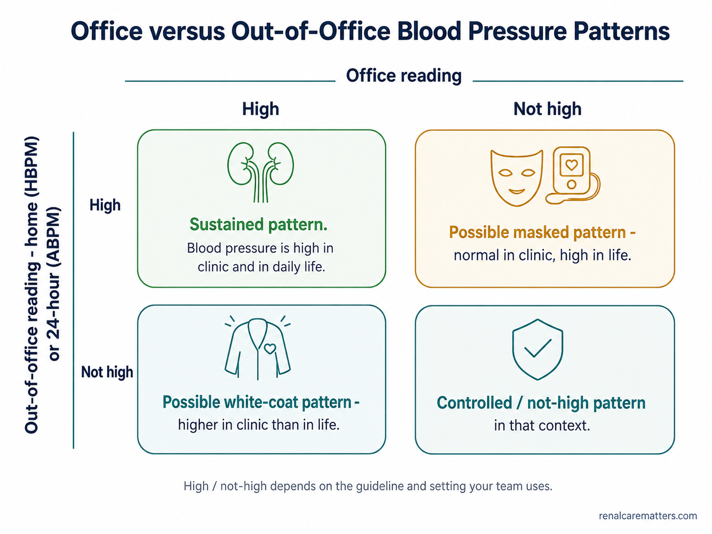

# Image Plan — *The 120-mmHg Problem* (`ckd-blood-pressure-target-standardized.html`)

**Guide:** KDIGO Blood Pressure Target in CKD — measurement-first, dual patient/clinician
**Prepared:** 2026-08-09 · **Pipeline:** Stage 1 (prompt authoring). Paste each `PROMPT` block into the
ChatGPT **Image Generator** GPT → https://chatgpt.com/g/g-pmuQfob8d-image-generator
**Skills used:** `williamriveromd-hero-vignette` · `williamriveromd-infographic-skill` ·
`williamriveromd-biomedical-mechanism-figure` · `williamriveromd-algorithm-generator-skill`

## House rules baked into every prompt
- **Light backgrounds only** (white / off-white / soft gray / pale teal `#eef6f7`). Never navy/charcoal/black.
- **Fonts:** on-image type is one of **Inter · Nunito Sans · IBM Plex Sans · Manrope** — no serif, no decorative.
- **Palette:** navy `#0f1e2e` (text/accents), teal `#1a6b72`, renal green `#1f7a4d`, amber `#b8860b`, red `#b91c1c`.
- **Attribution:** small semi-transparent `renalcarematters.com` bottom-right on every image **except the wordless hero**.
- **Clinical guardrails (this guide):** never display the bare inequality "<120" on a social/hero card without the
  measurement + population + tolerability context; never imply a universal target; never a BP-setting conversion.
  OG/social copy must carry **"standardized office"** or **"measurement matters."**
- **Save each asset** as `.png` **and** a matching `.webp` twin under `images/`, using the exact FILE NAME below.

## Asset roster

| # | File (`images/…`) | Status in guide | Skill | Size |
|---|---|---|---|---|
| 1 | `ckd-blood-pressure-target-standardized-vignette-hero.png` | ✅ wired (hero) | hero-vignette | 2048×2048 |
| 2 | `ckd-blood-pressure-target-standardized-og.png` | ✅ wired (`og:image`) | infographic | 1200×630 |
| 3 | `ckd-blood-pressure-target-standardized-01-standardized-vs-routine.png` | ✅ wired (§ measurement) | infographic | 1792×1024 |
| 4 | `ckd-blood-pressure-target-standardized-02-applicability-pathway.png` | ✅ wired (§ does-120-apply) | algorithm | 1024×1536 |
| 5 | `ckd-blood-pressure-target-standardized-03-philippine-workflow.png` | ✅ wired (§ PH workflow) | infographic | 1024×1536 |
| 6 | `ckd-blood-pressure-target-standardized-04-physiology.png` | ➕ recommended add | biomedical-mechanism | 1792×1024 |
| 7 | `ckd-blood-pressure-target-standardized-05-home-office-patterns.png` | ➕ recommended add | infographic | 1536×1152 |

> Assets 1–5 already have `<figure>`/`<picture>`/`og` references in the guide — dropping the files in "lights them up."
> Assets 6–7 are blueprint-required figures (§13) not yet placed inline; the exact `<figure>` HTML to insert is given
> under each. Re-run `python3 patch_hero_fetchpriority.py`, `patch_hero_fullwidth.py`, `patch_hero_maxwidth.py`,
> and `patch_image_lightbox.py` after adding any new inline figure.

---

## 1 · Circular vignette hero  *(wired — patient hero disc)*

```
FILE NAME: ckd-blood-pressure-target-standardized-vignette-hero.png
IMAGE TYPE: Circular vignette hero v3 — Scaffold B still-life
ASPECT RATIO: 1:1 (square — displayed inside an 85–90% inscribed circle with white margin)
PIXEL DIMENSIONS: 2048 × 2048
COMPOSITION ARCHETYPE: I — Object Hero
CAMERA: top-down / gentle overhead, shallow depth of field
HUMAN VARIATION (vs. previous guide): no people
AUDIENCE: mixed (patients + clinicians)
VISUAL GOAL: "120 is a protocol" — a careful, standardized blood-pressure measurement set, calm and trustworthy, wordless.

PROMPT:
Square 1:1 photorealistic still-life on a 2048×2048 canvas, composed to be displayed inside a CIRCULAR
vignette occupying 85–90% of the canvas diameter with a visible WHITE BORDER around the full circle (the
circle must never touch the canvas edges). Composition archetype: Object Hero. Camera: gentle overhead,
soft shallow depth of field.

Subject: a single clean, calmly arranged standardized blood-pressure measurement set on a soft, uncluttered
pale teal-tinted surface — a validated upper-arm automatic blood-pressure monitor with its cuff laid open and
tidy, a neatly folded paper checklist, a small simple analog timer or clock suggesting a quiet rest interval,
and a glass of water — bright natural daylight, gentle shadows, premium medical-editorial feel.

Visual hierarchy: the blood-pressure monitor and open cuff occupy 60–70% of the circle; the checklist, timer,
and water glass are 2–4 supporting elements filling 20–30%; reserve a 20–25% TITLE SAFE ZONE of empty soft
teal surface / gentle gradient in the upper-left (no objects, labels, icons, or numbers inside that zone) so
the HTML title can sit beside the disc. Soft edge falloff toward a slightly deeper neutral at the rim. Light,
calm, clinical-but-warm colour grade harmonizing with clinical teal #1a6b72 and navy #0f1e2e.

Absolutely NO readable text, numbers, packaging copy, brand names, titles, logos, or watermark on any object.
Full-bleed within the inscribed circle, no rectangular borders, frames, or banners.

NEGATIVE INSTRUCTIONS:
Avoid: busy layouts; collage overload; more than four supporting objects; dozens of icons; tiny unreadable
labels; infographic clutter; cropped circle; cropped objects; objects touching the circular border; any
content inside the title safe zone; baked-in text, numbers, titles, captions, logos, or watermarks;
rectangular borders/frames/banners; dark / charcoal / black backgrounds; cartoon style, neon, HDR,
over-saturation; distorted anatomy; wrist or cuffless devices.

QUALITY CHECK:
Square 2048×2048. Circle occupies 85–90% of canvas with a visible white margin — never cropped. ONE dominant
subject (the BP monitor + open cuff) at 60–70%, 2–4 supporting objects, a clean 20–25% title-safe zone. No
people. Wordless — no numbers or labels anywhere. Crops cleanly inside the circle.
```

---

## 2 · OG / social share card  *(wired — `og:image`, `twitter:image`)*

```
FILE NAME: ckd-blood-pressure-target-standardized-og.png
IMAGE TYPE: OG / social share card (editorial)
ASPECT RATIO: 1.91:1
PIXEL DIMENSIONS: 1200 × 630
AUDIENCE: mixed (patients + clinicians)
VISUAL GOAL: "120 is a protocol, not just a number" — measurement matters; scroll-stopping but calm and trustworthy.

PROMPT:
Editorial medical social-share card on a clean off-white (#fafafa) background, 1200×630, premium
renalcarematters.com nephrology aesthetic. Left two-thirds: bold headline typography in navy #0f1e2e set in
Inter — primary line "120 is a protocol," second line "not just a number." — with a short teal #1a6b72
subtitle beneath reading "Standardized-office measurement matters · KDIGO blood pressure in CKD." Right third:
a clean semi-photorealistic still-life of a validated upper-arm blood-pressure cuff beside a small checklist
card and the numerals "120" rendered as a calm design element (not an inequality), with a subtle teal
accent rule. A calm Filipino patient-and-clinician motif may appear small and softly blurred in the
background of the right panel. Generous negative space, rounded panel, gentle daylight, restrained palette
of teal #1a6b72, navy #0f1e2e, warm amber #b8860b accent. Mobile-legible at thumbnail size.

Render the copyright attribution exactly as renalcarematters.com in small semi-transparent navy text in the
bottom-right corner.

NEGATIVE INSTRUCTIONS:
Avoid cartoon style, clutter, tiny unreadable labels, AI gibberish text, unrealistic anatomy, overprocessed
HDR, generic stock-photo look, excessive saturation. NEVER use dark, navy, charcoal, or black backgrounds —
light backgrounds only. Do NOT display the inequality "<120" or any "below 120" claim without context, and do
NOT imply a universal target. Use ONLY Inter / Nunito Sans / IBM Plex Sans / Manrope — no serif or decorative
fonts. Never omit the renalcarematters.com attribution.

QUALITY CHECK:
Exactly 1200×630. Light background. Headline mobile-readable at thumbnail. Copy carries "standardized office"
or "measurement matters." No bare "<120" inequality, no universal-target implication. Attribution present
bottom-right.
```

---

## 3 · Standardized vs routine measurement  *(wired — § "120 is a protocol")*

```
FILE NAME: ckd-blood-pressure-target-standardized-01-standardized-vs-routine.png
IMAGE TYPE: Two-panel clinical comparison infographic
ASPECT RATIO: 16:9
PIXEL DIMENSIONS: 1792 × 1024
AUDIENCE: patients + clinicians
VISUAL GOAL: The same number from a rushed reading and a standardized reading do not mean the same thing.

PROMPT:
Two-panel clinical education infographic, landscape 16:9, on a clean white background, premium
renalcarematters.com nephrology aesthetic, clean sans-serif labels set in Inter. A slim centered navy divider
separates two calm semi-photorealistic scenes of a diverse Filipino adult having blood pressure measured.

LEFT panel, tagged with a small amber #b8860b chip reading "Routine / rushed": the patient is talking,
feet unsupported and dangling, arm hanging unsupported, cuff placed over a shirt sleeve, a single reading,
a busy clinic in the background. 3–4 tiny amber caution markers point to each problem.

RIGHT panel, tagged with a small teal #1a6b72 chip reading "Standardized office": the same style of patient
sits quietly, back supported, feet flat on the floor, legs uncrossed, bare upper arm supported at heart
level, correct cuff size on a validated upper-arm monitor, a visible 5-minute rest timer, repeated readings,
calm and quiet. 3–4 small teal check markers confirm each condition.

Short, mobile-readable labels only (no paragraphs). Bright airy daylight, restrained teal/navy/amber palette,
rounded panels, generous whitespace. Render the copyright attribution exactly as renalcarematters.com in small
semi-transparent navy text in the bottom-right corner.

NEGATIVE INSTRUCTIONS:
Avoid cartoon style, clutter, tiny unreadable labels, AI gibberish text, unrealistic anatomy, distorted hands,
overprocessed HDR, generic stock-photo look, excessive saturation. NEVER dark/navy/charcoal/black backgrounds.
Do not print any specific BP number or a conversion between the panels (this is about conditions, not a number).
Use ONLY Inter / Nunito Sans / IBM Plex Sans / Manrope. Never omit the renalcarematters.com attribution.

QUALITY CHECK:
1792×1024, light background, two clearly contrasted panels, correct posture/cuff/arm details on the right,
short legible labels, no numeric BP shown, no conversion implied, attribution bottom-right.
```

---

## 4 · "Does <120 apply to me?" applicability pathway  *(wired — § does-120-apply)*

```
FILE NAME: ckd-blood-pressure-target-standardized-02-applicability-pathway.png
IMAGE TYPE: Clinical algorithm — renalcarematters.com house style (Style Mode C)
ASPECT RATIO: 2:3 (portrait)
PIXEL DIMENSIONS: 1024 × 1536
AUDIENCE: mixed (patients + clinicians)
VISUAL GOAL: A top-down pathway showing that the KDIGO below-120 suggestion is for one specific group; several branches route elsewhere.

PROMPT:
Create a clean publication-ready clinical algorithm flowchart in the renalcarematters.com house style, portrait
1024×1536, white background, restrained navy #0f1e2e and teal #1a6b72 typography set in Inter, thin teal
connector arrows, generous margins, centered and symmetrical. Title at top: "Does the KDIGO 'below 120'
target apply?" Subtitle: "Standardized-office SBP, adults with non-dialysis CKD, when tolerated (2B)."

Top-to-bottom logic with teal diamond decision nodes and rounded action/endpoint nodes:
1. Decision: "Adult with CKD and high blood pressure?"
2. Decision: "On dialysis, pregnant, a transplant recipient, or a child?" — a YES branch leaves to a soft-gray
   endpoint "Separate pathway (dialysis / transplant / pediatric / pregnancy)."
3. Decision: "Standardized-office reading available?" — a NO branch leaves to an amber #b8860b node "Repeat with
   a standardized protocol first."
4. Decision: "Frailty, falls, very limited life expectancy, or symptoms on standing?" — a YES branch leaves to
   an amber node "Individualize — consider less intensive therapy."
5. Green #1f7a4d endpoint: "Potentially applicable — discuss the KDIGO below-120 (2B) suggestion, and agree a
   shared target + monitoring plan."

Use navy structural text, teal decision diamonds, green for the qualifying endpoint, amber for caution/redirect
nodes, soft gray for the separate-pathway endpoint. Short readable text in every node. No photorealistic people,
no icons unless a simple flat line icon clearly helps, no dark background, no clutter. Include a small
professional footer reading "© renalcarematters.com" at the bottom-right in subtle gray.

NEGATIVE INSTRUCTIONS:
No dark background, no photorealistic people, no cartoon styling, no decorative clutter, no spaghetti arrows,
no serif or decorative fonts (Inter only). Do not output a personal numeric target anywhere in the diagram.

QUALITY CHECK:
Portrait 1024×1536, clear top-to-bottom logic, decision diamonds distinct, green qualifying endpoint, amber
redirects, gray separate-pathway node, no numeric target emitted, footer bottom-right.
```

---

## 5 · Philippine clinic workflow  *(wired — § PH workflow)*

```
FILE NAME: ckd-blood-pressure-target-standardized-03-philippine-workflow.png
IMAGE TYPE: Multi-step workflow infographic (portrait)
ASPECT RATIO: 2:3 (portrait)
PIXEL DIMENSIONS: 1024 × 1536
AUDIENCE: clinicians, nurses, community health workers
VISUAL GOAL: A standardized measurement is achievable in a low-resource Philippine clinic with a chair, a timer, a validated cuff, and a habit of recording conditions.

PROMPT:
Portrait 1024×1536 patient-flow workflow infographic on a clean white background, premium renalcarematters.com
nephrology aesthetic, clean sans-serif labels set in Inter, navy #0f1e2e headings and teal #1a6b72 accents.
Title at top: "A standardized BP reading in a Philippine clinic." A single calm vertical sequence of six
rounded numbered step cards connected by thin teal arrows, each with one small flat line icon and one short
mobile-readable line:
1. Measurement chair set away from the triage rush.
2. Validated upper-arm device + a small library of cuff sizes.
3. Visible 5-minute quiet rest timer; no conversation.
4. Repeat readings; record position, arm, cuff, device, average, medication timing, and symptoms.
5. If not standardized, label the value "routine office" (do not map it directly to the target).
6. Arrange home or 24-hour monitoring when clinic and expected pressure conflict; team-based follow-up.

A soft, small, bright vignette of a calm Filipino barangay health-center setting may sit behind the title.
Restrained teal/navy/green palette, rounded cards, generous whitespace, no clutter. Render the copyright
attribution exactly as renalcarematters.com in small semi-transparent navy text at the bottom-center.

NEGATIVE INSTRUCTIONS:
Avoid cartoon style, clutter, tiny unreadable labels, AI gibberish text, unrealistic anatomy, overprocessed
HDR, generic stock-photo look. NEVER dark/navy/charcoal/black backgrounds. Use ONLY Inter / Nunito Sans /
IBM Plex Sans / Manrope. Do not print a specific target BP number. Never omit the renalcarematters.com attribution.

QUALITY CHECK:
Portrait 1024×1536, six clear numbered steps, short legible labels, light background, no target number,
attribution present.
```

---

## 6 · Why pressure rises in CKD — physiology  *(➕ recommended add)*

**Where it goes:** in the clinician **`#md-physiology`** section (or as a patient-friendly figure atop it).
Insert this `<figure>` at the top of that section, then re-run the hero/lightbox patchers:

```html
<figure style="margin:24px 0;">
  <picture>
    <source srcset="../images/ckd-blood-pressure-target-standardized-04-physiology.webp" type="image/webp">
    
  </picture>
  <figcaption>
    <p class="fig-desc">In CKD, the kidney retains sodium and water and the RAAS and sympathetic systems tighten vessels, while stiff arteries raise systolic pressure. Lowering pressure eases cardiovascular load — but too much for an individual reduces perfusion and causes symptoms.</p>
    <dl class="fig-abbrevs"><dt>RAAS</dt><dd>Renin–angiotensin–aldosterone system.</dd><dt>SBP</dt><dd>Systolic blood pressure.</dd><dt>eGFR</dt><dd>Estimated glomerular filtration rate.</dd></dl>
  </figcaption>
</figure>
```

```
FILE NAME: ckd-blood-pressure-target-standardized-04-physiology.png
IMAGE TYPE: Biomedical mechanism schematic (review-article style)
ASPECT RATIO: 16:9
PIXEL DIMENSIONS: 1792 × 1024
AUDIENCE: mixed (patients + clinicians)
VISUAL GOAL: The mechanism chain from CKD to high pressure to the perfusion/tolerance trade-off.

PROMPT:
Create a publication-grade biomedical mechanism schematic, flat vector illustration with soft semi-3D shading
on a white background, muted clinical palette, clean sans-serif labels set in Inter, thin dashed connector
lines, review-article figure style.

Topic: Why blood pressure rises in chronic kidney disease, and the lowering-vs-perfusion trade-off.

Left organ-level panel: a simplified kidney labeled "CKD" with major vessels; a small dashed connector box
points to a magnified glomerulus/nephron inset.

Center magnified panel (dashed border): a glomerulus and a stiffened arteriole. Concise callouts:
- ↑ Sodium & water retention (impaired pressure natriuresis)
- ↑ RAAS & sympathetic activation → vasoconstriction
- ↑ Arterial stiffness → ↑ systolic pressure, wide pulse pressure
- ↑ Intraglomerular pressure → albuminuria

Bottom summary flow (left → center → right):
- Left pale-pink pathology box: "High pressure → cardiovascular load; heart, brain, kidney microvascular injury."
- Center box: "Lower blood pressure (a strategy: measure, titrate, monitor, de-intensify)."
- Right pale-blue benefit box: "↓ Cardiovascular events — but too much for the individual → ↓ perfusion,
  dizziness, falls, hemodynamic eGFR dip." Bold the final teaching line: "Reduce load without exceeding
  perfusion and tolerance limits."

Use a white background, muted clinical colors (light gray-blue anatomy, soft yellow highlighted segments, red
for arteries/injury, blue for protective/therapeutic effects, pale pink pathology box, pale blue benefit box),
thin dashed connectors, generous whitespace. Avoid photorealism, dark backgrounds, decorative elements, and
overcrowding. Render "© renalcarematters.com" small and semi-transparent in the bottom-right corner.

NEGATIVE INSTRUCTIONS:
No photorealism, no dark background, no cartoon styling, no decorative clutter, no invented numeric thresholds,
no serif/decorative fonts (Inter only). Do not imply intensive lowering prevents kidney failure.

QUALITY CHECK:
1792×1024, white background, organ panel + dashed magnified inset + injury→intervention→benefit bottom flow,
anatomically plausible, legible labels, attribution bottom-right.
```

---

## 7 · Office / home / 24-hour BP phenotypes  *(➕ recommended add)*

**Where it goes:** in the patient **`#different-bp-settings`** section, beside the phenotype table.
Insert this `<figure>`, then re-run the hero/lightbox patchers:

```html
<figure style="margin:24px 0;">
  <picture>
    <source srcset="../images/ckd-blood-pressure-target-standardized-05-home-office-patterns.webp" type="image/webp">
    
  </picture>
  <figcaption>
    <p class="fig-desc">Comparing a clinic reading with an out-of-office reading (home or 24-hour) reveals four patterns: sustained, white-coat, masked, and controlled. Which pattern you have changes what the reading means.</p>
    <dl class="fig-abbrevs"><dt>HBPM</dt><dd>Home blood pressure monitoring.</dd><dt>ABPM</dt><dd>Ambulatory (24-hour) blood pressure monitoring.</dd></dl>
  </figcaption>
</figure>
```

```
FILE NAME: ckd-blood-pressure-target-standardized-05-home-office-patterns.png
IMAGE TYPE: 2×2 comparison matrix infographic
ASPECT RATIO: 4:3
PIXEL DIMENSIONS: 1536 × 1152
AUDIENCE: patients + clinicians
VISUAL GOAL: The four office-vs-out-of-office patterns, without printing any universal threshold number.

PROMPT:
Clean 2×2 matrix education infographic on a white background, 1536×1152, premium renalcarematters.com
nephrology aesthetic, clean sans-serif labels set in Inter, navy #0f1e2e headings and teal #1a6b72 accents.
Axis labels: the horizontal axis reads "Office reading" (columns: High / Not high); the vertical axis reads
"Out-of-office reading — home (HBPM) or 24-hour (ABPM)" (rows: High / Not high). Four rounded quadrant cards,
each with a short title and a one-line plain-language description and a small flat line icon:
- Office High + Out-of-office High → "Sustained pattern."
- Office High + Out-of-office Not high → "Possible white-coat pattern — higher in clinic than in life."
- Office Not high + Out-of-office High → "Possible masked pattern — normal in clinic, high in life."
- Office Not high + Out-of-office Not high → "Controlled / not-high pattern in that context."

Use green #1f7a4d, amber #b8860b, and teal #1a6b72 to gently distinguish the quadrants; navy text. A small
footnote line in soft gray reads: "High / not-high depends on the guideline and setting your team uses."
Rounded cards, generous whitespace, mobile-readable. Render the copyright attribution exactly as
renalcarematters.com in small semi-transparent navy text in the bottom-right corner.

NEGATIVE INSTRUCTIONS:
Avoid cartoon style, clutter, tiny unreadable labels, AI gibberish text, overprocessed HDR, excessive
saturation. NEVER dark/navy/charcoal/black backgrounds. Do NOT print any specific mmHg threshold number in the
matrix (the footnote explains cut-offs are guideline/setting-specific). Use ONLY Inter / Nunito Sans /
IBM Plex Sans / Manrope. Never omit the renalcarematters.com attribution.

QUALITY CHECK:
1536×1152, light background, clear 2×2 matrix with labeled axes, four legible quadrant descriptions, the
"depends on guideline/setting" footnote present, NO universal threshold number printed, attribution bottom-right.
```

---

## After generation — wiring checklist
1. Save each `.png` **and** a `.webp` twin into `images/` with the exact FILE NAME above.
2. For assets **6–7**, paste the provided `<figure>` HTML into the named section.
3. Run, from repo root:
   ```bash
   python3 patch_hero_fetchpriority.py --guide ckd-blood-pressure-target-standardized.html
   python3 patch_hero_fullwidth.py     --guide ckd-blood-pressure-target-standardized.html
   python3 patch_hero_maxwidth.py      --guide ckd-blood-pressure-target-standardized.html
   python3 patch_image_lightbox.py     --guide ckd-blood-pressure-target-standardized.html
   ```
4. Confirm the OG card is exactly **1200×630** and that `og:image:width`/`og:image:height` already read 1200/630 (they do).
5. Optional Stage 2: hand this pack to `williamriveromd-local-image-generator` for manifests + folder scaffolding.
