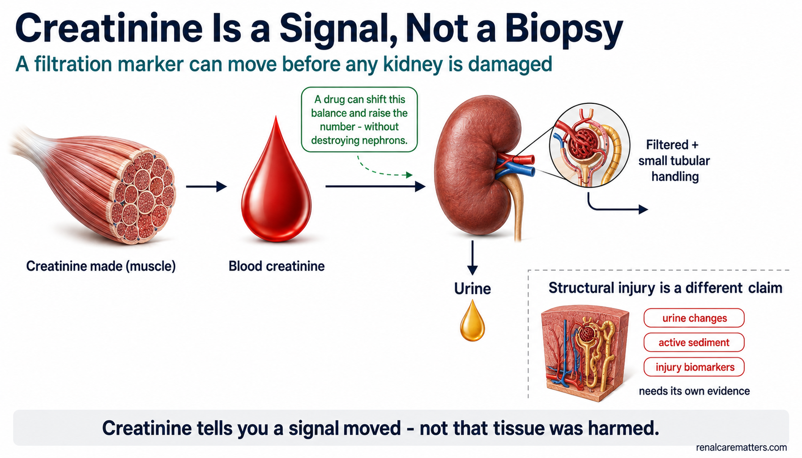
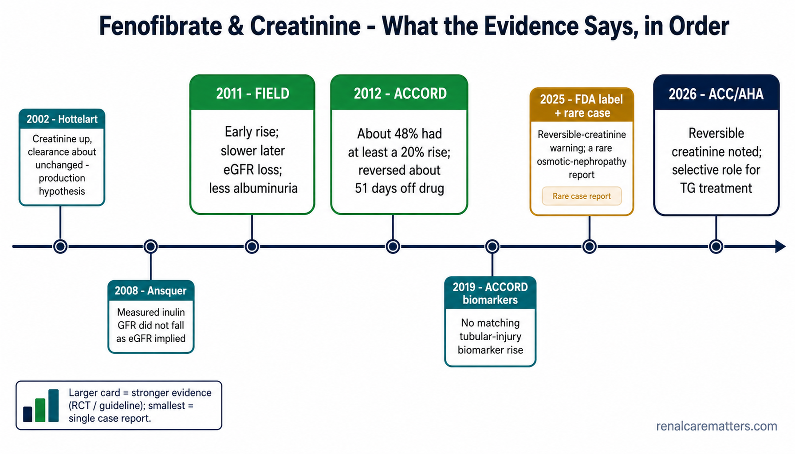

# Image Pack — *When Creatinine Rises After Fenofibrate*

**Guide slug:** `fenofibrate-creatinine-kidney-function`
**Guide URL:** https://renalcarematters.com/guides/fenofibrate-creatinine-kidney-function.html
**Prepared with:** `williamriveromd-hero-vignette`, `williamriveromd-infographic-skill`, `williamriveromd-simple-figure`, `williamriveromd-algorithm-generator-skill`
**Production target:** ChatGPT Image Generator GPT → https://chatgpt.com/g/g-pmuQfob8d-image-generator

> **How to use:** paste the fenced **PROMPT** block for each image straight into the Image Generator GPT.
> Each block is self-contained (prompt + negatives + attribution). Save every output as `.png` under
> `images/` using the stated **File name**, then create a matching `.webp` twin for the inline figures.
> The hero and OG are already referenced by the guide; the three in-body figures need their `<figure>`
> snippet (bottom of this file) pasted in after the images exist.

---

## House-style guardrails (apply to every image)

- **Light backgrounds only** — white `#ffffff`, off-white `#fafafa`, soft gray `#f3f4f6`, light teal tint `#eef6f7`. Never navy/charcoal/black fills.
- **Palette:** navy `#0f1e2e` (text/structure), clinical teal `#1a6b72`, renal green `#1f7a4d` (reassuring/reversible), amber `#b8860b` (caution/uncertain), clinical red `#b91c1c` (true injury/danger).
- **Fonts:** on-image text uses **only** Inter, Nunito Sans, IBM Plex Sans, or Manrope — never serif.
- **Attribution:** `renalcarematters.com` (or `© renalcarematters.com` for the algorithm) small, semi-transparent, bottom-right (bottom-center for portrait). Never omit.
- **Generic drug only** — no brand name, logo, or trade dress on any tablet/bottle. No readable packaging copy.
- **Editorial temperature:** calm and non-alarmist. This guide's whole point is *interpret, don't panic* — never a frightening/diseased-kidney visual, never red-alarm framing for the routine reversible signal.

---

## Image plan blueprint

| # | File name | Placement | Type / skill | Dimensions | Wired? |
|---|---|---|---|---|---|
| 1 | `fenofibrate-creatinine-kidney-function-vignette-hero.png` | Patient hero (circular vignette, `mode-patient`) | Still-life object hero · hero-vignette | 2048 × 2048 (1:1) | ✅ referenced |
| 2 | `fenofibrate-creatinine-kidney-function-og.png` | Social share / `og:image` | Editorial OG card · infographic | 1200 × 630 (1.91:1) | ✅ referenced |
| 3 | `fenofibrate-creatinine-kidney-function-01-three-explanations.png` | Patient §*The Pattern* | Branch flow · simple-figure | 1792 × 1024 (16:9) | ✅ referenced |
| 4 | `fenofibrate-creatinine-kidney-function-02-signal-not-biopsy.png` | Patient §*Marker, Not Injury* | Concept mechanism · simple-figure | 1792 × 1024 (16:9) | ⬜ add `<figure>` |
| 5 | `fenofibrate-creatinine-kidney-function-md-01-evidence-timeline.png` | Clinician §*Evidence* | Evidence timeline · simple-figure | 1792 × 1024 (16:9) | ⬜ add `<figure>` |
| 6 | `fenofibrate-creatinine-kidney-function-md-02-decision-pathway.png` | Clinician §*Workup* | Clinical algorithm · algorithm-generator (House Style C) | 1024 × 1536 (2:3) | ⬜ add `<figure>` |

*Optional 7th (deferred): a "Why was fenofibrate started?" triglyceride-severity matrix (500 / 1,000 mg/dL bands, pancreatitis-vs-ASCVD goals). Omitted for now — the §Was It Necessary prose + myth module cover it. Generate later with `williamriveromd-simple-figure` Scaffold E if desired.*

---

## Image 1 — Hero vignette (patient)

```
FILE NAME: fenofibrate-creatinine-kidney-function-vignette-hero.png
IMAGE TYPE: Circular vignette hero v3 — Scaffold B (single still-life / object)
ASPECT RATIO: 1:1 (square — displayed inside an 85–90% inscribed circle with white margin)
PIXEL DIMENSIONS: 2048 × 2048
COMPOSITION ARCHETYPE: I — Object Hero
CAMERA: three-quarter macro, soft top-down bias
HUMAN VARIATION (vs. previous guide): no people
AUDIENCE: patients & families
VISUAL GOAL: a calm, reassuring still-life that says "a lipid pill and a kidney blood test" without alarm — the picture beside which the HTML title sits.

PROMPT:
Square 1:1 photorealistic still-life on a 2048×2048 canvas, composed to be displayed inside a CIRCULAR vignette occupying 85–90% of the canvas diameter with a visible WHITE BORDER around the full circle (the circle must never touch the canvas edges). Composition archetype: I — Object Hero. Camera: three-quarter macro with a gentle top-down bias.

Subject: a single clean, elegant arrangement of one plain amber-yellow oval medication tablet (generic, unbranded, no readable text) resting beside a capped laboratory blood-collection tube filled with a small amount of straw-coloured serum, and a folded paper lab slip whose printing is softly out of focus and unreadable, arranged on a soft, uncluttered light teal-tinted (#eef6f7) surface with gentle natural daylight and shallow depth of field. A very subtle, softly blurred upward-tilting line (like a faint trend line) is suggested in the background haze behind the tube — barely there, calm, not a bold graph.

Visual hierarchy: the tablet-and-tube grouping occupies 60–70% of the circle; 2–3 small supporting elements (the lab slip, a soft shadow, a hint of a second tablet) fill 20–30%; reserve a 20–25% TITLE SAFE ZONE in the upper-left of clean soft gradient surface (no objects, labels, icons, or the trend line inside that zone) so the HTML title can sit beside the disc without covering important artwork. Soft edge falloff toward a slightly deeper neutral at the rim. Light, calm, clinical-but-warm colour grade harmonizing with clinical teal #1a6b72 and navy #0f1e2e on a light background.

Absolutely NO readable text or labels on the objects (no packaging copy you can read), no titles, no logos, no watermark. Full-bleed within the inscribed circle, no rectangular borders.

NEGATIVE INSTRUCTIONS:
Avoid: busy layouts; collage overload; more than four supporting scenes; dozens of icons; tiny unreadable labels; infographic clutter; duplicated people; repeated compositions; cropped circle; cropped objects; edge clipping; objects touching the circular border; important content inside the title safe zone; baked-in text, titles, captions, logos, watermarks; rectangular borders, frames, banners; dark / charcoal / black backgrounds; cartoon style, neon, HDR, over-saturation; a bold or alarming red graph; branded pill markings; frightening or diseased-kidney imagery; distorted anatomy.

QUALITY CHECK:
Square 2048×2048. Circle occupies 85–90% of canvas with a visible white margin — never cropped. ONE dominant object grouping (tablet + serum tube) at 60–70% of the circle, 2–3 supporting elements, a 20–25% empty title-safe zone (soft gradient, no objects/labels) reserved upper-left. Calm, wordless, reassuring; generic unbranded pill; light teal surface, no dark background. Crops cleanly inside the circle with nothing lost at the edges. No text or watermark of any kind.
```

---

## Image 2 — OG / social share card

```
FILE NAME: fenofibrate-creatinine-kidney-function-og.png
IMAGE TYPE: Editorial OG / social share card (Archetype 1, text-bearing)
ASPECT RATIO: 1.91:1 (fixed — OG spec)
PIXEL DIMENSIONS: 1200 × 630
AUDIENCE: mixed (patients + prescribers scrolling social)
VISUAL GOAL: a premium, calm share card that poses the guide's central question — reversible drug effect vs kidney injury — at a glance.

PROMPT:
Premium nephrology-education Open Graph social share card, exactly 1200 × 630 px, clean off-white (#fafafa) background, publication-grade editorial layout, generous negative space, mobile-legible at thumbnail size. All typography in the sans-serif font Inter.

Left two-thirds — text block, left-aligned: a small teal (#1a6b72) uppercase kicker reading "MEDICINES & KIDNEYS"; below it a large bold navy (#0f1e2e) headline in Inter reading "When Creatinine Rises After Fenofibrate"; below that a lighter navy sub-line reading "Kidney injury, a reversible drug effect — or something in between?".

Right third — a clean, simple flat vector motif on a soft teal-tint (#eef6f7) rounded panel: one small generic amber (#b8860b) medication tablet at the left, a thin navy line rising from it (a creatinine trend going up), and where the line reaches a small node it splits into TWO diverging labelled branches — an upper renal-green (#1f7a4d) branch drawn as a solid arrow toward a small check-style kidney icon (meaning "reversible"), and a lower amber-to-red (#b91c1c) branch drawn as a dashed arrow toward a small caution kidney icon (meaning "true injury, less common"). Keep the two branch labels to at most one short word each, in Inter. The dashed lower branch signals it is the uncommon path — do not draw both branches as equally solid.

Bottom-right corner: the attribution "renalcarematters.com" in small semi-transparent navy (#0f1e2e) Inter text at ~70% opacity. Calm, restrained, non-alarmist colour grade; no photographic people; no 3D gloss; no red-alert framing.

NEGATIVE INSTRUCTIONS:
Avoid cartoon style, avoid clutter, avoid tiny unreadable labels, avoid AI gibberish text, avoid unrealistic anatomy, avoid overprocessed HDR, avoid generic stock-photo look, avoid excessive saturation. NEVER use dark, navy, charcoal, or black backgrounds — light backgrounds only. Use ONLY the sans-serif font Inter — no serif fonts, no decorative or handwritten typefaces. Do not misspell "fenofibrate" or "creatinine". No brand names or drug logos. Do not make the card look like a danger/alert warning. Never omit the renalcarematters.com attribution.

QUALITY CHECK:
Exactly 1200 × 630. Headline spelled correctly ("When Creatinine Rises After Fenofibrate"), Inter font, navy on off-white. Right-side motif reads at a glance: pill → rising line → branch to reversible (green, solid) vs injury (dashed, amber/red, clearly the minor path). Mobile-readable at thumbnail. renalcarematters.com attribution visible bottom-right. Calm, premium, non-alarmist.
```

---

## Image 3 — "One Lab Change, Three Possible Explanations" (patient)

```
FILE NAME: fenofibrate-creatinine-kidney-function-01-three-explanations.png
IMAGE TYPE: Branch flow diagram (simple-figure — Scaffold D adapted, single-input → three-branch)
ASPECT RATIO: 16:9 landscape
PIXEL DIMENSIONS: 1792 × 1024
AUDIENCE: patients & families (also readable by clinicians)
VISUAL GOAL: show that one rise in creatinine after fenofibrate has three possible explanations, only one of which is true injury — and that the branch differs between patients.

PROMPT:
Clean medical-education branch-flow infographic, AJKD/NEJM graphical-abstract style, white (#ffffff) background, generous whitespace, all labels in the sans-serif font Inter, mobile-readable (labels ≥12pt equivalent). Title at top center in bold navy (#0f1e2e): "One Lab Change, Three Possible Explanations". Optional teal (#1a6b72) subtitle beneath: "A creatinine rise after fenofibrate is not one thing".

Left side: a small navy rounded node "Fenofibrate started", a bold navy arrow pointing right to a central teal (#1a6b72) rounded node "Creatinine rises (eGFR falls)". From that central node, THREE arrows fan out to three rounded outcome cards stacked on the right, each with a short bold heading and one line of plain description:
1) Renal-green (#1f7a4d) SOLID arrow → card "Altered creatinine generation" — "more creatinine made, not lost filtration".
2) Teal (#1a6b72) SOLID arrow → card "Reversible functional change" — "blood-flow shift in filtration; often reverses".
3) Amber-to-red (#b91c1c) DASHED arrow → card "True kidney injury" — "uncommon; needs urine/blood-test proof".

Draw the third arrow and card border DASHED (and slightly smaller) to signal it is the least common, unproven-by-default path — the first two are the usual explanations; do not render all three as equally established. A soft gray (#f3f4f6) full-width footer strip along the bottom carries one navy sentence in Inter: "The mechanism can differ between patients — clinical context decides which branch you are on." Bottom-right: "renalcarematters.com" in small semi-transparent navy Inter text.

NEGATIVE INSTRUCTIONS:
Avoid cartoon style, avoid clutter, avoid tiny unreadable labels, avoid AI gibberish text, avoid unrealistic anatomy, avoid overprocessed HDR, avoid excessive saturation. NEVER use dark, navy, charcoal, or black backgrounds — light backgrounds only. Use ONLY the sans-serif font Inter — no serif fonts. Do not draw all three branches identically; the "true kidney injury" branch must read as the minor, dashed path. Do not misspell "creatinine", "fenofibrate", or "eGFR". Never omit the renalcarematters.com attribution.

QUALITY CHECK:
Landscape 1792 × 1024, white background, Inter font. One input ("Fenofibrate started") → "Creatinine rises" → three clearly differentiated branches; the third (true injury) is dashed/smaller. Footer sentence present and legible. Mobile-readable. renalcarematters.com bottom-right.
```

---

## Image 4 — "Creatinine Is a Signal, Not a Biopsy" (patient)

```
FILE NAME: fenofibrate-creatinine-kidney-function-02-signal-not-biopsy.png
IMAGE TYPE: Single-concept mechanism figure (simple-figure — Scaffold D)
ASPECT RATIO: 16:9 landscape
PIXEL DIMENSIONS: 1792 × 1024
AUDIENCE: patients & families (also clinicians)
VISUAL GOAL: show creatinine as a balance (generation → blood → filtration/tubular handling → urine) that can move upstream of any structural damage, so a number change is not proof of injury.

PROMPT:
Medical pathophysiology concept infographic, AJKD/NEJM graphical-abstract style, white (#ffffff) background, ample negative space, all text in the sans-serif font Inter, mobile-readable. Title at top in bold navy (#0f1e2e): "Creatinine Is a Signal, Not a Biopsy". Subtitle in clinical teal (#1a6b72): "A filtration marker can move before any kidney is damaged".

Main row (left to right), a clean flow of simple semi-photorealistic 3D icons connected by thin navy arrows: a stylised skeletal MUSCLE bundle labelled "Creatinine made (muscle)" → a red BLOOD DROP labelled "Blood creatinine" → a single calm, healthy 3D KIDNEY with a small inset showing filtration plus a small secondary "tubular secretion" side-arrow, labelled "Filtered + small tubular handling" → a downward flow to a labelled "Urine". Above the blood-drop→kidney segment, place a small renal-green (#1f7a4d) callout: "A drug can shift this balance and raise the number — without destroying nephrons."

Lower-right, visually separated by a soft dashed divider, a second smaller layer titled in navy "Structural injury is a different claim" with a clinical-red (#b91c1c) accent: a small kidney-tissue / nephron cross-section icon beside a short list rendered as three tiny pill-labels — "urine changes", "active sediment", "injury biomarkers" — with the note "needs its own evidence". Keep this injury layer clearly smaller/secondary to the top balance flow. Bottom strip (soft gray #f3f4f6): navy Inter sentence "Creatinine tells you a signal moved — not that tissue was harmed." Bottom-right: "renalcarematters.com" small semi-transparent navy Inter text.

NEGATIVE INSTRUCTIONS:
Avoid cartoon style, avoid clutter, avoid tiny unreadable labels, avoid AI gibberish text, avoid unrealistic anatomy, avoid overprocessed HDR, avoid excessive saturation. NEVER use dark, navy, charcoal, or black backgrounds — light backgrounds only. Use ONLY the sans-serif font Inter — no serif fonts. Show the kidney as healthy/normal (not diseased) in the main balance row. Do not misspell "creatinine", "nephrons", "tubular". Never omit the renalcarematters.com attribution.

QUALITY CHECK:
Landscape 1792 × 1024, white background, Inter font. Main row reads muscle → blood → kidney (filtration + tubular) → urine as a balance; green callout makes the "number can move without nephron loss" point; a clearly-secondary red-accented "structural injury needs its own evidence" layer sits below a dashed divider. Footer sentence present. Mobile-readable. renalcarematters.com bottom-right.
```

---

## Image 5 — Evidence timeline (clinician)

```
FILE NAME: fenofibrate-creatinine-kidney-function-md-01-evidence-timeline.png
IMAGE TYPE: Horizontal evidence timeline (simple-figure — Scaffold C adapted)
ASPECT RATIO: 16:9 landscape
PIXEL DIMENSIONS: 1792 × 1024
AUDIENCE: clinicians
VISUAL GOAL: sequence the evidence base from the 2002 production hypothesis to the 2026 guideline, weighting trials over the single case report.

PROMPT:
Clean clinical-education timeline infographic, white (#ffffff) background, publication-grade, all text in the sans-serif font Inter, mobile-readable. Title at top center in bold navy (#0f1e2e): "Fenofibrate & Creatinine — What the Evidence Says, in Order". A single horizontal navy timeline axis runs left to right across the middle, with seven evenly spaced date nodes, each a rounded card connected to the axis by a short stem. Card size encodes evidence weight — randomized-trial and regulatory/guideline cards are LARGER; the single case report is the SMALLEST.

Nodes (left to right), each with a bold year, a short source label, and one plain finding line:
1) "2002 · Hottelart" (small, teal #1a6b72) — "Creatinine up, clearance ~unchanged → production hypothesis".
2) "2008 · Ansquer" (small, teal) — "Measured inulin GFR did not fall as eGFR implied".
3) "2011 · FIELD" (large, renal-green #1f7a4d) — "Early rise; slower later eGFR loss; less albuminuria".
4) "2012 · ACCORD" (large, renal-green) — "~48% had ≥20% rise; reversed ~51 days off drug".
5) "2019 · ACCORD biomarkers" (medium, teal) — "No matching tubular-injury biomarker rise".
6) "2025 · FDA label + rare case" (medium, amber #b8860b) — "Reversible-creatinine warning; a rare osmotic-nephropathy report".
7) "2026 · ACC/AHA" (large, navy) — "Reversible creatinine noted; selective role for TG treatment".

Use a small legend chip in a corner: "Larger card = stronger evidence (RCT / guideline); smallest = single case report." Keep the 2025 case report visually minor so it never rivals the trials. Bottom-right: "renalcarematters.com" in small semi-transparent navy Inter text.

NEGATIVE INSTRUCTIONS:
Avoid cartoon style, avoid clutter, avoid tiny unreadable labels, avoid AI gibberish text, avoid unrealistic anatomy, avoid overprocessed HDR, avoid excessive saturation. NEVER use dark, navy, charcoal, or black backgrounds — light backgrounds only. Use ONLY the sans-serif font Inter — no serif fonts. Do NOT give the 2025 single case report the same visual weight as the randomized trials. Do not misspell "fenofibrate", "creatinine", "albuminuria", "ACCORD", "FIELD". Never omit the renalcarematters.com attribution.

QUALITY CHECK:
Landscape 1792 × 1024, white background, Inter font. Seven correctly-dated nodes on one horizontal axis, 2002 → 2026, left to right. Card size encodes evidence strength (trials/guideline large, case report smallest) with a legend. All finding lines legible on mobile. renalcarematters.com bottom-right.
```

---

## Image 6 — Clinical decision pathway (clinician)

```
FILE NAME: fenofibrate-creatinine-kidney-function-md-02-decision-pathway.png
IMAGE TYPE: Clinical algorithm flowchart (algorithm-generator — Style Mode C, renalcarematters.com house style)
ASPECT RATIO: 2:3 portrait
PIXEL DIMENSIONS: 1024 × 1536
AUDIENCE: clinicians
VISUAL GOAL: a calm, house-style decision algorithm for a creatinine rise after fenofibrate — no automatic stop on a single percentage.

PROMPT:
Create a clean publication-ready clinical algorithm flowchart in the renalcarematters.com house style. Use a white or very light off-white background, restrained navy and teal typography set in the sans-serif font Inter (never a serif font), thin teal connector arrows, generous margins, centered symmetrical top-to-bottom layout, portrait 1024 × 1536, suitable for a clinician-facing nephrology guide.

Colour conventions: navy #0f1e2e for the title, body text and structural emphasis; teal #1a6b72 for decision diamonds and connector accents; green #1f7a4d for recommended/qualifying endpoints; amber #b8860b for caution nodes; clinical red #b91c1c for the urgent branch; soft gray for side notes.

Title at top in bold navy Inter: "Creatinine Rose After Fenofibrate — What Happens Next?"

Content to render, top to bottom:
- Start node (navy rounded rectangle): "Confirm the timeline — baseline vs current creatinine/eGFR; dose, formulation, start date".
- Arrow down to a teal decision DIAMOND: "Concerning features? (large/progressive rise, oliguria, muscle pain + dark urine, acute illness/hypotension, active urine sediment, hyperkalemia/acidosis)".
- RED branch (label "YES" in bold red) to a red rounded rectangle: "Urgent evaluation — check CK / rhabdomyolysis, treat volume/illness, hold causative agents as clinically appropriate, exclude other AKI causes".
- GREEN/teal branch (label "NO — clinically stable") down to a teal action node: "Review dose vs current eGFR · volume status · interacting meds (NSAID, RAS inhibitor, diuretic) · urinalysis + UACR · repeat creatinine/eGFR · ± cystatin C if it changes management".
- Arrow to an amber decision diamond: "Rise modest and stabilising, patient well?".
- From "YES": green endpoint node "Trend and continue; individualized clinician judgement — no universal % stop rule".
- From "NO / uncertain": amber node "Clinician-directed dechallenge (improvement supports drug causality; ACCORD reversed ~51 days) → recheck".
- Both lower paths converge to a final green endpoint node at the bottom: "Reassess whether fenofibrate was indicated — triglyceride severity, pancreatitis vs ASCVD goal, alternatives".
- A small soft-gray side note near the top-right: "A creatinine-defined AKI threshold can be met without proven tissue injury — interpret, don't reflexively stop."

Design requirements: clear title, top-to-bottom logic, rounded rectangles for actions/endpoints and diamonds for decisions, consistent spacing and alignment, no dark background, no clutter, no photorealistic people, optional simple flat line icons only if useful. Include a small professional footer reading "© renalcarematters.com" positioned at the bottom-right corner in subtle gray medical-publication styling.

NEGATIVE INSTRUCTIONS:
No dark/navy/charcoal/black background; no photorealistic people; no cartoon styling; no decorative clutter; no spaghetti arrows; no serif or decorative fonts (Inter only); no tiny unreadable labels; no AI gibberish text. Do not imply an automatic medication stop based on a single percentage. Do not misspell "creatinine", "fenofibrate", "rhabdomyolysis", "eGFR", "UACR". Never omit the © renalcarematters.com footer.

QUALITY CHECK:
Portrait 1024 × 1536, white/off-white background, Inter font. Top-to-bottom logic: confirm timeline → concerning-features decision → red urgent branch vs stable-workup branch → stabilising? decision → trend vs dechallenge → converge on "reassess indication". Decision diamonds distinct from action rectangles; red used only for the urgent branch. Legible at full and thumbnail size. "© renalcarematters.com" bottom-right.
```

---

## After generation — inline `<figure>` snippets to paste into the guide

Images **1** (hero) and **2** (OG) are already wired. Add the three in-body figures below **after** the PNG+WebP twins exist in `images/`. Each carries the lightbox-required `<p class="fig-desc">` and, where an acronym appears in the art, a `<dl class="fig-abbrevs">` (CLAUDE.md rule 11).

**Figure 4 → in the patient `#marker` section (after the `.mechanism-grid`, before the KDIGO alert):**

```html
<figure style="margin:28px 0 0;">
  <picture>
    <source srcset="../images/fenofibrate-creatinine-kidney-function-02-signal-not-biopsy.webp" type="image/webp">
    
  </picture>
  <figcaption>
    <p class="fig-desc">Creatinine is a balance — made by muscle, carried in blood, filtered by the kidney (plus a small amount secreted by the tubules), then passed in urine. A drug can shift that balance and raise the number without destroying nephrons. Proving structural injury is a separate claim that needs its own evidence: urine changes, active sediment, or injury biomarkers.</p>
    <dl class="fig-abbrevs">
      <dt>eGFR</dt><dd>Estimated glomerular filtration rate</dd>
    </dl>
  </figcaption>
</figure>
```

**Figure 5 → in the clinician `#md-evidence` section (right after the evidence table's `</div>` close of `.table-wrap`):**

```html
<figure style="margin:28px 0;">
  <picture>
    <source srcset="../images/fenofibrate-creatinine-kidney-function-md-01-evidence-timeline.webp" type="image/webp">
    
  </picture>
  <figcaption>
    <p class="fig-desc">The evidence in chronological order — from the 2002 creatinine-production hypothesis to the 2026 ACC/AHA guideline. Card size encodes evidence weight: randomized-trial and guideline sources (FIELD, ACCORD, ACC/AHA) are largest; the single 2025 osmotic-nephropathy case report is the smallest and must not be read as explaining the usual phenomenon.</p>
    <dl class="fig-abbrevs">
      <dt>eGFR</dt><dd>Estimated glomerular filtration rate</dd>
      <dt>ACCORD</dt><dd>Action to Control Cardiovascular Risk in Diabetes</dd>
      <dt>FIELD</dt><dd>Fenofibrate Intervention and Event Lowering in Diabetes</dd>
      <dt>TG</dt><dd>Triglycerides</dd>
      <dt>FDA</dt><dd>U.S. Food and Drug Administration</dd>
      <dt>ACC/AHA</dt><dd>American College of Cardiology / American Heart Association</dd>
    </dl>
  </figcaption>
</figure>
```

**Figure 6 → in the clinician `#md-workup` section (right after the `.algo-card`, before the "Who deserves closer renal surveillance" `<h3>`):**

```html
<figure style="margin:28px 0;">
  <picture>
    <source srcset="../images/fenofibrate-creatinine-kidney-function-md-02-decision-pathway.webp" type="image/webp">
    
  </picture>
  <figcaption>
    <p class="fig-desc">A calm decision pathway for a creatinine rise after fenofibrate: confirm the timeline, screen for concerning features (urgent branch), otherwise run the stable-patient workup, judge whether the rise is modest and stabilising, and use dechallenge as diagnostic evidence — always converging on the question of whether fenofibrate was indicated in the first place. There is no universal percentage stopping rule.</p>
    <dl class="fig-abbrevs">
      <dt>eGFR</dt><dd>Estimated glomerular filtration rate</dd>
      <dt>AKI</dt><dd>Acute kidney injury</dd>
      <dt>CK</dt><dd>Creatine kinase</dd>
      <dt>UACR</dt><dd>Urine albumin-to-creatinine ratio</dd>
      <dt>NSAID</dt><dd>Nonsteroidal anti-inflammatory drug</dd>
      <dt>RAS</dt><dd>Renin–angiotensin system</dd>
    </dl>
  </figcaption>
</figure>
```

> **Note on the portrait algorithm (Figure 6):** it keeps `max-width:600px; margin:0 auto` on the `` so the tall 2:3 diagram is centered and not magnified across the full column, consistent with `patch_hero_maxwidth.py` conventions for non-full-width art.

---

## Production checklist

1. Generate images **1–6** in the Image Generator GPT (paste each PROMPT block).
2. Save each as `images/<file-name>.png`; create a `.webp` twin for figures **3–6** (and the hero **1**).
3. Confirm the OG card (**2**) is exactly **1200 × 630**; the hero (**1**) square **2048 × 2048**.
4. Paste the three `<figure>` snippets into the guide at the marked anchors; keep the existing `#pattern` three-explanations figure as-is.
5. Re-run `python3 patch_image_lightbox.py --guide fenofibrate-creatinine-kidney-function.html` (idempotent) and confirm every new `<figure>` has a `<p class="fig-desc">`.
6. Update `og:image` only if the OG filename changes (it already points at `-og.png`).
7. Optional Stage 2: hand this pack to `williamriveromd-local-image-generator` to build the local folder + `image-manifest.csv/json` and to append `og:image:*` tags automatically.

*Every prompt was authored to renalcarematters.com house style: light backgrounds, Inter/approved sans-serif, the navy/teal/green/amber/red semantic palette, generic (unbranded) drug depiction, calm non-alarmist tone, and the mandatory renalcarematters.com attribution.*
