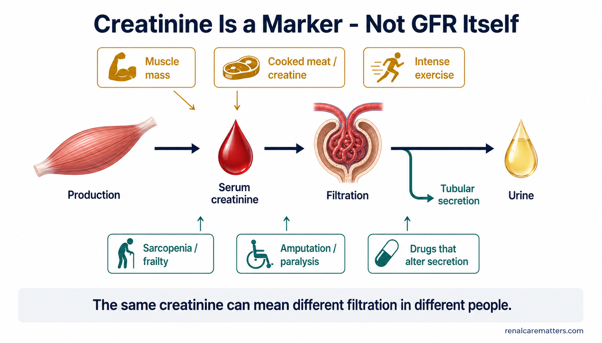
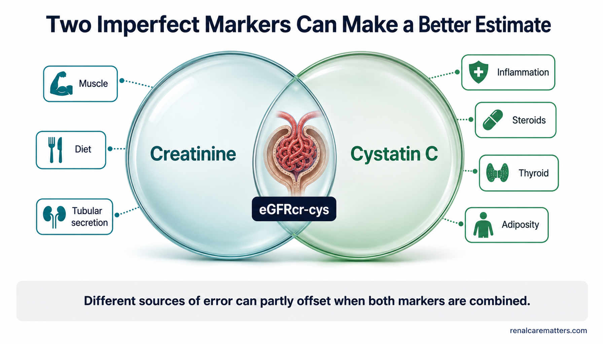
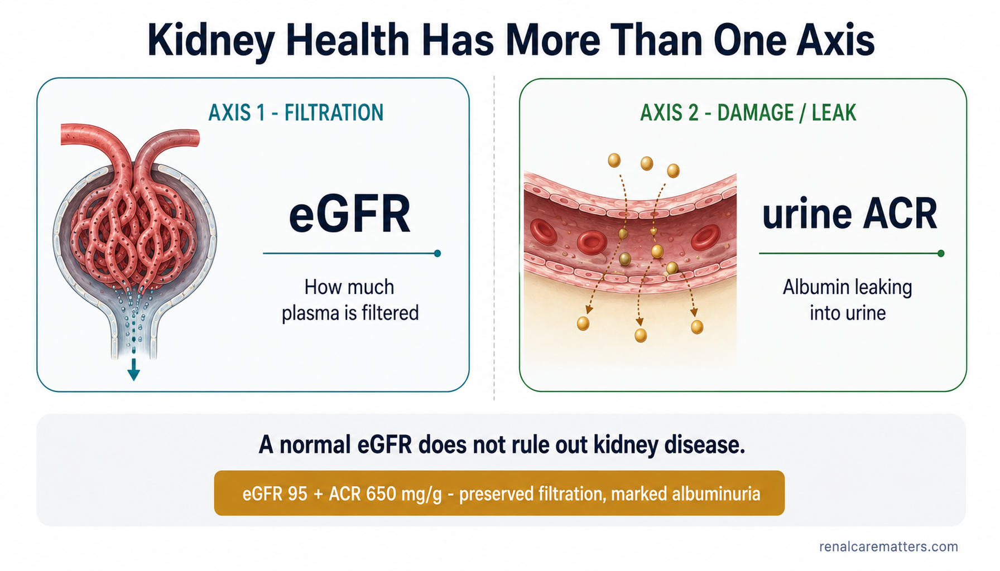

# Image Plan — How to Properly Assess Your Kidney Function

**Guide:** `guides/how-to-properly-assess-kidney-function.html`
**Slug:** `how-to-properly-assess-kidney-function`
**Live URL:** https://renalcarematters.com/guides/how-to-properly-assess-kidney-function.html
**Companion calculator:** `guides/calc-which-kidney-test.html`
**Evidence horizon:** 7 Aug 2026 · KDIGO 2024 aligned
**Prompt-authoring skills used:** `williamriveromd-hero-vignette` (hero) · `williamriveromd-simple-figure` (in-body figures) · `williamriveromd-infographic-skill` (OG card + checklist) · `williamriveromd-algorithm-generator-skill` (decision flowchart, House-Style Mode C)

---

## How to produce these (workflow)

1. Paste each **PROMPT** block below into the ChatGPT **Image Generator GPT** (`https://chatgpt.com/g/g-pmuQfob8d-image-generator`), one at a time.
2. Verify every rendered word, unit, and arrow **by eye** — regenerate on any misspelling, wrong unit, reversed arrow, or misleading relationship (see each image's QUALITY CHECK). Do **not** trust generated typography blindly; if a label is critical and keeps garbling, render the figure without the dense label and overlay the text in HTML/CSS instead.
3. Save each as `images/<filename>.png` **and** a WebP twin `images/<filename>.webp`.
4. Wire images 04–07 into the guide (paste-ready `<figure>` HTML is under each). Images 01 (ladder), the hero vignette, and the OG card are **already referenced** in the guide/head — producing the files makes them appear.
5. After adding files, run `python3 patch_hero_fetchpriority.py --guide how-to-properly-assess-kidney-function.html` and `python3 patch_hero_maxwidth.py --guide …` so the hero ships LCP-optimized, then re-run `patch_image_lightbox.py` (already installed) and confirm each `<figure>` carries a `<figcaption class="fig-desc">`.

### Global house style (baked into every prompt)
- **Light background only** — white `#ffffff`, off-white `#fafafa`, soft gray `#f3f4f6`, light teal tint `#eef6f7`. Never navy/charcoal/black fills.
- Palette: navy `#0f1e2e` (text/structure), clinical teal `#1a6b72`, renal green `#1f7a4d`, amber/gold `#b8860b`, clinical red `#b91c1c`, soft purple `#6c3d8e`.
- **Fonts:** only Inter / Nunito Sans / IBM Plex Sans / Manrope. Never serif.
- **Attribution:** `renalcarematters.com` (bottom-right; bottom-center for portrait) on every figure — **except the wordless hero vignette**, which carries no text at all.
- **No "percent kidney function"** iconography, no gauge implying a percentage, no fake lab values beyond those specified, no logos.

### Plan at a glance

| # | File | Section placement | Skill / archetype | Size | Status |
|---|------|-------------------|-------------------|------|--------|
| OG | `…-og.png` | `og:image` (head) | infographic · OG card | 1200×630 | **referenced — produce file** |
| Hero | `…-vignette-hero.png` | hero `.hero-vignette` | hero-vignette · Scaffold C anatomy | 2048×2048 | **referenced — produce file** |
| 01 | `…-01-measurement-ladder.png` | §The 60-Second Answer (`#answer`) | simple-figure · step sequence | 1792×1024 | **referenced (live figure) — produce file** |
| 02 | `…-02-creatinine-marker-not-gfr.png` | §Creatinine (`#creatinine`) | simple-figure · mechanism | 1792×1024 | recommended add |
| 03 | `…-03-two-lenses-creatinine-cystatin.png` | §Cystatin C (`#cystatin`) | simple-figure · mechanism | 1792×1024 | recommended add |
| 04 | `…-04-gfr-and-albuminuria-two-axes.png` | §Urine Albumin (`#uacr`) | simple-figure · comparison | 1792×1024 | recommended add |
| 05 | `…-05-which-kidney-test-algorithm.png` | §Calculators (`#tools`) + calc page | algorithm · House-Style C | 1024×1536 | recommended add |
| 06 | `…-06-measured-gfr-process.png` | §Measured GFR (`#md-mgfr`, clinician) | simple-figure · step sequence | 1792×1024 | recommended add |
| 07 | `…-07-prepare-for-kidney-test.png` | §How to Prepare (`#prepare`) | infographic · checklist | 1792×1024 | recommended add |

> Optional (not scheduled): an "eGFR ±30% uncertainty band" figure is **intentionally omitted** — the guide already renders that concept natively as an HTML `.uband` component in the clinician Equations section, so a raster version would duplicate it. Add only if you later want a social-clip version.

---

## OG — Open Graph share card

```
FILE NAME:
how-to-properly-assess-kidney-function-og.png

IMAGE TYPE:
OG / social share card (editorial, light background)

ASPECT RATIO:
1.91:1

PIXEL DIMENSIONS:
1200 × 630

AUDIENCE:
mixed (patients + clinicians)

VISUAL GOAL:
Signal at a glance that kidney-function testing is a ladder of tests — creatinine, eGFR, cystatin C — with urine ACR as a separate damage signal, not another filtration test.

PROMPT:
Landscape Open Graph social card, exactly 1200 × 630 pixels, premium nephrology-education editorial aesthetic, off-white #fafafa background, ALL typography in Inter. LEFT 60% text-safe zone: a small clinical-teal #1a6b72 kicker reading "KIDNEY TESTS, EXPLAINED"; a large bold navy #0f1e2e headline "How to Properly Assess Your Kidney Function"; a smaller navy sub-line "Creatinine · eGFR · cystatin C · urine ACR". RIGHT 40%: a clean semi-photorealistic 3D warm red-brown human kidney beside four small stacked rounded test tiles labelled "Creatinine", "eGFR", "Cystatin C", and "uACR" in Inter; visually connect the first three tiles (Creatinine → eGFR → Cystatin C) as a single filtration-assessment chain with thin teal #1a6b72 connectors, and set the fourth tile "uACR" slightly offset with a short renal-green #1f7a4d marker to read as a separate kidney-damage signal, not part of the chain. Restrained teal #1a6b72 and renal-green #1f7a4d accents, generous negative space, mobile-legible. Small semi-transparent navy "renalcarematters.com" in the bottom-right corner.

NEGATIVE INSTRUCTIONS:
Avoid cartoon style, avoid clutter, avoid tiny unreadable labels, avoid AI gibberish text, avoid unrealistic anatomy, avoid overprocessed HDR, avoid generic stock-photo look, avoid excessive saturation. NEVER use dark, navy, charcoal, or black backgrounds — light backgrounds only. No percent sign, no percentage gauge, no fake numeric lab values, no logos, no syringe, no dialysis machine. Use ONLY Inter, Nunito Sans, IBM Plex Sans, or Manrope — no serif fonts. Never omit the renalcarematters.com attribution.

QUALITY CHECK:
Exactly 1200 × 630. Light background. Headline legible as a thumbnail. Exactly four test tiles spelled Creatinine / eGFR / Cystatin C / uACR; the first three read as one filtration chain and uACR reads as a separate signal. No percent sign anywhere. renalcarematters.com visible bottom-right. Pair with meta og:image:width="1200" and og:image:height="630".
```

---

## Hero — circular vignette (wordless)

```
FILE NAME:
how-to-properly-assess-kidney-function-vignette-hero.png

IMAGE TYPE:
Circular vignette hero v3 — Scaffold C (calm 3D anatomy / object hero)

ASPECT RATIO:
1:1 (square — displayed inside an 85–90% inscribed circle with a white margin)

PIXEL DIMENSIONS:
2048 × 2048

COMPOSITION ARCHETYPE:
I — Object Hero (single dominant object, small environmental detail only)

CAMERA:
three-quarter macro, slightly above eye level, shallow depth of field

HUMAN VARIATION (vs. previous guide):
no people (single-subject anatomical still — deliberately distinct from the person-led heroes of adjacent guides)

AUDIENCE:
mixed (patients + clinicians)

VISUAL GOAL:
Convey "increasing measurement precision on one kidney" — a kidney viewed through a layered measurement lens — with a separate small urine drop hinting that damage is a different dimension.

PROMPT:
Square 1:1 semi-photorealistic 3D medical illustration on a 2048×2048 canvas, composed to be displayed inside a CIRCULAR vignette occupying 85–90% of the canvas diameter with a visible WHITE BORDER around the full circle (the circle must never touch the canvas edges). Composition archetype: I — Object Hero. Camera: three-quarter macro with soft studio lighting and shallow depth of field.

Subject: a single anatomically accurate warm red-brown human kidney, centered slightly lower-right on a soft light teal-tinted #eef6f7 background. In front of the kidney, a clear glass-like measurement lens / magnifier is subtly divided into three concentric visual layers that read as increasing precision, without any text: an innermost small blood-drop / creatinine cue in a muted red, a middle clinical-teal #1a6b72 fine filtration-grid cue, and an outer precise renal-green #1f7a4d clearance ring. A separate tiny clear urine-drop cue floats to one side to represent kidney-damage assessment as a different dimension. Restrained clinical colour (renal reds, teal and green accents), gentle soft shadow beneath.

Visual hierarchy: the kidney-and-lens occupies 60–70% of the circle; the three precision layers and the single urine drop are the 2–4 supporting elements (20–30%); reserve a 20–25% TITLE SAFE ZONE of empty soft teal-tinted gradient in the upper-left of the circle (no anatomy, leader lines, labels, or callouts in that zone) so the HTML title can sit beside the disc. Soft edge falloff toward a slightly deeper neutral at the rim. Full-bleed within the inscribed circle, no rectangular borders.

Absolutely NO text of any kind — no title, subtitle, caption, label, leader line, percentage, logo, or watermark. Clean render only.

NEGATIVE INSTRUCTIONS:
Avoid busy layouts, collage overload, more than four supporting elements, dozens of icons, tiny unreadable labels, infographic clutter, cropped circle, cropped anatomy, edge clipping, objects touching the circular border, important content inside the title safe zone, baked-in text/titles/captions/logos/watermarks, rectangular borders/frames/banners, dark/charcoal/black backgrounds, cartoon style, neon, HDR, over-saturation, implausible anatomy, and any percentage or gauge imagery.

QUALITY CHECK:
Square 2048×2048. Circle occupies 85–90% of canvas with a visible white margin — never cropped. ONE dominant subject (kidney + layered lens) at 60–70% of the circle, the three precision layers + one urine drop as supporting elements, a 20–25% empty title-safe zone reserved upper-left. Light teal-tinted background — never dark. Absolutely no text anywhere. Crops cleanly inside the circle with nothing lost at the edges.
```

---

## 01 — The measurement ladder  ·  §`#answer` (LIVE figure)

```
FILE NAME:
how-to-properly-assess-kidney-function-01-measurement-ladder.png

IMAGE TYPE:
Simple figure — Scaffold C, ascending step sequence with a parallel rail

ASPECT RATIO:
16:9

PIXEL DIMENSIONS:
1792 × 1024

AUDIENCE:
mixed (patients + clinicians)

VISUAL GOAL:
Show four ascending rungs of filtration testing (creatinine → eGFRcr → eGFRcr-cys → measured GFR) with urine ACR set below as a separate damage axis — never a fifth rung.

PROMPT:
Clean clinical education infographic, white #ffffff background, ALL text in Inter. Title at top-center in bold navy #0f1e2e: "The Kidney-Filtration Measurement Ladder". Subtitle in clinical teal #1a6b72: "Add precision only when the decision needs it". Four rounded rectangular step cards arranged as an ASCENDING staircase from lower-left to upper-right, each higher than the last, connected by bold navy up-right arrows. STEP 1, teal #1a6b72 top accent, small blood-tube icon, bold label "Serum creatinine", sub-line "measured marker". STEP 2, deeper teal-navy top accent, small calculator icon, bold label "eGFRcr", sub-line "estimated filtration". STEP 3, renal-green #1f7a4d top accent, small paired-biomarkers icon, bold label "eGFRcr-cys", sub-line "creatinine + cystatin C". STEP 4, deep green #14603a top accent, small timed-clearance (clock + vial) icon, bold label "Measured GFR", sub-line "exogenous-marker clearance". Beneath the whole staircase, on a soft gray #f3f4f6 band, draw a SEPARATE horizontal amber #b8860b rail with a dashed outline, a small urine-drop icon, and the label "Kidney damage is a different axis — urine ACR + urinalysis"; this rail must run parallel and clearly NOT be a fifth step of the staircase. Generous whitespace, mobile-readable labels ≥11pt. Small semi-transparent navy "renalcarematters.com" in the bottom-right corner.

NEGATIVE INSTRUCTIONS:
Avoid cartoon style, avoid clutter, avoid tiny unreadable labels, avoid AI gibberish text, avoid unrealistic anatomy, avoid overprocessed HDR, avoid excessive saturation. NEVER use dark, navy, charcoal, or black backgrounds — light backgrounds only. Do NOT draw urine ACR as a fifth ascending step; keep it on a separate parallel rail. No percentages. Use ONLY Inter, Nunito Sans, IBM Plex Sans, or Manrope — no serif fonts. Never omit the renalcarematters.com attribution.

QUALITY CHECK:
Exactly four ascending steps labelled Serum creatinine / eGFRcr / eGFRcr-cys / Measured GFR, rising left-to-right. The urine-ACR rail is visually separate and parallel — clearly not a rung. Light background, mobile-readable, no percentages. renalcarematters.com bottom-right.
```

*This figure is already embedded in the guide (`#answer`). No HTML change needed once the file exists.*

---

## 02 — Creatinine is a marker, not GFR  ·  §`#creatinine`

```
FILE NAME:
how-to-properly-assess-kidney-function-02-creatinine-marker-not-gfr.png

IMAGE TYPE:
Simple figure — Scaffold D, single mechanism / one-panel poster

ASPECT RATIO:
16:9

PIXEL DIMENSIONS:
1792 × 1024

AUDIENCE:
mixed (patients + clinicians)

VISUAL GOAL:
Show creatinine as a balance (production → blood → filtration → small tubular secretion → urine) that non-GFR factors can shift up or down, so the same value means different filtration in different people.

PROMPT:
Medical physiology infographic, AJKD/NEJM graphical-abstract style, white #ffffff background, ALL text in Inter, clean flat-vector plus restrained semi-3D accents. Title at top in bold navy #0f1e2e: "Creatinine Is a Marker — Not GFR Itself". A central left-to-right physiology pathway: a stylized skeletal muscle labelled "Production" → a red blood drop labelled "Serum creatinine" → an anatomically clean glomerulus labelled "Filtration" → a small downward tubular side-arrow labelled "Tubular secretion" → a urine droplet labelled "Urine". ABOVE the pathway, three small amber #b8860b modifier chips pointing toward creatinine, each with a small icon: "Muscle mass", "Cooked meat / creatine", "Intense exercise". BELOW the pathway, three small clinical-teal #1a6b72 modifier chips: "Sarcopenia / frailty", "Amputation / paralysis", "Drugs that alter secretion". A bottom full-width soft gray #f3f4f6 strip with a navy #0f1e2e takeaway sentence: "The same creatinine can mean different filtration in different people." Clinical palette navy / teal / renal-green / amber, generous whitespace, mobile-readable labels. Small semi-transparent navy "renalcarematters.com" in the bottom-right corner.

NEGATIVE INSTRUCTIONS:
Avoid cartoon style, avoid clutter, avoid tiny unreadable labels, avoid AI gibberish text, avoid unrealistic anatomy, avoid overprocessed HDR, avoid excessive saturation. NEVER use dark, navy, charcoal, or black backgrounds — light backgrounds only. No alarming or damaged-kidney imagery, no percentages. Use ONLY Inter, Nunito Sans, IBM Plex Sans, or Manrope — no serif fonts. Never omit the renalcarematters.com attribution.

QUALITY CHECK:
The pathway reads Production → Serum creatinine → Filtration → Tubular secretion → Urine, left to right. Three amber "raise" modifiers above, three teal "lower/alter" modifiers below. Takeaway sentence legible. Light background, no percentages. renalcarematters.com bottom-right.
```

**Paste-ready `<figure>` — insert in `guides/how-to-properly-assess-kidney-function.html`, at the end of `<section … id="creatinine">`, right before its closing `</section>`:**

```html
  <figure style="margin:28px 0 0;">
    <picture>
      <source srcset="../images/how-to-properly-assess-kidney-function-02-creatinine-marker-not-gfr.webp" type="image/webp">
      
    </picture>
    <figcaption>
      <p class="fig-desc">Serum creatinine is a balance — made by muscle, carried in blood, filtered by the kidney with a small tubular-secretion component, then passed in urine. Factors above (amber) can raise it without an equal fall in filtration; factors below (teal) can lower it and make filtration look better than it is. The same creatinine can mean different GFR in different people.</p>
      <dl class="fig-abbrevs">
        <dt>GFR</dt><dd>Glomerular filtration rate</dd>
      </dl>
    </figcaption>
  </figure>
```

---

## 03 — Two imperfect lenses (creatinine + cystatin C)  ·  §`#cystatin`

```
FILE NAME:
how-to-properly-assess-kidney-function-03-two-lenses-creatinine-cystatin.png

IMAGE TYPE:
Simple figure — Scaffold D, single-concept mechanism (two overlapping lenses)

ASPECT RATIO:
16:9

PIXEL DIMENSIONS:
1792 × 1024

AUDIENCE:
mixed (patients + clinicians)

VISUAL GOAL:
Show that two markers with different distortions, combined, focus more accurately on true filtration than either alone.

PROMPT:
Clinical concept infographic, AJKD/NEJM graphical-abstract style, white #ffffff background, ALL text in Inter. Title at top-center in bold navy #0f1e2e: "Two Imperfect Markers Can Make a Better Estimate". LEFT: a large translucent clinical-teal #1a6b72 lens labelled "Creatinine", with three small surrounding influence chips: "Muscle", "Diet", "Tubular secretion". RIGHT: a large translucent renal-green #1f7a4d lens labelled "Cystatin C", with four small surrounding influence chips: "Inflammation", "Steroids", "Thyroid", "Adiposity". The two transparent lenses OVERLAP in the center, and where they overlap they bring a small crisp glomerulus into sharp focus; place a central navy #0f1e2e label on the overlap reading "eGFRcr-cys". A bottom full-width soft gray #f3f4f6 strip with a navy takeaway: "Different sources of error can partly offset when both markers are combined." Premium, calm, generous whitespace, mobile-readable labels. Small semi-transparent navy "renalcarematters.com" in the bottom-right corner.

NEGATIVE INSTRUCTIONS:
Avoid cartoon style, avoid clutter, avoid tiny unreadable labels, avoid AI gibberish text, avoid unrealistic anatomy, avoid overprocessed HDR, avoid excessive saturation. NEVER use dark, navy, charcoal, or black backgrounds — light backgrounds only. Do not imply either marker is perfect; no percentages. Use ONLY Inter, Nunito Sans, IBM Plex Sans, or Manrope — no serif fonts. Never omit the renalcarematters.com attribution.

QUALITY CHECK:
Teal "Creatinine" lens (Muscle/Diet/Tubular secretion) on the left, green "Cystatin C" lens (Inflammation/Steroids/Thyroid/Adiposity) on the right, overlapping to focus a glomerulus labelled "eGFRcr-cys". Takeaway legible. Light background, no percentages. renalcarematters.com bottom-right.
```

**Paste-ready `<figure>` — insert at the end of `<section … id="cystatin">`, before its closing `</section>` (after the "When cystatin C is especially worth adding" table):**

```html
  <figure style="margin:28px 0 0;">
    <picture>
      <source srcset="../images/how-to-properly-assess-kidney-function-03-two-lenses-creatinine-cystatin.webp" type="image/webp">
      
    </picture>
    <figcaption>
      <p class="fig-desc">Two filtration markers with different blind spots. Creatinine is thrown off by muscle, diet and tubular secretion; cystatin C by inflammation, steroids, thyroid and body fat. Because their errors differ, combining them (eGFRcr-cys) focuses on true filtration more accurately than either marker alone.</p>
      <dl class="fig-abbrevs">
        <dt>eGFR<sub>cr-cys</sub></dt><dd>Estimated GFR from creatinine + cystatin C</dd>
      </dl>
    </figcaption>
  </figure>
```

---

## 04 — GFR and albuminuria are two axes  ·  §`#uacr`

```
FILE NAME:
how-to-properly-assess-kidney-function-04-gfr-and-albuminuria-two-axes.png

IMAGE TYPE:
Simple figure — Scaffold B, side-by-side comparison (two axes)

ASPECT RATIO:
16:9

PIXEL DIMENSIONS:
1792 × 1024

AUDIENCE:
mixed (patients + clinicians)

VISUAL GOAL:
Establish filtration (eGFR) and damage/leak (urine ACR) as two independent axes — a normal eGFR does not rule out kidney disease.

PROMPT:
Medical education comparison infographic, AJKD/NEJM graphical-abstract style, white #ffffff background, ALL text in Inter. Title centered at top in bold navy #0f1e2e: "Kidney Health Has More Than One Axis". A soft dashed vertical divider splits the canvas into two equal rounded panels, with NO arrow between them (they are parallel, not sequential). LEFT panel, teal/navy theme: a clean glomerular-filter icon, a small kicker "AXIS 1 · FILTRATION" in clinical teal #1a6b72, a large navy label "eGFR", and a caption "How much plasma is filtered". RIGHT panel, renal-green/amber theme: a glomerular capillary with a few small albumin particles crossing the wall into the urine space, a small kicker "AXIS 2 · DAMAGE / LEAK" in renal green #1f7a4d, a large navy label "urine ACR", and a caption "Albumin leaking into urine". Across the bottom, a full-width soft gray #f3f4f6 strip with a bold navy sentence: "A normal eGFR does not rule out kidney disease." Include one small rounded example chip in amber #b8860b: "eGFR 95 + ACR 650 mg/g → preserved filtration, marked albuminuria". Rounded panel corners, ample negative space, mobile-readable labels ≥11pt. Small semi-transparent navy "renalcarematters.com" in the bottom-right corner.

NEGATIVE INSTRUCTIONS:
Avoid cartoon style, avoid clutter, avoid tiny unreadable labels, avoid AI gibberish text, avoid unrealistic anatomy, avoid overprocessed HDR, avoid excessive saturation. NEVER use dark, navy, charcoal, or black backgrounds — light backgrounds only. No flow arrow between the two panels (they are independent axes); no percent-kidney gauge; do not name a specific disease. Use ONLY Inter, Nunito Sans, IBM Plex Sans, or Manrope — no serif fonts. Never omit the renalcarematters.com attribution.

QUALITY CHECK:
Two equal parallel panels — left "eGFR / How much plasma is filtered", right "urine ACR / Albumin leaking into urine" — with no connecting arrow. Bottom sentence "A normal eGFR does not rule out kidney disease." The example chip reads eGFR 95 + ACR 650 mg/g. Light background. renalcarematters.com bottom-right.
```

**Paste-ready `<figure>` — insert in `<section … id="uacr">`, immediately after the `.axis-grid` block (before the "Because they are separate…" paragraph), or at the end of the section before `</section>`:**

```html
  <figure style="margin:28px 0 0;">
    <picture>
      <source srcset="../images/how-to-properly-assess-kidney-function-04-gfr-and-albuminuria-two-axes.webp" type="image/webp">
      
    </picture>
    <figcaption>
      <p class="fig-desc">Kidney health has two independent axes. Filtration is measured by eGFR; damage is measured by the urine albumin-to-creatinine ratio (ACR). They do not move together — someone can have a normal eGFR with heavy albuminuria and real kidney disease. There is no arrow between the panels because neither causes the other; they are read side by side.</p>
      <dl class="fig-abbrevs">
        <dt>eGFR</dt><dd>Estimated glomerular filtration rate</dd>
        <dt>ACR</dt><dd>Albumin-to-creatinine ratio</dd>
      </dl>
    </figcaption>
  </figure>
```

---

## 05 — Which kidney test do you need? (algorithm)  ·  §`#tools` (+ calc page)

*Authored with `williamriveromd-algorithm-generator-skill`, House-Style Mode C.*

```
FILE NAME:
how-to-properly-assess-kidney-function-05-which-kidney-test-algorithm.png

IMAGE TYPE:
Clinical algorithm flowchart — renalcarematters.com House-Style (Mode C)

ASPECT RATIO:
2:3 (portrait)

PIXEL DIMENSIONS:
1024 × 1536

AUDIENCE:
mixed (patients + clinicians)

VISUAL GOAL:
Route a reader to the right rung of the kidney-test ladder, with an urgent red branch for acute illness and an amber side-note for special populations.

PROMPT:
Create a clean publication-ready clinical algorithm flowchart in the renalcarematters.com house style. White #ffffff background, restrained navy #0f1e2e and teal #1a6b72 typography set in Inter (never a serif font), thin teal connector arrows, portrait orientation, centered and symmetrical, generous margins, top-to-bottom clinical logic, publication-grade vector look. Title at top in bold navy: "Which Kidney Filtration Test Do You Need?".

Colour conventions: navy #0f1e2e for title and structural text; teal #1a6b72 rounded decision nodes; renal green #1f7a4d for recommended endpoint nodes; amber #b8860b for a caution side-note; clinical red #b91c1c for the urgent branch; soft gray for reminders.

Content to render (top to bottom):
- A red #b91c1c decision node near the very top, drawn as a short side branch off the entry: "Rapidly changing creatinine, acute illness, or very low urine output?" → red endpoint: "Do not rely on steady-state eGFR — clinical AKI assessment".
- Main trunk decision node (teal): "Routine assessment / CKD risk?" → green endpoint: "Serum creatinine + validated eGFR; add urine ACR for kidney damage".
- Next decision node (teal): "Could creatinine mislead (muscle, diet, drug) OR is the result near an important decision threshold?" → green endpoint: "Add cystatin C → use combined eGFRcr-cys".
- Next decision node (teal): "Are both markers unreliable OR is very high accuracy required?" → green endpoint: "Consider measured GFR using standardized exogenous-marker clearance".
- A small amber #b8860b side note box near the bottom: "Pregnancy, children, transplant donors, and narrow-therapeutic-index drugs need special pathways."

Design requirements: clear title, rounded rectangles for actions/endpoints and diamond or distinctly-shaped teal nodes for decisions, consistent node widths and spacing, clean top-to-bottom arrows with no crossing connectors, no dark background, no photorealistic people, no clutter. Include a small professional footer reading "© renalcarematters.com" at the bottom-right corner in subtle gray medical-publication styling.

NEGATIVE INSTRUCTIONS:
Avoid cartoon style, spaghetti connectors, crossing arrows, tiny unreadable labels, AI gibberish text, and clutter. NEVER use a dark background. No percentages, no percent-kidney gauge. Use ONLY Inter, Nunito Sans, IBM Plex Sans, or Manrope — no serif fonts. Never omit the © renalcarematters.com footer.

QUALITY CHECK:
Portrait 1024×1536, light background. One red urgent branch (acute illness → clinical AKI assessment), three green endpoints in ascending precision (creatinine+eGFR+uACR → combined eGFRcr-cys → measured GFR), one amber special-population side note. No crossing connectors, mobile-readable. © renalcarematters.com bottom-right.
```

**Paste-ready `<figure>` — insert in `<section … id="tools">`, right after the intro paragraph and before the first `.calc-cards-wrap` (portrait art is capped so it doesn't render oversized):**

```html
  <figure style="margin:24px auto 8px;">
    <picture>
      <source srcset="../images/how-to-properly-assess-kidney-function-05-which-kidney-test-algorithm.webp" type="image/webp">
      
    </picture>
    <figcaption>
      <p class="fig-desc">A decision map for choosing a kidney-filtration test. An urgent red branch peels off first for acute illness — where a steady-state eGFR should not be trusted and clinical AKI assessment is needed. Otherwise the trunk climbs in precision: routine creatinine + eGFR (with urine ACR) → add cystatin C for a combined estimate when creatinine may mislead → measured GFR for the highest-stakes decisions. An amber note flags special populations that need dedicated pathways.</p>
      <dl class="fig-abbrevs">
        <dt>eGFR<sub>cr-cys</sub></dt><dd>Estimated GFR from creatinine + cystatin C</dd>
        <dt>AKI</dt><dd>Acute kidney injury</dd>
        <dt>ACR</dt><dd>Albumin-to-creatinine ratio</dd>
      </dl>
    </figcaption>
  </figure>
```

*Re-use note: this same file also works well as an in-body figure on `guides/calc-which-kidney-test.html` (in the `#ladder` section), since the calculator implements exactly this logic.*

---

## 06 — What measured GFR actually does  ·  §`#md-mgfr` (clinician)

```
FILE NAME:
how-to-properly-assess-kidney-function-06-measured-gfr-process.png

IMAGE TYPE:
Simple figure — Scaffold C, horizontal 4-step process

ASPECT RATIO:
16:9

PIXEL DIMENSIONS:
1792 × 1024

AUDIENCE:
clinicians (also readable by patients)

VISUAL GOAL:
Explain the mGFR workflow (give marker → distribute → timed samples → clearance) and warn that a nuclear image alone is not a global mGFR.

PROMPT:
Publication-grade biomedical process schematic, AJKD/NEJM graphical-abstract style, white #ffffff background, ALL text in Inter. Title at top in bold navy #0f1e2e: "Measured GFR: When the Estimate Is Not Enough". Four simple ordered rounded panels on a soft gray #f3f4f6 band, connected left-to-right by thin clinical-teal #1a6b72 arrows, each panel with a small clean icon and a short label: Panel 1 "Give a known exogenous filtration marker" with a small IV vial icon; Panel 2 "Marker distributes in plasma" with a blood-vessel icon; Panel 3 "Timed blood and/or urine samples" with a clock + sample-tubes icon; Panel 4 "Clearance calculation → mGFR" with a calculator + crisp glomerulus icon. A small footer line in navy: "Examples: iohexol, iothalamate, 51Cr-EDTA — protocol and sampling time matter." A separate small amber #b8860b caution note: "A nuclear kidney image alone is not the same as a standardized GFR clearance measurement." Restrained clinical colours, generous whitespace, mobile-readable labels. Small semi-transparent navy "renalcarematters.com" in the bottom-right corner.

NEGATIVE INSTRUCTIONS:
Avoid cartoon style, avoid clutter, avoid tiny unreadable labels, avoid AI gibberish text, avoid unrealistic anatomy, avoid overprocessed HDR, avoid excessive saturation. NEVER use dark, navy, charcoal, or black backgrounds — light backgrounds only. No radiation-hazard drama, no unnecessary medical equipment, no percentages. Use ONLY Inter, Nunito Sans, IBM Plex Sans, or Manrope — no serif fonts. Never omit the renalcarematters.com attribution.

QUALITY CHECK:
Four ordered panels: give marker → distributes in plasma → timed samples → clearance → mGFR. Footer names iohexol / iothalamate / 51Cr-EDTA. Amber caution that a nuclear image alone is not a global mGFR. Light background, no percentages. renalcarematters.com bottom-right.
```

**Paste-ready `<figure>` — insert inside `<section … id="md-mgfr">`, within the `<div style="padding-top:40px;">`, right after the "The mGFR process" paragraph:**

```html
    <figure style="margin:28px 0;">
      <picture>
        <source srcset="../images/how-to-properly-assess-kidney-function-06-measured-gfr-process.webp" type="image/webp">
        
      </picture>
      <figcaption>
        <p class="fig-desc">How a measured GFR is obtained: a known dose of an exogenous filtration marker is given, allowed to distribute in plasma, then timed blood and/or urine samples measure how fast the kidney clears it — and clearance is calculated as the mGFR. Common markers are iohexol, iothalamate and 51Cr-EDTA. A nuclear tracer image on its own is not a global measured GFR; the clearance protocol is what makes it one.</p>
        <dl class="fig-abbrevs">
          <dt>mGFR</dt><dd>Measured glomerular filtration rate</dd>
          <dt>51Cr-EDTA</dt><dd>Chromium-51 ethylenediaminetetraacetic acid</dd>
        </dl>
      </figcaption>
    </figure>
```

---

## 07 — Before a creatinine / eGFR test (checklist)  ·  §`#prepare`

*Authored with `williamriveromd-infographic-skill`, multi-panel checklist archetype.*

```
FILE NAME:
how-to-properly-assess-kidney-function-07-prepare-for-kidney-test.png

IMAGE TYPE:
Patient-education infographic — checklist (multi-panel)

ASPECT RATIO:
16:9

PIXEL DIMENSIONS:
1792 × 1024

AUDIENCE:
patients

VISUAL GOAL:
A calm, non-judgmental five-item prep checklist for a creatinine/eGFR test, plus a urine-ACR tip.

PROMPT:
Patient-friendly clinical checklist infographic, clean modern nephrology-clinic aesthetic, off-white #fafafa background, ALL text in Inter. Title at top-center in bold navy #0f1e2e: "Before a Creatinine / eGFR Test". Five rounded checklist cards in a balanced row (or 3-over-2 grid), each on soft gray #f3f4f6 with a small green #1f7a4d check icon and a short label: (1) "Use your usual hydration — do not water-load"; (2) "For a precise comparison, avoid cooked meat or fish for at least 12 hours"; (3) "Avoid unusually strenuous exercise right before testing"; (4) "Tell your clinician about creatine supplements, diet changes, recent illness and medicines"; (5) "Do not stop prescribed medicines unless instructed". A bottom full-width clinical-teal #1a6b72 strip with white text: "For urine ACR, a first-morning midstream sample is preferred when feasible." Calm, reassuring, non-judgmental tone, navy/teal/green/amber accents, generous whitespace, mobile-readable labels ≥11pt. Small semi-transparent navy "renalcarematters.com" in the bottom-right corner.

NEGATIVE INSTRUCTIONS:
Avoid cartoon style, avoid clutter, avoid tiny unreadable labels, avoid AI gibberish text, avoid unrealistic anatomy, avoid overprocessed HDR, avoid excessive saturation, avoid a scolding or alarmist tone. NEVER use dark, navy, charcoal, or black backgrounds — light backgrounds only. No percentages. Use ONLY Inter, Nunito Sans, IBM Plex Sans, or Manrope — no serif fonts. Never omit the renalcarematters.com attribution.

QUALITY CHECK:
Exactly five prep cards with the specified text, plus a teal bottom strip about a first-morning midstream urine ACR sample. Calm, non-judgmental, light background, mobile-readable, no percentages. renalcarematters.com bottom-right.
```

**Paste-ready `<figure>` — insert inside `<section … id="prepare">`, right after the green `alert` checklist block, before `</section>`:**

```html
  <figure style="margin:28px 0 0;">
    <picture>
      <source srcset="../images/how-to-properly-assess-kidney-function-07-prepare-for-kidney-test.webp" type="image/webp">
      
    </picture>
    <figcaption>
      <p class="fig-desc">A calm prep checklist for a creatinine/eGFR blood test: keep your usual hydration (do not water-load), skip cooked meat or fish for at least 12 hours before a comparison test, avoid unusually strenuous exercise beforehand, tell your clinician about creatine/diet/illness/medicines, and never stop a prescribed medicine just for a "clean" result. For a urine ACR, a first-morning midstream sample is preferred.</p>
      <dl class="fig-abbrevs">
        <dt>eGFR</dt><dd>Estimated glomerular filtration rate</dd>
        <dt>ACR</dt><dd>Albumin-to-creatinine ratio</dd>
      </dl>
    </figcaption>
  </figure>
```

---

## Post-production checklist

- [ ] All 9 files saved as **both** `.png` and `.webp` in `images/`.
- [ ] Every rendered label, unit, and arrow verified by eye; regenerate on any error (units like `mg/g`, marker names `iohexol / iothalamate / 51Cr-EDTA`, and the "no fifth rung" rule for image 01 are the highest-risk).
- [ ] No image contains a **percent sign or a percent-kidney gauge** (site policy).
- [ ] Attribution present: `renalcarematters.com` (figures 01–04, 07), `© renalcarematters.com` (algorithm 05, 06) — **and none on the hero vignette**.
- [ ] Figures 02–07 wired into the guide with the paste-ready `<figure>` blocks (each already carries a `<figcaption class="fig-desc">` + abbreviations, per CLAUDE.md rules 11 & 13).
- [ ] Ran `patch_hero_fetchpriority.py`, `patch_hero_maxwidth.py`, `patch_hero_fullwidth.py` for the guide after the hero lands; `patch_image_lightbox.py` already installed.
- [ ] OG card is exactly **1200×630**; head `og:image:width`/`og:image:height` already set to those values.
