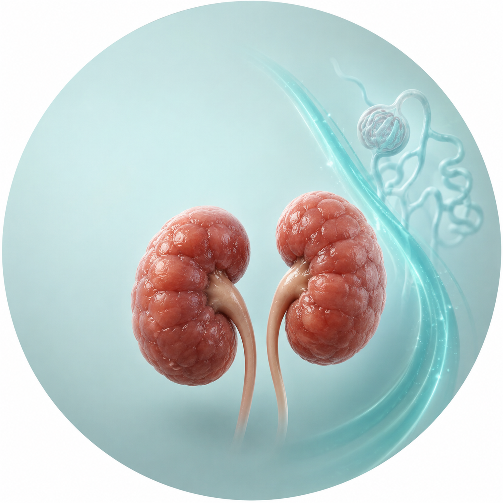

# Image Plan — `neonatal-acute-kidney-injury-clinician.html`
### Neonatal Acute Kidney Injury: A Clinician Guide · renalcarematters.com

**Stage 1 prompt pack** for the raster assets that illustrate this guide. Each
prompt is authored with the matching williamriveromd graphic skill, ready to
paste into the [ChatGPT Image Generator GPT](https://chatgpt.com/g/g-pmuQfob8d-image-generator).
Save each PNG (+ a `.webp` twin) into `images/`, then optionally hand the pack to
Stage 2 (`williamriveromd-local-image-generator`) for manifests + `og:image` wiring.

**Audience is clinicians only** (neonatologists, pediatric nephrologists, NICU
pharmacists, intensivists, trainees). On-image text is **English only**. There
are **no patient scenes and no identifiable distressed infants** — per the
source blueprint, this guide favours physiology schematics, comparison cards,
and calm anatomy over photographed newborns.

**Two figures are already built as inline SVG in the guide and need no raster
prompt** — do not regenerate them:
- **V3 "Creatinine is a trajectory"** (three conceptual curves) — `§ The Creatinine Problem`
- **V4 "Injury before dysfunction"** (susceptibility→consequences cascade) — `§ What Neonatal AKI Is`

**House rules applied to every prompt below:** light backgrounds only (navy /
teal are typography + accent, never a fill); the navy `#0f1e2e` / teal `#1a6b72`
/ renal-green `#1f7a4d` / amber `#b8860b` / clinical-red `#b91c1c` palette;
sans-serif type only (Inter / Nunito Sans / IBM Plex Sans / Manrope — named
explicitly in each prompt); mobile-readable labels; and the mandatory
`renalcarematters.com` attribution bottom-right (bottom-center for portrait).

> **Text-accuracy caveat (from the blueprint's Visual QA):** GPT-4o frequently
> garbles dense on-image text. The three text-heaviest assets here — the
> **diagnostic pathway (#5)**, the **follow-up router (#9)**, and the
> **marker-comparison card (#7)** — must be proofread letter-by-letter after
> generation. If the labels do not render cleanly, rebuild them as inline
> HTML/SVG (the same approach already used for V3/V4) rather than shipping a
> raster with wrong clinical text.

---

## Plan overview

| # | Section / use | File | Skill | Type | Size | Priority |
|---|---|---|---|---|---|---|
| 1 | Hero circular vignette (beside `<h1>`) | `neonatal-acute-kidney-injury-clinician-vignette-hero.png` | hero-vignette | Scaffold C — calm 3D anatomy | 2048 × 2048 (1:1) | High |
| 2 | OG / social share card | `neonatal-acute-kidney-injury-clinician-og.png` | infographic | OG editorial poster | **1200 × 630 (fixed)** | **Required** |
| 3 | §Why the newborn kidney differs — developmental origins | `neonatal-acute-kidney-injury-clinician-01-developmental-origins.png` | biomedical-mechanism-figure | Review-article schematic | 1792 × 1024 (16:9) | Medium |
| 4 | §Risk-first recognition — six-domain risk map | `neonatal-acute-kidney-injury-clinician-02-risk-map.png` | infographic | Radial reference card | 1792 × 1024 (16:9) | Medium |
| 5 | §Diagnostic approach — phenotype pathway | `neonatal-acute-kidney-injury-clinician-03-diagnostic-pathway.png` | algorithm-generator | Style Mode C — house style | 1024 × 1536 (2:3) | Medium |
| 6 | §Prevention — Baby NINJA surveillance loop | `neonatal-acute-kidney-injury-clinician-04-baby-ninja-workflow.png` | infographic | Circular workflow | 1024 × 1024 (1:1) | Medium |
| 7 | §Biomarkers — creatinine vs cystatin C vs uNGAL | `neonatal-acute-kidney-injury-clinician-05-marker-comparison.png` | infographic | Clinician reference card | 1536 × 1152 (4:3) | Medium |
| 8 | §KRT — modality comparison | `neonatal-acute-kidney-injury-clinician-06-krt-modalities.png` | infographic | Clinician reference card | 1792 × 1024 (16:9) | Low |
| 9 | §Post-NICU follow-up — consensus router | `neonatal-acute-kidney-injury-clinician-07-followup-router.png` | algorithm-generator | Style Mode C — house style | 1024 × 1536 (2:3) | Medium |

> **Hero wiring note.** The guide currently ships a **copy-only hero** (no
> `hero-figure`). To use asset #1, add the vignette markup inside `.hero-grid`,
> after `.hero-copy`:
> ```html
> <figure class="hero-figure">
>   <div class="hero-vignette">
>     <picture>
>       <source srcset="../images/neonatal-acute-kidney-injury-clinician-vignette-hero.webp" type="image/webp">
>       
>     </picture>
>   </div>
> </figure>
> ```
> `<body>` is already `physician-mode single-mode`, so the single-mode vignette
> bleed applies. Then re-run `patch_hero_fetchpriority.py`, `patch_hero_fullwidth.py`,
> and `patch_hero_maxwidth.py --guide neonatal-acute-kidney-injury-clinician.html`.

---

## 1 · Hero vignette — calm neonatal-kidney anatomy with a trajectory motif
*Skill: williamriveromd-hero-vignette · Scaffold C — calm 3D anatomy (wordless)*

> Square, masked into the round hero disc. One dominant subject, generous
> negative space, and a reserved title-safe zone. **No baked-in text** — the
> page renders the `<h1>` beside the circle.

```
FILE NAME: neonatal-acute-kidney-injury-clinician-vignette-hero.png
IMAGE TYPE: Circular vignette hero v3 — Scaffold C (calm 3D anatomy)
ASPECT RATIO: 1:1 (square — displayed inside an 85–90% inscribed circle with white margin)
PIXEL DIMENSIONS: 2048 × 2048
COMPOSITION ARCHETYPE: F — Anatomy
CAMERA: three-quarter, gentle studio lighting
HUMAN VARIATION (vs previous guide): no people
AUDIENCE: Clinicians
VISUAL GOAL: Convey the guide's thesis at a glance — the newborn kidney is fragile, and its creatinine is a descending trajectory, not a number.

PROMPT:
Square 1:1 semi-photorealistic 3D medical illustration on a 2048×2048 canvas, composed to be displayed inside a CIRCULAR vignette occupying 85–90% of the canvas diameter with a visible WHITE BORDER around the full circle (the circle must never touch the canvas edges). Composition archetype: F Anatomy. Camera: three-quarter view with soft studio lighting and a gentle shadow.

Subject: a single clean render of a pair of small, anatomically accurate NEWBORN kidneys (smooth, slightly lobulated fetal-type surface to read as neonatal, not adult), floating centered on a soft, uncluttered light teal-tinted background. Behind and to one side, a subtle, elegant translucent line-curve descends gently from upper-left toward lower-right — an abstract "creatinine trajectory" motif rendered as a soft glowing teal ribbon, clearly decorative and NOT a readable chart, with no axis numbers or words. Restrained clinical colour: natural renal reds and browns for the kidneys, teal #1a6b72 accent for the curve, on a light background.

Visual hierarchy: the kidney pair occupies 60–70% of the circle; the descending curve ribbon and one faint supporting structure (a small stylised nephron or a soft cluster of glomeruli) make up 20–30%; reserve a 20–25% TITLE SAFE ZONE of empty soft background in the upper-left (no anatomy, leader lines, labels, or callouts in that zone) so the HTML title can sit beside the disc. Soft edge falloff toward a slightly deeper neutral at the rim.

Absolutely NO text, labels, leader lines, callouts, numbers, titles, logos, or watermark — a clean render only. Full-bleed within the inscribed circle, no rectangular borders, frames, or banners.

NEGATIVE INSTRUCTIONS:
Avoid busy layouts, collage overload, more than four supporting elements, dozens of icons, tiny unreadable labels, infographic clutter, cropped circle, cropped anatomy, edge clipping, objects touching the circular border, important content inside the title safe zone, baked-in text/titles/captions/logos/watermarks, rectangular borders/frames/banners, dark/charcoal/black backgrounds, cartoon style, neon, HDR, over-saturation, adult-sized kidneys, any depiction of an infant or face, and implausible anatomy. The trajectory ribbon must not read as a real graph with numbers.

QUALITY CHECK:
Square 2048×2048. Circle occupies 85–90% of canvas with a visible white margin — never cropped. ONE dominant subject (the neonatal kidney pair) at 60–70% of the circle, a decorative descending teal ribbon + one faint anatomical support at 20–30%, and a 20–25% empty title-safe zone. No people, no text, no readable chart. Crops cleanly inside the circle with nothing lost at the edges.
```

---

## 2 · OG / social share card — editorial poster
*Skill: williamriveromd-infographic-skill · Archetype: OG editorial poster*

```
FILE NAME: neonatal-acute-kidney-injury-clinician-og.png
IMAGE TYPE: OG / social share card — editorial poster
ASPECT RATIO: 1.91:1
PIXEL DIMENSIONS: 1200 × 630 (fixed — never change)
AUDIENCE: Mixed (clinician-leaning)
VISUAL GOAL: A calm, premium share card that says "recognize kidney injury before creatinine tells the whole story."

PROMPT:
Publication-grade nephrology Open Graph card, exactly 1200 × 630 pixels, on an off-white (#fafafa) background with generous whitespace. All typography in the clean sans-serif font Inter.

LEFT text-safe zone (about 58% of the width): a small teal eyebrow label in uppercase reading "NEONATAL & PEDIATRIC NEPHROLOGY" in teal #1a6b72; below it a large bold navy (#0f1e2e) headline reading "Neonatal Acute Kidney Injury"; below that a lighter navy subhead reading "Recognize risk before creatinine tells the whole story." Keep the text crisp, high-contrast, and mobile-readable.

RIGHT illustration zone (about 42%): a restrained, semi-photorealistic clinical illustration of a single pair of small newborn kidneys in natural renal red, beside a clean descending creatinine-trajectory line that gently stalls into a plateau (a soft teal curve, decorative, with no readable axis numbers), and one small circular urine-output gauge glyph in renal green. Use navy, teal, renal-green, and a single amber caution accent.

Small semi-transparent navy attribution text "renalcarematters.com" in the bottom-right corner. Light, airy, calm, publication-grade — no baby photograph, no syringe, no futuristic effects, no decorative pseudo-data, no neon.

NEGATIVE INSTRUCTIONS:
Avoid cartoon style, avoid clutter, avoid tiny unreadable labels, avoid AI gibberish text, avoid unrealistic anatomy, avoid overprocessed HDR, avoid generic stock-photo look, avoid excessive saturation. NEVER use a dark, navy, charcoal, or black background — light background only. Use ONLY the sans-serif font Inter — no serif fonts, no decorative or handwritten typefaces. No infant photograph, no needles, no sci-fi elements. Never omit the renalcarematters.com attribution.

QUALITY CHECK:
Exactly 1200 × 630. Left-aligned headline block legible as a thumbnail; right-side illustration calm and clinically plausible; light background; renalcarematters.com attribution visible bottom-right. Pair with og:image:width="1200" and og:image:height="630".
```

---

## 3 · §Why the newborn kidney differs — developmental origins schematic
*Skill: williamriveromd-biomedical-mechanism-figure · Review-article schematic*

> Complements the inline SVG timeline with a richer organ→unit→outcome figure.
> Content is grounded in the guide: nephrogenesis to ~34–36 weeks, preterm
> interruption, two downstream branches. **Label "reduced nephron endowment" as
> risk, not inevitable CKD.**

```
FILE NAME: neonatal-acute-kidney-injury-clinician-01-developmental-origins.png
IMAGE TYPE: Biomedical mechanism schematic — review-article style
ASPECT RATIO: 16:9
PIXEL DIMENSIONS: 1792 × 1024
AUDIENCE: Clinicians
VISUAL GOAL: Show why the preterm kidney starts life with less reserve and two distinct downstream risks.

PROMPT:
Create a publication-grade biomedical mechanism schematic in a clean scientific review-article style, on a WHITE background, flat vector illustration with soft semi-3D shading, muted clinical palette (light gray-blue anatomy, soft yellow highlight, renal red for vessels, teal and blue accents), clean sans-serif labels set in Inter (never a serif font), thin dashed connector lines, generous whitespace, no photorealism and no dark background.

Topic: developmental origins of neonatal kidney vulnerability.

LEFT organ-level panel: a simplified fetal-to-newborn kidney cross-section labelled "Developing kidney" with a small gestational timeline beneath it marked "nephrogenesis → ~34–36 weeks" and "no new nephrons after term." Show a thin dashed connector box pointing to the magnified panel.

CENTER magnified panel (inside a dashed border): a single nephron / glomerulus being formed in the outer cortex, with the still-forming zone highlighted in soft yellow, and concise callouts: "low renal blood flow & GFR at birth (rise after birth)", "immature tubular transport & autoregulation", "small filtration reserve".

A red dashed vertical marker labelled "preterm birth interrupts nephron formation" cuts across the timeline.

BOTTOM summary flow (left → right arrows):
- Left pale-pink box (drivers): "Interrupted nephrogenesis + extrauterine stress (hypoxia, inflammation, vasoactive drugs, nephrotoxins)"
- Center box (bridge): "Reduced nephron endowment + limited reserve"
- Right — TWO pale-blue outcome boxes: (1) "Immediate: AKI susceptibility in the NICU"; (2) "Lifelong: reduced kidney reserve — a susceptibility factor, NOT a diagnosis of CKD".

Small semi-transparent navy attribution "© renalcarematters.com" in the bottom-right corner.

NEGATIVE INSTRUCTIONS:
Avoid photorealism, dark/charcoal/black backgrounds, decorative effects, cartoon styling, clutter, tiny unreadable labels, AI gibberish text, invented numeric thresholds, and adult-kidney anatomy. Use only the sans-serif font Inter. Do not imply reduced nephron endowment equals CKD. Never omit the renalcarematters.com attribution.

QUALITY CHECK:
Organ panel → dashed magnified nephron inset → bottom injury/bridge/two-outcome flow. Muted palette, white background, legible Inter labels, "reduced reserve ≠ CKD" preserved, attribution bottom-right.
```

---

## 4 · §Risk-first recognition — six-domain neonatal AKI risk map
*Skill: williamriveromd-infographic-skill · Archetype: radial clinician reference card*

> No scoring numbers — the guide deliberately avoids a universal additive risk
> score. Six labelled domains around a central neonatal kidney.

```
FILE NAME: neonatal-acute-kidney-injury-clinician-02-risk-map.png
IMAGE TYPE: Radial clinician reference card
ASPECT RATIO: 16:9
PIXEL DIMENSIONS: 1792 × 1024
AUDIENCE: Clinicians
VISUAL GOAL: Group neonatal AKI risk into six domains that trigger surveillance (not a probability score).

PROMPT:
Clinical reference infographic, publication-grade nephrology design, on a WHITE background with soft light-gray rounded cards, navy #0f1e2e headings, teal #1a6b72 accents, clean sans-serif type set in Inter. Landscape 16:9, calm and uncluttered, mobile-readable labels.

Center: a small, clean semi-3D illustration of a pair of newborn kidneys inside a soft teal-tinted circle, with a short title beneath reading "Risk-first recognition — trigger surveillance, not a score".

Around the center, six evenly spaced rounded domain cards connected by thin teal lines, each with a simple flat line icon and a short heading + 3–4 keyword examples:
1. "Developmental" — <28 weeks, birth weight <1500 g, growth restriction, low nephron endowment
2. "Hemodynamic / oxygen" — asphyxia / HIE, shock, hypotension, hypoxemia, significant PDA, cardiac surgery, ECMO
3. "Inflammatory / critical illness" — sepsis, NEC, multiorgan dysfunction, severe respiratory failure
4. "Kidney / urinary anatomy" — CAKUT, obstruction, renal vein or arterial thrombosis, solitary kidney
5. "Exposure" — aminoglycosides, vancomycin, other nephrotoxins, iodinated contrast, multiple concurrent nephrotoxins
6. "Iatrogenic / trajectory" — rapid fluid accumulation, recurrent AKI, dosing not updated for changing function

A small footer line reads "Any high-risk context → move the infant onto a surveillance pathway." Small semi-transparent navy attribution "renalcarematters.com" bottom-right.

NEGATIVE INSTRUCTIONS:
Avoid clutter, tiny unreadable labels, AI gibberish text, cartoon style, dark/navy/black backgrounds, neon, over-saturation, and any risk-score numbers or percentages. Use only the sans-serif font Inter. Never omit the renalcarematters.com attribution.

QUALITY CHECK:
Central neonatal-kidney hub with six clean domain cards, each with a legible heading + a few keywords, no probability numbers, light background, Inter type, attribution bottom-right.
```

---

## 5 · §Diagnostic approach — phenotype-based pathway
*Skill: williamriveromd-algorithm-generator-skill · Style Mode C (house style)*

> **Text-heavy — proofread every node; rebuild as SVG if garbled.** Portrait.
> Red is reserved for the urgent-escalation node only.

```
FILE NAME: neonatal-acute-kidney-injury-clinician-03-diagnostic-pathway.png
IMAGE TYPE: Clinical algorithm — renalcarematters.com house style (Style Mode C)
ASPECT RATIO: 2:3
PIXEL DIMENSIONS: 1024 × 1536
AUDIENCE: Clinicians
VISUAL GOAL: A top-to-bottom phenotype workflow for suspected neonatal AKI.

PROMPT:
Create a clean publication-ready clinical algorithm flowchart in the renalcarematters.com house style. White / very light off-white background, restrained navy #0f1e2e and teal #1a6b72 typography set in Inter (never a serif font), thin teal connector arrows, generous margins, centered and vertical, portrait orientation. Rounded rectangles for action nodes; teal for decision/assessment nodes; amber #b8860b for caution; red #b91c1c ONLY for the urgent-escalation node; green #1f7a4d for the consult endpoint.

Title at top: "Suspected Neonatal AKI — Phenotype-Based Workflow".

Top-to-bottom logic:
1. Trigger node (teal): "Rising OR failing-to-fall creatinine · low urine output · high-risk exposure"
2. "Verify the signal — repeat/confirm creatinine, validate urine-output method, plot weight & cumulative balance"
3. "Assess circulation & oxygen delivery — perfusion, BP trend, lactate in context, cardiac function, vasoactive support, hemoglobin"
4. "Define the fluid phenotype — depleted / euvolemic / overloaded / capillary leak (do not infer intravascular volume from edema)"
5. "Review infection & medications — sepsis, NEC, HIE; reconcile nephrotoxins, dosing interval, TDM, recent contrast"
6. "Exclude postrenal & vascular — bladder/catheter patency; ultrasound with Doppler if obstruction, thrombosis, or perfusion in question"
7. "Characterize consequences — K, Na, HCO3/acid-base, Ca, Mg, PO4, glucose, urea, fluid accumulation, nutrition delivery"
8. Amber caution node: "'Pre-renal' is a mechanism, not reassurance — sustained hypoperfusion can cause structural injury"
9. Green endpoint node: "Consult pediatric nephrology early — severe/progressive AKI, unclear cause, congenital/vascular disease, refractory complications, possible KRT"
A red side-note node connected near the top: "URGENT: refractory hyperkalemia/acidosis, symptomatic fluid overload, anuria — escalate now, do not wait for a creatinine threshold".

Include a small professional footer reading "© renalcarematters.com" at the bottom-center in subtle gray medical-publication styling.

NEGATIVE INSTRUCTIONS:
No dark background, no clutter, no photorealistic people, no cartoon styling, no spaghetti arrows, no invented numeric thresholds, no tiny unreadable text. Use only the sans-serif font Inter. Keep red to the urgent node only. Never omit the © renalcarematters.com footer.

QUALITY CHECK:
Vertical, spacious, guideline-grade; every node legible; red reserved for urgent escalation; green consult endpoint; footer bottom-center. Proofread all clinical labels; if any word is malformed, rebuild as inline SVG.
```

---

## 6 · §Prevention — Baby NINJA surveillance loop
*Skill: williamriveromd-infographic-skill · Archetype 8: circular workflow*

> Trigger + surveillance numbers are grounded in the guide (Stoops 2019 QI
> program). Label "adapt to local policy — pharmacy-owned list."

```
FILE NAME: neonatal-acute-kidney-injury-clinician-04-baby-ninja-workflow.png
IMAGE TYPE: Circular clinical workflow
ASPECT RATIO: 1:1
PIXEL DIMENSIONS: 1024 × 1024
AUDIENCE: Clinicians
VISUAL GOAL: The Baby NINJA nephrotoxin-stewardship loop, from a pharmacy-owned list to audit.

PROMPT:
Circular clinical workflow infographic, polished nephrology systems diagram, on a WHITE background with soft light-gray and light-teal rounded nodes, navy #0f1e2e and teal #1a6b72 typography set in Inter, thin teal directional arrows forming a clean loop. Calm, uncluttered, mobile-readable.

Center: a small shield or clipboard glyph with a neonatal-kidney icon and the label "Baby NINJA — nephrotoxin stewardship (single-center QI evidence)".

Around it, six sequential steps connected by curved arrows:
1. "Pharmacy-owned, versioned nephrotoxin list"
2. "Trigger: ≥3 nephrotoxic meds in 24 h OR ≥4 calendar days of IV aminoglycoside"
3. "Surveillance: daily serum creatinine until 2 days after exposure ends or AKI resolves (whichever is later)"
4. "Review: necessity, combination burden, dose interval, therapeutic drug monitoring"
5. "Stop monitoring after the exposure / AKI window"
6. "Audit: exposure days, AKI events, balancing measures (blood sampling)"

A short footer strip reads "Adapt to local policy — bundle effect, single center, not a randomized trial." Small semi-transparent navy attribution "renalcarematters.com" bottom-right.

NEGATIVE INSTRUCTIONS:
Avoid clutter, tiny unreadable labels, AI gibberish text, cartoon style, dark/navy/black backgrounds, neon, over-saturation, and any invented percentages inside the loop. Use only the sans-serif font Inter. Keep the loop to six clean steps. Never omit the renalcarematters.com attribution.

QUALITY CHECK:
Clean six-step teal loop around a central Baby NINJA glyph, trigger and surveillance wording exact, "adapt to local policy" footer, light background, Inter type, attribution bottom-right.
```

---

## 7 · §Biomarkers — creatinine vs cystatin C vs uNGAL
*Skill: williamriveromd-infographic-skill · Archetype 5: clinician reference card*

> **Text-heavy — proofread. Do not rank one marker as universally best.**

```
FILE NAME: neonatal-acute-kidney-injury-clinician-05-marker-comparison.png
IMAGE TYPE: Clinician reference card — three-column comparison
ASPECT RATIO: 4:3
PIXEL DIMENSIONS: 1536 × 1152
AUDIENCE: Clinicians
VISUAL GOAL: What each marker measures, its strength, and its neonatal limitation — none is a stand-alone diagnosis.

PROMPT:
Clinical reference infographic card for clinicians, publication-grade nephrology design, on a WHITE background with three equal soft light-gray rounded columns, navy #0f1e2e headings and teal #1a6b72 rules, clean sans-serif type set in Inter. Calm, balanced, mobile-readable, no clutter.

Top header band (navy text on light): "Neonatal kidney markers — what each one actually measures". A subtitle reads "None is a biopsy or an etiologic diagnosis."

Three columns, each with a small clean icon and three short rows (What it measures / Strength / Neonatal limitation):
- Column 1 "Serum creatinine" — Measures: filtration (functional, late). Strength: universal, cheap, trendable. Limitation: maternal signal at birth, low muscle mass blunts sensitivity, fluid dilution.
- Column 2 "Cystatin C" — Measures: filtration. Strength: less muscle-mass dependent, minimal placental transfer. Limitation: neonatal reference intervals & AKI definitions not standardized; do not slot into KDIGO staging.
- Column 3 "Urinary NGAL (uNGAL)" — Measures: tubular injury (early signal). Strength: can rise before creatinine. Limitation: wide non-AKI range; varies by gestation, assay, inflammation — no universal cutoff.

Bottom take-home strip (teal): "Use markers together and in context — creatinine + urine output remain the staging basis." Small semi-transparent navy attribution "renalcarematters.com" bottom-right.

NEGATIVE INSTRUCTIONS:
Avoid clutter, tiny unreadable labels, AI gibberish text, cartoon style, dark/navy/black backgrounds, neon, over-saturation, invented numeric cutoffs, and any "best marker" ranking or trophy/checkmark implying one is superior. Use only the sans-serif font Inter. Never omit the renalcarematters.com attribution.

QUALITY CHECK:
Three balanced columns, each with measures/strength/limitation, "none is a diagnosis" subtitle, no marker ranked best, light background, Inter type, attribution bottom-right. Proofread every clinical word; rebuild as SVG if malformed.
```

---

## 8 · §KRT — modality comparison
*Skill: williamriveromd-infographic-skill · Archetype 5: clinician reference card*

> A modality **comparison**, not a circuit map. If the CKRT column shows a small
> filter glyph, keep it schematic; if a detailed hemofilter is drawn, follow the
> skill's hemofilter reference anatomy (two end ports = blood in/out; two side
> ports = dialysate in near venous end, effluent out near arterial end;
> replacement fluid into the blood line, never the shell port) — but a simple
> device silhouette is preferred here.

```
FILE NAME: neonatal-acute-kidney-injury-clinician-06-krt-modalities.png
IMAGE TYPE: Clinician reference card — three-column modality comparison
ASPECT RATIO: 16:9
PIXEL DIMENSIONS: 1792 × 1024
AUDIENCE: Clinicians
VISUAL GOAL: PD vs CKRT vs intermittent/prolonged — role and neonatal constraints, with the selection inputs.

PROMPT:
Clinical reference infographic card for clinicians, publication-grade nephrology design, on a WHITE background with three equal soft light-gray rounded columns, navy #0f1e2e headings, teal #1a6b72 rules, clean sans-serif type set in Inter. Landscape 16:9, calm and uncluttered.

Top header: "Neonatal kidney replacement therapy — modality selection". Subtitle: "Indications are clinical and trajectory-based, not a creatinine threshold."

Three columns, each with a simple flat device/anatomy icon and two short rows (Role / Neonatal constraints):
- Column 1 "Peritoneal dialysis (PD)" — Role: widely accessible; effective for many neonatal AKI scenarios; no vascular access or anticoagulation. Constraints: recent abdominal surgery, NEC, diaphragmatic defects, leaks; catheter access; ultrafiltration precision.
- Column 2 "Continuous KRT (CKRT)" — Role: continuous control in unstable infants; infant-dedicated systems reduce extracorporeal-volume mismatch. Constraints: vascular access, circuit volume, anticoagulation, staffing, machine availability. (Small schematic filter icon only.)
- Column 3 "Prolonged / intermittent" — Role: selected larger or more stable infants where expertise exists. Constraints: hemodynamic tolerance, fluid-shift precision.

Bottom selection-input strip (teal): "Choose by: hemodynamic stability · abdominal contraindications · vascular access · required precision · local expertise." Small semi-transparent navy attribution "renalcarematters.com" bottom-right.

NEGATIVE INSTRUCTIONS:
Avoid clutter, tiny unreadable labels, AI gibberish text, cartoon style, dark/navy/black backgrounds, neon, over-saturation, invented dwell volumes/doses/pressures, and any "best modality" ranking. Use only the sans-serif font Inter. If a filter is drawn, do not merge dialysate and blood paths. Never omit the renalcarematters.com attribution.

QUALITY CHECK:
Three balanced modality columns with role + constraints, selection-input footer, no fabricated prescription numbers, light background, Inter type, attribution bottom-right.
```

---

## 9 · §Post-NICU follow-up — consensus router
*Skill: williamriveromd-algorithm-generator-skill · Style Mode C (house style)*

> **Text-heavy — proofread; rebuild as SVG if garbled.** Reproduces the 2024
> modified-Delphi router (Starr 2024). Flag it as expert consensus with limited
> trial evidence. Portrait.

```
FILE NAME: neonatal-acute-kidney-injury-clinician-07-followup-router.png
IMAGE TYPE: Clinical algorithm — renalcarematters.com house style (Style Mode C)
ASPECT RATIO: 2:3
PIXEL DIMENSIONS: 1024 × 1536
AUDIENCE: Clinicians
VISUAL GOAL: Route the at-risk NICU graduate to the right kidney-health follow-up intensity.

PROMPT:
Create a clean publication-ready clinical algorithm flowchart in the renalcarematters.com house style. White / very light off-white background, restrained navy #0f1e2e and teal #1a6b72 typography set in Inter (never a serif font), thin teal connector arrows, generous margins, centered, portrait. Rounded rectangles for actions/endpoints; teal for decision nodes; amber #b8860b for the caution/evidence note; green #1f7a4d for the pediatric-nephrology referral endpoint.

Title at top: "Post-NICU Kidney Health Follow-up — 2024 Consensus Router".

Top action node: "At-risk graduate: <34 weeks · critically ill with AKI · critical cardiac disease → discharge kidney evaluation: properly measured BP + serum creatinine + kidney-health education & follow-up ownership".

First decision (teal diamond): "Evidence of kidney disease at discharge? — creatinine ≥0.5 mg/dL · BP >95th percentile · treated hypertension · nephrocalcinosis · CAKUT" → YES → green endpoint "Pediatric nephrology follow-up per local guidance".

If NO, branch by group (balanced rounded nodes):
- "28 to <34 weeks, otherwise at-risk → BP assessment + education at age 2 years"
- "<28 weeks, BW <1500 g, or AKI/dialysis in a preterm infant → comprehensive assessment at age 2 years (sooner after significant exposures)"
- "≥34 weeks with stage 1 AKI → comprehensive assessment at age 2 years"
- "≥34 weeks with stage 2/3 AKI, dialysis, recurrent AKI, or AKI + severe comorbidity (ECMO, CDH, HIE, NEC, CLD) → comprehensive assessment within 6 months AND again at age 2 years"
- "Critical cardiac disease, otherwise at-risk → comprehensive assessment at age 2 years (sooner after risk-modifying events)"
- "High-risk critical cardiac disease → comprehensive assessment every 6 months through age 2 years + annual nephrology follow-up"

Amber caution footer node: "Expert consensus (largely level 3–5) — limited direct trial evidence. Where two categories apply, follow the earlier / more intensive one."

Include a small professional footer reading "© renalcarematters.com" at the bottom-center in subtle gray medical-publication styling.

NEGATIVE INSTRUCTIONS:
No dark background, no clutter, no photorealistic people, no cartoon styling, no spaghetti arrows, no invented thresholds beyond those listed, no tiny unreadable text. Use only the sans-serif font Inter. Never omit the © renalcarematters.com footer.

QUALITY CHECK:
Vertical router; discharge-evaluation top node; kidney-disease-at-discharge decision → nephrology; six group branches with exact timings; amber consensus-caveat node; footer bottom-center. Proofread every timing and threshold; rebuild as inline SVG if any label is malformed.
```

---

## Production notes

- **Save each asset as** `images/<file>.png` **and a `.webp` twin** (same
  basename). The guide's `<picture>` blocks and the OG meta expect both.
- **The OG card (#2) is required** — it is the Latest-guides strip thumbnail and
  the social share image; until it exists, the card renders a broken thumb.
- **The hero (#1) requires the markup edit** shown in the overview note, then a
  re-run of the three hero patch scripts.
- **Proofread the three text-heavy assets (#5, #7, #9) letter-by-letter.** If
  GPT-4o garbles the clinical labels, rebuild them as inline HTML/SVG in the
  guide — exactly as V3 and V4 already are — rather than shipping wrong text.
- **On-image text is English only.** No Tagalog/Cebuano/Kapampangan on the
  rasters (this is a clinician-only guide; the hero-meta labels translate via
  HTML, the images do not).
- **Every asset carries `renalcarematters.com` attribution** (bottom-right for
  landscape/square, bottom-center for portrait).
- **No fabricated numbers.** Every threshold, trigger, and timing on these
  images is taken from the guide text (neonatal modified KDIGO, the Baby NINJA
  trigger, the 2024 consensus router). Do not let the generator add plausible-
  looking values that are not in the guide.
