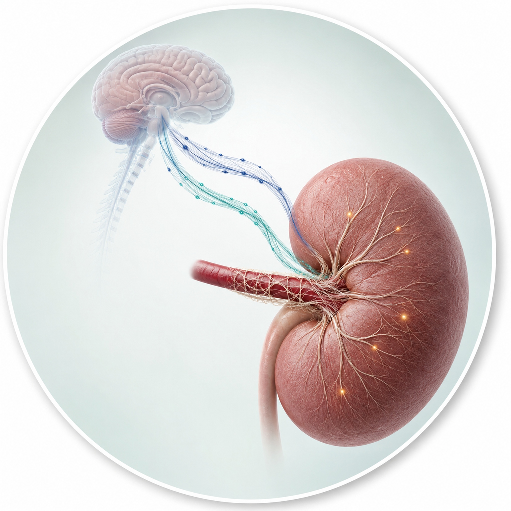
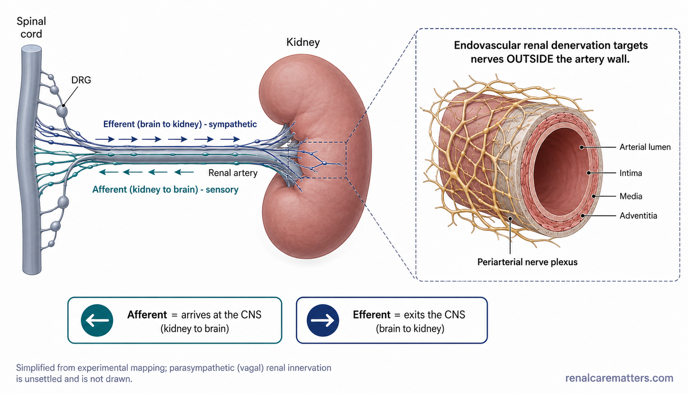

# Image Plan — `nervous-system-of-the-kidney.html`
### The Nervous System of the Kidney — Renal Nerves Explained · renalcarematters.com

**Stage 1 prompt pack** for the 10 raster assets that illustrate this guide. Each
prompt is authored with the matching williamriveromd graphic skill, ready to
paste into the [ChatGPT Image Generator GPT](https://chatgpt.com/g/g-pmuQfob8d-image-generator).
Save each PNG (+ a `.webp` twin) into `images/`, then hand the pack to Stage 2
(`williamriveromd-local-image-generator`) for manifests + `og:image` wiring, **or**
follow the *HTML integration* section at the bottom to swap each inline SVG for a
`<figure><picture>` block.

**Why this pack exists.** The guide currently ships with **7 hand-authored inline
SVG diagrams** (1 hero + 6 in-body). This pack **replaces all 7** with
production raster figures and **adds 3 new assets** the blueprint called for but
that the SVG build folded into text: an OG share card, a *kidney → brain
interoception* figure, and a *renal-denervation evidence timeline*. Result: the
guide's full Figure 1–8 architecture from the blueprint, plus hero + OG.

**On-image text is English only** — consistent with the guide (the hero-meta
labels translate via HTML; raster images do not).

---

## Global style contract (applied to every prompt)

House rules from the williamriveromd graphic skills, plus the guide-specific
palette note from the blueprint (§7 / §12):

- **Light backgrounds only.** White `#ffffff`, off-white `#fafafa`, soft gray
  `#f3f4f6`, or a very light pale-mint tint `#eef6f7`. Navy/teal are typography
  and accent colours, never a fill. (This overrides the blueprint's "deep
  teal-to-navy field" OG idea — the house light-background rule wins.)
- **Restrained renal palette, no neon, no bright-red atlas kidneys.** Anatomy in
  soft muted tones (dusty rose / clay kidneys, gray-blue vessels), not glossy
  cybernetic reds.
- **Directional colour code, used consistently across the whole set:**
  - **Navy `#1f3864` = efferent (brain → kidney), sympathetic.**
  - **Teal `#1a6b72` = afferent (kidney → brain), sensory.**
  - **Amber/gold `#b8860b` = local neuropeptide / CGRP / molecular signal.**
  - Red `#b91c1c` = injury; green `#1f7a4d` = repair / benefit; purple `#6c3d8e`
    = specialist / uncertain.
- **Accessibility (blueprint §12): never encode afferent vs. efferent by colour
  alone.** Every directional arrow carries an explicit text label *and* a
  distinct arrowhead direction, so the meaning survives greyscale / colour-blind
  viewing.
- **No thick "vagus → kidney" motor pathway** anywhere. Parasympathetic
  innervation is unsettled; do not draw it as established anatomy.
- **Correct directions everywhere:** efferent arrowheads point *toward* the
  kidney; afferent arrowheads point *toward* the spinal cord / brain.
- **Fonts:** one approved sans-serif only — **Inter** is named in every prompt.
  No serif, no decorative faces.
- **Attribution (mandatory):** small semi-transparent navy `renalcarematters.com`
  in the **bottom-right** corner (bottom-center for portrait). Never omit.
- **Experimental-evidence flagging:** any figure resting on animal / preclinical
  work carries an on-image evidence caption (mouse model, experimental,
  associative human data, not a clinical therapy) — matching the guide's A–D
  badges.

---

## Plan overview

| # | Section / use | File | Skill | Type | Size | Replaces |
|---|---|---|---|---|---|---|
| 1 | Hero circular vignette (beside `<h1>`) | `nervous-system-of-the-kidney-vignette-hero.png` | hero-vignette | Scaffold C — calm 3D anatomy | 2048 × 2048 (1:1) | hero SVG |
| 2 | OG / social share card | `nervous-system-of-the-kidney-og.png` | infographic | OG editorial poster | **1200 × 630 (fixed)** | new |
| 3 | §2 The wiring — where the nerves are | `nervous-system-of-the-kidney-01-wiring.png` | biomedical-mechanism | Review-article schematic | 1792 × 1024 (16:9) | §2 SVG |
| 4 | §3 Four jobs of the sympathetic nerves | `nervous-system-of-the-kidney-02-four-jobs.png` | simple-figure | Single mechanism / radial (D) | 1792 × 1024 (16:9) | §3 SVG |
| 5 | §4 Kidney → brain interoception | `nervous-system-of-the-kidney-03-interoception.png` | biomedical-mechanism | Review-article schematic | 1792 × 1024 (16:9) | new |
| 6 | §5 Renorenal reflex — healthy vs distorted | `nervous-system-of-the-kidney-04-renorenal-reflex.png` | simple-figure | Side-by-side comparison (B) | 1792 × 1024 (16:9) | §5 SVG |
| 7 | §8 2026 TRPV1–CGRP–macrophage repair axis | `nervous-system-of-the-kidney-05-trpv1-cgrp-mechanism.png` | biomedical-mechanism | Review-article schematic | 1792 × 1024 (16:9) | §8 SVG |
| 8 | §10 Renal denervation — what is ablated | `nervous-system-of-the-kidney-06-denervation-ablation.png` | simple-figure | Single mechanism / cross-section (D) | 1792 × 1024 (16:9) | §10 SVG |
| 9 | §10 Renal-denervation evidence timeline | `nervous-system-of-the-kidney-07-rdn-timeline.png` | simple-figure | Horizontal step sequence (C) | 1792 × 1024 (16:9) | new |
| 10 | §12 Evidence staircase | `nervous-system-of-the-kidney-08-evidence-staircase.png` | simple-figure | Single mechanism / one-panel (D) | 1792 × 1024 (16:9) | §12 SVG |

---

## 1 · Hero vignette — the kidney wired both ways (wordless 3D anatomy)
*Skill: williamriveromd-hero-vignette · Scaffold C — calm 3D anatomy*

> Square, masked into the round hero disc. **Wordless** — the page renders the
> `<h1>` next to the circle. Keep the reserved title-safe zone on the **left**
> so the HTML headline never sits over anatomy.

```
FILE NAME: nervous-system-of-the-kidney-vignette-hero.png
IMAGE TYPE: Circular vignette hero v3 — Scaffold C (calm 3D anatomy)
ASPECT RATIO: 1:1 (square — displayed inside an 85–90% inscribed circle with white margin)
PIXEL DIMENSIONS: 2048 × 2048
COMPOSITION ARCHETYPE: F — Anatomy
CAMERA: three-quarter, gentle studio lighting
HUMAN VARIATION (vs. previous guide): no people
AUDIENCE: mixed (educated patients, clinicians, trainees)
VISUAL GOAL: convey at a glance that the kidney and brain are physically wired together in both directions.

PROMPT:
Square 1:1 semi-photorealistic 3D medical illustration on a 2048×2048 canvas,
composed to be displayed inside a CIRCULAR vignette occupying 85–90% of the
canvas diameter with a visible WHITE BORDER around the full circle (the circle
must never touch the canvas edges). Composition archetype: F Anatomy. Camera:
elegant three-quarter view with soft studio lighting and a gentle drop shadow.

Subject: ONE dominant, clean anatomical render of a single human kidney (soft,
muted clay-rose tone, NOT glossy bright-atlas red) on the RIGHT side of the
circle, with its renal artery entering and a delicate mesh of fine periarterial
NERVE FIBERS wrapping the vessel and fanning into the kidney surface. From those
fibers, two slender bundles of nerve threads arc gracefully across toward a
softly stylised, semi-transparent human brain-and-spinal-cord silhouette on the
UPPER LEFT: one bundle rendered in deep navy (#1f3864) reads as travelling FROM
the brain TOWARD the kidney; the other, rendered in clinical teal (#1a6b72),
reads as travelling FROM the kidney TOWARD the brain. A few tiny warm amber
(#b8860b) glowing points sit only on the kidney surface, hinting at local
signalling. The two nerve bundles are visually distinct by both colour AND by a
subtle woven separation so the "two-way" idea is obvious.

Visual hierarchy: the kidney + periarterial nerves occupy ~60–70% of the circle
(right and lower area); the brain/spinal silhouette and connecting fibers are
supporting context ~20–30% (upper-left); reserve a clean 20–25% TITLE SAFE ZONE
of soft pale-mint-to-white gradient background in the LEFT portion of the circle
(no anatomy, no fibers, no labels, no callouts in that zone) so the HTML title
can sit beside the disc. Restrained clinical colour on a light pale-mint (#eef6f7)
to off-white background; soft edge falloff toward a slightly deeper neutral at
the rim. Anatomically plausible, calm, premium medical-textbook-cover feel.

Absolutely NO text, labels, leader lines, arrowheads-with-words, callouts,
titles, logos, or watermark — clean render only, and do NOT draw a thick direct
vagus-to-kidney trunk. Full-bleed within the inscribed circle, no rectangular
borders.

NEGATIVE INSTRUCTIONS:
Avoid busy layouts, collage overload, more than four supporting scenes, dozens of
icons, tiny unreadable labels, infographic clutter, duplicated people, repeated
compositions, cropped circle, cropped objects, cropped anatomy, edge clipping,
objects touching the circular border, important content inside the title safe zone,
baked-in text/titles/captions/logos/watermarks, rectangular borders/frames/banners,
dark/charcoal/black backgrounds, cartoon style, neon, HDR, over-saturation,
bright-red atlas kidneys, a thick direct vagus-to-kidney nerve trunk, distorted
or implausible anatomy.

QUALITY CHECK:
Square 2048×2048. Circle occupies 85–90% of canvas with a visible white margin,
never cropped. ONE dominant kidney-with-nerves subject (60–70%), brain/spinal
silhouette + two colour-distinct fiber bundles as supporting context (20–30%),
20–25% empty title-safe zone on the LEFT (soft gradient only). Two-way wiring is
readable at a glance; efferent (navy, toward kidney) and afferent (teal, toward
brain) are visually separable without reading any words. No vagus trunk. Crops
cleanly inside the circle with nothing lost at the edges. Wordless.
```

---

## 2 · OG / social share card — "Your Kidneys Are Wired to Your Brain"
*Skill: williamriveromd-infographic-skill · OG editorial poster (light background)*

> Fixed 1200 × 630. Left text-safe zone for the title; kidney-brain motif on the
> right. Light background per house rule (adapts the blueprint's dark OG brief).

```
FILE NAME: nervous-system-of-the-kidney-og.png
IMAGE TYPE: OG / social share card — editorial poster
ASPECT RATIO: 1.91:1
PIXEL DIMENSIONS: 1200 × 630 (fixed — never change)
AUDIENCE: mixed
VISUAL GOAL: a scroll-stopping share card that says the kidneys and brain are wired together, with a clear title.

PROMPT:
Premium medical editorial OG / social share card, landscape 1200×630, on a clean
off-white (#fafafa) background with a very subtle pale-mint (#eef6f7) wash — light
background only, never dark. Left ~55% is a text-safe zone: a large bold headline
in navy (#0f1e2e), set in the Inter typeface, reading "Your Kidneys Are Wired to
Your Brain", with a smaller clinical-teal (#1a6b72) subhead beneath in Inter
reading "Renal nerves, blood pressure & the new science of kidney repair." Right
~45%: a clean semi-photorealistic 3D render of a single muted clay-rose human
kidney with fine periarterial nerve fibers, linked by TWO gently curved arrows to
a minimal stylised brain-and-spinal-cord silhouette — a NAVY (#1f3864) arrow
pointing brain → kidney and a TEAL (#1a6b72) arrow pointing kidney → brain, each
arrow carrying a tiny direction word ("to kidney" / "to brain") so direction is
never colour-only. One small amber (#b8860b) dot on the kidney hints at local
signalling. Generous negative space, calm and authoritative, mobile-thumbnail
legible. Small semi-transparent navy "renalcarematters.com" in the bottom-right
corner.

NEGATIVE INSTRUCTIONS:
Avoid cartoon style, avoid clutter, avoid tiny unreadable labels, avoid AI
gibberish text, avoid unrealistic anatomy, avoid overprocessed HDR, avoid
excessive saturation. NEVER use dark, navy, charcoal, or black backgrounds —
light backgrounds only. Use ONLY the sans-serif font Inter — no serif fonts, no
decorative typefaces. No bright-red atlas kidney. No thick vagus-to-kidney
pathway. Never omit the renalcarematters.com attribution.

QUALITY CHECK:
Exactly 1200 × 630. Light background. Headline + subhead legible as a small
social thumbnail. Kidney-brain motif on the right with two labelled, direction-
correct arrows (efferent navy to kidney, afferent teal to brain). Attribution
bottom-right.
```

---

## 3 · §2 The wiring — where the nerves actually are
*Skill: williamriveromd-biomedical-mechanism-figure · review-article schematic*

> Replaces the §2 inline SVG. Organ panel + magnified periarterial-plexus inset,
> with a bottom "direction decoder" strip in place of the injury→benefit flow.

```
FILE NAME: nervous-system-of-the-kidney-01-wiring.png
IMAGE TYPE: Biomedical mechanism schematic — anatomy / wiring
ASPECT RATIO: 16:9
PIXEL DIMENSIONS: 1792 × 1024
AUDIENCE: mixed
VISUAL GOAL: orient the reader to where renal nerves run and which direction each type travels.

PROMPT:
Create a publication-grade biomedical mechanism schematic in the scientific
review-article style, white (#ffffff) background, flat vector illustration with
soft semi-3D shading, clean Inter sans-serif labels, thin dashed connector boxes,
muted clinical palette, generous whitespace.

Topic: the wiring of the renal nerves.

Left organ panel: a simplified human kidney in muted clay-rose with a gray-blue
renal artery entering at the hilum; the spinal cord drawn as a slim vertical
gray-blue column to the far left, with small dorsal root ganglia (labelled "DRG")
as beads beside it. A thin dashed connector box points from the renal artery to
the magnified inset.

Center/right magnified panel (inside a dashed border): a cross-section of the
renal artery wall with a mesh of fine nerve fibers running OUTSIDE the vessel
wall — the "periarterial nerve plexus" (labelled). Two clearly separated,
direction-labelled arrow bundles run along the artery between the CNS and the
kidney:
- a NAVY (#1f3864) bundle with arrowheads pointing TOWARD the kidney, labelled
  "Efferent (brain → kidney) · sympathetic";
- a TEAL (#1a6b72) bundle with arrowheads pointing TOWARD the spinal cord,
  labelled "Afferent (kidney → brain) · sensory".
Add a small caption "Endovascular renal denervation targets nerves OUTSIDE the
artery wall."

Bottom direction-decoder strip (two small rounded cards instead of an injury/
benefit flow):
- Left card (teal accent): "Afferent = arrives at the CNS (kidney → brain)".
- Right card (navy accent): "Efferent = exits the CNS (brain → kidney)".

Include a small muted note: "Simplified from experimental mapping; parasympathetic
(vagal) renal innervation is unsettled and is not drawn." Do NOT draw a thick
vagus-to-kidney trunk.

Use white background, muted clinical colours, clean Inter labels, thin dashed
connector lines, review-article figure style. Small semi-transparent navy
"renalcarematters.com" bottom-right.

NEGATIVE INSTRUCTIONS:
Avoid cartoon style, clutter, tiny unreadable labels, AI gibberish text,
unrealistic anatomy, HDR, excessive saturation. NEVER dark/navy/charcoal/black
backgrounds — light only. Inter font only, no serif. No bright-red atlas kidney.
No vagus-to-kidney trunk. Do not encode afferent/efferent by colour alone — keep
the text labels and correct arrowhead directions. Never omit the
renalcarematters.com attribution.

QUALITY CHECK:
Efferent arrows point toward the kidney (navy); afferent arrows point toward the
spinal cord (teal); both are text-labelled. Periarterial plexus sits outside the
artery wall. DRG shown. No vagus trunk. Mobile-readable. Attribution bottom-right.
```

---

## 4 · §3 The four jobs of the renal sympathetic nerves
*Skill: williamriveromd-simple-figure · Scaffold D (single mechanism / radial)*

> Replaces the §3 inline SVG. One central sympathetic terminal, four labelled
> radial outputs, and a magnitude/context footnote.

```
FILE NAME: nervous-system-of-the-kidney-02-four-jobs.png
IMAGE TYPE: Single mechanism / radial figure (Scaffold D)
ASPECT RATIO: 16:9
PIXEL DIMENSIONS: 1792 × 1024
AUDIENCE: mixed
VISUAL GOAL: show the four physiological jobs of the renal sympathetic nerves and that they sum to volume/BP defence.

PROMPT:
Medical pathophysiology infographic, AJKD/NEJM graphical-abstract style, white
(#ffffff) background. Title at top in bold navy (#0f1e2e), Inter typeface: "Four
Jobs of the Renal Sympathetic Nerves"; subtitle in clinical teal (#1a6b72):
"Brain → kidney control (efferent)". 

Center-left: a clean semi-3D render of a single sympathetic nerve terminal
touching a small kidney/nephron, drawn in navy (#1f3864) to signal an efferent
(brain → kidney) pathway. From it, FOUR bold navy arrows radiate to four rounded
modular cards, each with a small icon and a short Inter label:
1. "β₁ receptor → renin release" (teal accent);
2. "Tubular signalling → sodium reabsorption" (teal accent);
3. "α-adrenergic → vasoconstriction (strong activation)" (amber #b8860b accent);
4. "Net effect → defends blood volume & blood pressure" (renal green #1f7a4d
   accent), drawn slightly larger as the summed outcome.

Bottom strip on soft gray (#f3f4f6): a single muted note in navy — "Effect
magnitude depends on how strongly the nerves fire and on physiologic context —
there is no single on/off threshold." 

Muted anatomy (no bright-red kidney), ample whitespace, mobile-readable labels
≥11pt. Small semi-transparent navy "renalcarematters.com" bottom-right.

NEGATIVE INSTRUCTIONS:
Avoid cartoon style, clutter, tiny unreadable labels, AI gibberish text,
unrealistic anatomy, HDR, excessive saturation. NEVER dark backgrounds — light
only. Inter font only, no serif. No bright-red atlas kidney. No invented numeric
thresholds. Never omit the renalcarematters.com attribution.

QUALITY CHECK:
Four distinct labelled outputs (renin, sodium, vasoconstriction, volume/BP),
efferent pathway reads navy, "net effect" card visually emphasised, context
footnote present, no fabricated numbers. Mobile-readable. Attribution bottom-right.
```

---

## 5 · §4 Kidney → brain interoception (NEW)
*Skill: williamriveromd-biomedical-mechanism-figure · review-article schematic*

> New figure (blueprint Figure 3). Four sensory inputs → sensory fibers → T8–L2
> DRG → central autonomic networks. Labelled a *simplified experimental map*.

```
FILE NAME: nervous-system-of-the-kidney-03-interoception.png
IMAGE TYPE: Biomedical mechanism schematic — sensory / interoception
ASPECT RATIO: 16:9
PIXEL DIMENSIONS: 1792 × 1024
AUDIENCE: mixed
VISUAL GOAL: show the kidney as a sensing organ feeding information back to the nervous system.

PROMPT:
Create a publication-grade biomedical mechanism schematic in the scientific
review-article style, white (#ffffff) background, flat vector illustration with
soft semi-3D shading, clean Inter sans-serif labels, thin dashed connector boxes,
muted clinical palette, generous whitespace.

Topic: the sensory kidney — interoception (kidney → brain).

Left organ panel: a simplified muted clay-rose kidney with FOUR small labelled
input icons feeding into it, each with a short Inter label: "Pelvic pressure /
stretch", "Ischemia", "Inflammation", "Chemical milieu". A thin dashed connector
box points to the magnified inset.

Center magnified panel (inside a dashed border): a sensory (afferent) nerve
ending among tubules, drawn in TEAL (#1a6b72), labelled "Sensory afferent fibers
(incl. TRPV1⁺ nociceptors)". A single teal arrow bundle with arrowheads pointing
AWAY from the kidney travels to the right.

Right panel: the teal afferent bundle reaches a column of dorsal root ganglia
labelled "DRG (≈ T8–L2)", then continues as a teal arrow to a small stylised
brain/brainstem labelled "Spinal, brainstem & hypothalamic autonomic networks".
All afferent arrows point TOWARD the CNS.

Bottom summary strip (two rounded cards):
- Left (teal): "Sensing ≠ pain — most renal sensory signals never reach
  consciousness and instead drive autonomic reflexes."
- Right (muted gray): "Simplified experimental map — human projection detail is
  incompletely resolved."

Use white background, muted clinical colours, clean Inter labels, thin dashed
connectors, review-article style. Small semi-transparent navy
"renalcarematters.com" bottom-right.

NEGATIVE INSTRUCTIONS:
Avoid cartoon style, clutter, tiny unreadable labels, AI gibberish text,
unrealistic anatomy, HDR, excessive saturation. NEVER dark backgrounds — light
only. Inter font only, no serif. No bright-red atlas kidney. Afferent arrows must
point toward the CNS and be text-labelled (not colour-only). Never omit the
renalcarematters.com attribution.

QUALITY CHECK:
Four sensory inputs shown; afferent (teal) fibers travel kidney → DRG (T8–L2) →
central networks with correct arrow direction; "sensing ≠ pain" and "experimental
map" captions present. Mobile-readable. Attribution bottom-right.
```

---

## 6 · §5 The renorenal reflex — healthy vs distorted
*Skill: williamriveromd-simple-figure · Scaffold B (side-by-side comparison)*

> Replaces the §5 inline SVG. Two states, with an "experimental evidence" banner
> across both.

```
FILE NAME: nervous-system-of-the-kidney-04-renorenal-reflex.png
IMAGE TYPE: Side-by-side comparison (Scaffold B)
ASPECT RATIO: 16:9
PIXEL DIMENSIONS: 1792 × 1024
AUDIENCE: mixed
VISUAL GOAL: contrast the healthy inhibitory renorenal reflex with its disease-associated distortion.

PROMPT:
Medical education comparison infographic, AJKD/NEJM graphical-abstract style,
white (#ffffff) background. Title centered at top in bold navy (#0f1e2e), Inter
typeface: "The Renorenal Reflex: Healthy vs Distorted". A thin full-width banner
just under the title in muted amber (#b8860b) text reads: "Experimental evidence —
direction depends on physiologic context." A soft dashed vertical divider splits
the canvas into two equal panels.

Left panel, labelled in renal green (#1f7a4d) "Healthy feedback": a small kidney
with an upward step-flow of four short labelled stages connected by downward
arrows —
"Renal stretch / pressure" → "↑ Afferent signal (teal)" → "↓ Efferent sympathetic
tone (navy)" → bold green "→ Natriuresis (salt out)".

Right panel, labelled in clinical red (#b91c1c) "Disease-associated feedback": a
small kidney with the same four-stage flow —
"CKD / inflammation / injury" → "Altered afferent processing" → "↑ Efferent
sympathetic tone (navy)" → bold red "→ Sodium retention, ↑ blood pressure".

Keep afferent elements teal and efferent elements navy, each with a text label so
direction is never colour-only. Rounded panel corners, ample negative space,
mobile-readable Inter labels ≥11pt. Small semi-transparent navy
"renalcarematters.com" bottom-right.

NEGATIVE INSTRUCTIONS:
Avoid cartoon style, clutter, tiny unreadable labels, AI gibberish text,
unrealistic anatomy, HDR, excessive saturation. NEVER dark backgrounds — light
only. Inter font only, no serif. No bright-red atlas kidney (the red is for the
disease-panel label/accent, not the organ). Never omit the renalcarematters.com
attribution.

QUALITY CHECK:
Two clearly divided panels; healthy panel ends in natriuresis (green), disease
panel ends in sodium retention / ↑BP (red); afferent teal + efferent navy both
text-labelled; "experimental evidence" banner present. Mobile-readable.
Attribution bottom-right.
```

---

## 7 · §8 The 2026 TRPV1–CGRP–macrophage repair axis
*Skill: williamriveromd-biomedical-mechanism-figure · review-article schematic (signature layout)*

> Replaces the §8 inline SVG. The featured mechanism — full organ → cellular →
> injury/intervention/benefit flow, with the mandatory evidence caption band.

```
FILE NAME: nervous-system-of-the-kidney-05-trpv1-cgrp-mechanism.png
IMAGE TYPE: Biomedical mechanism schematic — neuroimmune repair axis
ASPECT RATIO: 16:9
PIXEL DIMENSIONS: 1792 × 1024
AUDIENCE: mixed (clinician-leaning)
VISUAL GOAL: depict how injury-activated sensory nerves use CGRP to shift macrophages toward repair, with honest evidence framing.

PROMPT:
Create a publication-grade biomedical mechanism schematic in the scientific
review-article style, white (#ffffff) background, flat vector illustration with
soft semi-3D shading, clean Inter sans-serif labels, thin dashed connector boxes,
muted clinical palette, generous whitespace.

Topic: the 2026 TRPV1–CGRP–macrophage repair axis in ischemia-reperfusion acute
kidney injury.

Left organ panel: a simplified muted clay-rose kidney labelled "Ischemia–
reperfusion AKI (mouse model)", with a small red (#b91c1c) inflamed zone and a
label "↑ IL-6, tubular stress". A thin dashed connector box points to the
magnified inset.

Center magnified panel (inside a dashed border): a TRPV1-positive sensory nerve
ending (teal #1a6b72) sitting beside a macrophage (soft slate). Draw the pathway
as a clean left-to-right chain of small labelled nodes with amber (#b8860b)
arrows for the neuropeptide steps:
"TRPV1⁺ nociceptor activated" → "CGRP released (amber)" → "RAMP1 on macrophage" →
"↑ cAMP → PKA → CREB" → "↑ IL4Rα, ↑ IL-4 response" → bold green (#1f7a4d)
"IL4Rα-high / CD206-high anti-inflammatory, pro-healing macrophage".

Bottom summary flow (three boxes with left-to-right arrows):
- Left pink pathology box: "Injury: ischemia–reperfusion, inflammation (IL-6)".
- Center pale-amber intervention/mechanism box: "Sensory-neural signal: TRPV1 →
  CGRP → RAMP1".
- Right pale-blue benefit box: "Pro-healing macrophage state → improved repair
  (experimental)".

Mandatory evidence caption band across the very bottom, small muted navy Inter
text: "Causal evidence: mouse models. Human support: small postoperative
correlations (↑urinary CGRP ↔ ↓KIM-1/NGAL). Not a clinical therapy."

Use white background, muted clinical colours, clean Inter labels, thin dashed
connectors, review-article style. Small semi-transparent navy
"renalcarematters.com" bottom-right.

NEGATIVE INSTRUCTIONS:
Avoid cartoon style, clutter, tiny unreadable labels, AI gibberish text,
unrealistic anatomy, HDR, excessive saturation. NEVER dark backgrounds — light
only. Inter font only, no serif. No bright-red atlas kidney. Do NOT imply this is
an approved human therapy. Never omit the renalcarematters.com attribution.

QUALITY CHECK:
Chain reads TRPV1 → CGRP → RAMP1 → cAMP/PKA/CREB → IL4Rα → pro-healing macrophage;
injury→intervention→benefit summary present; evidence caption band explicitly says
mouse-causal / small human observational / not a therapy. Mobile-readable.
Attribution bottom-right.
```

---

## 8 · §10 Renal denervation — what is actually ablated
*Skill: williamriveromd-simple-figure · Scaffold D (single mechanism / cross-section)*

> Replaces the §10 inline SVG. One clean renal-artery cross-section with the
> catheter inside and nerves outside the wall; caption on fibre-type selectivity.

```
FILE NAME: nervous-system-of-the-kidney-06-denervation-ablation.png
IMAGE TYPE: Single mechanism / cross-section (Scaffold D)
ASPECT RATIO: 16:9
PIXEL DIMENSIONS: 1792 × 1024
AUDIENCE: mixed
VISUAL GOAL: show that catheter energy reaches nerves outside the artery wall and is not fibre-type selective.

PROMPT:
Medical pathophysiology infographic, AJKD/NEJM graphical-abstract style, white
(#ffffff) background. Title at top in bold navy (#0f1e2e), Inter typeface: "Renal
Denervation — What Is Actually Ablated"; subtitle in clinical teal (#1a6b72):
"Energy from inside the artery reaches nerves outside its wall."

Center: a clean, large semi-3D cross-section of a renal artery. Inside the lumen,
an endovascular catheter tip emits short radiating energy waves (muted amber
#b8860b) outward through the vessel wall. OUTSIDE the arterial wall sits the
periarterial nerve plexus, shown as a mix of TWO clearly labelled fibre types
being interrupted (small "✕" break marks): a NAVY (#1f3864) "Efferent
(sympathetic)" fibre and a TEAL (#1a6b72) "Afferent (sensory)" fibre. A short
callout labels the catheter "Radiofrequency / ultrasound catheter (endovascular)."

Bottom strip on soft gray (#f3f4f6): a single bold navy Inter note — "Current
renal denervation is NOT fibre-type selective — both efferent and afferent nerves
can be interrupted."

Muted anatomy (no bright-red atlas artery), ample whitespace, mobile-readable
labels ≥11pt. Small semi-transparent navy "renalcarematters.com" bottom-right.

NEGATIVE INSTRUCTIONS:
Avoid cartoon style, clutter, tiny unreadable labels, AI gibberish text,
unrealistic anatomy, HDR, excessive saturation. NEVER dark backgrounds — light
only. Inter font only, no serif. No garish red anatomy. Both fibre types must be
text-labelled (not colour-only). Never omit the renalcarematters.com attribution.

QUALITY CHECK:
Catheter sits INSIDE the lumen; energy travels outward; nerves sit OUTSIDE the
wall; both efferent (navy) and afferent (teal) fibres are shown interrupted and
text-labelled; "not fibre-type selective" caption present. Mobile-readable.
Attribution bottom-right.
```

---

## 9 · §10 Renal-denervation evidence timeline (NEW)
*Skill: williamriveromd-simple-figure · Scaffold C (horizontal step sequence)*

> New figure (blueprint Figure 7). Qualitative milestones only — **no fabricated
> BP numbers.**

```
FILE NAME: nervous-system-of-the-kidney-07-rdn-timeline.png
IMAGE TYPE: Horizontal step sequence / timeline (Scaffold C)
ASPECT RATIO: 16:9
PIXEL DIMENSIONS: 1792 × 1024
AUDIENCE: mixed (clinician-leaning)
VISUAL GOAL: trace how the renal-denervation evidence matured from a negative pivotal trial to a guideline option.

PROMPT:
Clean clinical education infographic, white (#ffffff) background. Title at top
center in bold navy (#0f1e2e), Inter typeface: "Renal Denervation — How the
Evidence Matured". FIVE rounded rectangular cards arranged horizontally in a
single row along a left-to-right timeline, connected by bold navy right-pointing
arrows. Each card has a colored top accent band, a year, a bold short label, and
one line of context:
1. Red (#b91c1c) — "2014 · SYMPLICITY HTN-3: first blinded sham-controlled trial —
   NEGATIVE primary endpoint; reset the field";
2. Teal (#1a6b72) — "2018–2020 · Improved sham-controlled programs (SPYRAL,
   RADIANCE): modest, reproducible BP lowering";
3. Navy (#1f3864) — "2023 · Two RDN systems receive US FDA approval for
   hypertension";
4. Amber (#b8860b) — "2024 · ESC guideline & AHA scientific statement: adjunct in
   selected patients";
5. Renal green (#1f7a4d) — "2025 · ACC/AHA guideline: Class 2b option (may be
   considered) after shared decision-making".

Cards sit on a very soft gray (#f3f4f6) panel. Bottom full-width strip in soft
gray with a brief navy Inter summary: "An adjunct for selected resistant/
uncontrolled hypertension — never a replacement for lifestyle and medication."

Keep the timeline QUALITATIVE — do NOT print any specific mmHg blood-pressure
numbers. Generous whitespace, mobile-readable. Small semi-transparent navy
"renalcarematters.com" bottom-right.

NEGATIVE INSTRUCTIONS:
Avoid cartoon style, clutter, tiny unreadable labels, AI gibberish text,
unrealistic anatomy, HDR, excessive saturation. NEVER dark backgrounds — light
only. Inter font only, no serif. Do NOT invent or print any mmHg BP figures.
Never omit the renalcarematters.com attribution.

QUALITY CHECK:
Five chronological milestones 2014 → 2025 with correct labels and left-to-right
arrows; no fabricated BP numbers; summary line frames RDN as an adjunct.
Mobile-readable. Attribution bottom-right.
```

---

## 10 · §12 The evidence staircase
*Skill: williamriveromd-simple-figure · Scaffold D (single mechanism / one-panel)*

> Replaces the §12 inline SVG. Four ascending maturity steps; the two exemplars
> pinned at their true levels so the gap is obvious.

```
FILE NAME: nervous-system-of-the-kidney-08-evidence-staircase.png
IMAGE TYPE: Single one-panel conceptual figure (Scaffold D)
ASPECT RATIO: 16:9
PIXEL DIMENSIONS: 1792 × 1024
AUDIENCE: mixed
VISUAL GOAL: show, at a glance, that the CGRP–AKI mechanism and renal denervation for BP sit at very different evidence maturities.

PROMPT:
Medical education conceptual infographic, AJKD/NEJM graphical-abstract style,
white (#ffffff) background. Title at top in bold navy (#0f1e2e), Inter typeface:
"The Evidence Staircase"; subtitle in clinical teal (#1a6b72): "How mature is the
evidence?". 

Center: a clean four-step ascending staircase rising left-to-right, each step a
wide rounded slab with an Inter label, ascending in tone from soft purple to
green:
- Step 1 (lowest, soft purple #6c3d8e tint): "Cellular & animal mechanisms";
- Step 2 (teal #1a6b72 tint): "Human anatomy & observational biomarkers";
- Step 3 (navy #1f3864 tint): "Sham-controlled blood-pressure trials";
- Step 4 (highest, renal green #1f7a4d tint): "Guidelines".

Place TWO labelled marker chips on the staircase to contrast maturity:
- a purple chip reading "2026 CGRP–AKI repair mechanism" sitting on Step 1
  (translational / lowest);
- a navy chip reading "Renal denervation for blood pressure" sitting on Step 3
  (clinical / high).

A subtle vertical dashed guide between the two chips visually emphasises the gap
in maturity. Bottom strip on soft gray (#f3f4f6): navy Inter note — "A mechanism
can be biologically plausible without being a treatment." Ample negative space,
mobile-readable ≥11pt. Small semi-transparent navy "renalcarematters.com"
bottom-right.

NEGATIVE INSTRUCTIONS:
Avoid cartoon style, clutter, tiny unreadable labels, AI gibberish text,
unrealistic anatomy, HDR, excessive saturation. NEVER dark backgrounds — light
only. Inter font only, no serif. Never omit the renalcarematters.com attribution.

QUALITY CHECK:
Four ascending labelled steps; CGRP–AKI chip on step 1 (low), renal-denervation
chip on step 3 (high); the maturity gap is obvious; takeaway line present.
Mobile-readable. Attribution bottom-right.
```

---

## HTML integration (after images are generated)

For each generated asset, save both a `.png` and a `.webp` twin into `images/`,
then wire it into the guide. **The guide currently uses inline `<svg>` for all
seven figures**, so each swap replaces an `<svg>`…`</svg>` block.

**1 · Hero.** Replace the inline `<svg>` inside
`figure.hero-figure > .hero-vignette` with:

```html
<picture>
  <source srcset="../images/nervous-system-of-the-kidney-vignette-hero.webp" type="image/webp">
  
</picture>
```
Then run `python3 patch_hero_fetchpriority.py --guide nervous-system-of-the-kidney.html`,
`python3 patch_hero_fullwidth.py --guide …`, and `python3 patch_hero_maxwidth.py --guide …`.

**2 · OG card.** Add the four `og:image` / `twitter:image` dimensions (already
1200 × 630 in the guide `<head>`) — the image just needs to exist at
`images/nervous-system-of-the-kidney-og.png`. No markup change required.

**3–10 · In-body figures.** For each `<figure class="svg-fig">`, replace the
`<div class="fig-svg-panel"><svg…>…</svg></div>` with a `<picture>` block and keep
the existing `<figcaption>` (the `.fig-desc` plain-language line and the
`<dl class="fig-abbrevs">` are what the image lightbox reads — do not delete them):

```html
<figure>
  <picture>
    <source srcset="../images/nervous-system-of-the-kidney-01-wiring.webp" type="image/webp">
    
  </picture>
  <figcaption> … keep the existing .fig-desc + .fig-abbrevs unchanged … </figcaption>
</figure>
```

Map of `<svg>` → file:

| Guide section | Replace SVG with |
|---|---|
| §2 The wiring | `…-01-wiring.png` |
| §3 Four jobs | `…-02-four-jobs.png` |
| §4 Interoception (**new figure — insert**) | `…-03-interoception.png` |
| §5 Renorenal reflex | `…-04-renorenal-reflex.png` |
| §8 2026 mechanism | `…-05-trpv1-cgrp-mechanism.png` |
| §10 Denervation ablation | `…-06-denervation-ablation.png` |
| §10 RDN timeline (**new figure — insert** after the trial table) | `…-07-rdn-timeline.png` |
| §12 Evidence staircase | `…-08-evidence-staircase.png` |

After swapping, run `python3 patch_image_lightbox.py --guide nervous-system-of-the-kidney.html`
(idempotent) so single-tap opens the raster in the lightbox with its plain-language
caption. The per-guide SVG CSS (`.fig-svg-panel`, `.decoder`) can then be removed
from the second `<style>` block, or left harmlessly.

---

## Production workflow

1. Paste each prompt block (in order) into the
   [ChatGPT Image Generator GPT](https://chatgpt.com/g/g-pmuQfob8d-image-generator).
2. Download each PNG; generate a `.webp` twin (`cwebp -q 82 in.png -o out.webp`).
3. Drop both into `images/` using the exact file names above.
4. Do the HTML swaps in the integration section, run the hero + lightbox patchers.
5. Optionally hand this file to Stage 2 (`williamriveromd-local-image-generator`)
   for the manifest + og:image bookkeeping.

**Consistency check before shipping:** across all 10 assets, confirm navy = efferent
(toward kidney), teal = afferent (toward brain), amber = CGRP/local; every
directional arrow is text-labelled (not colour-only); no bright-red atlas kidneys;
no vagus-to-kidney trunk; every experimental/mouse figure carries its evidence
caption; and `renalcarematters.com` sits bottom-right on each.
