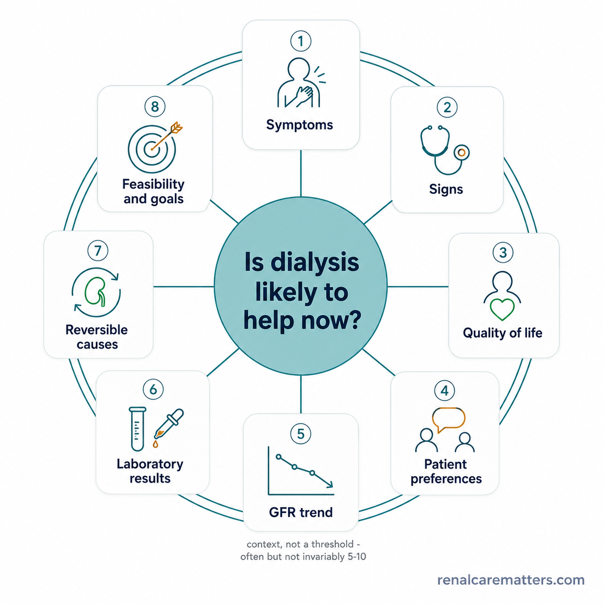
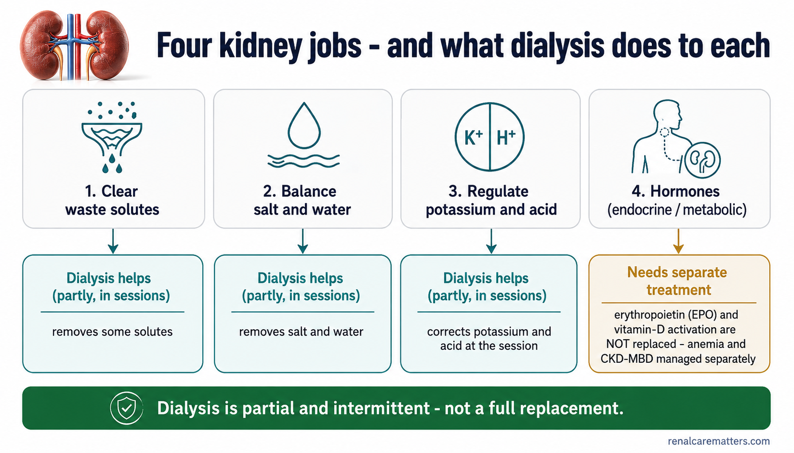
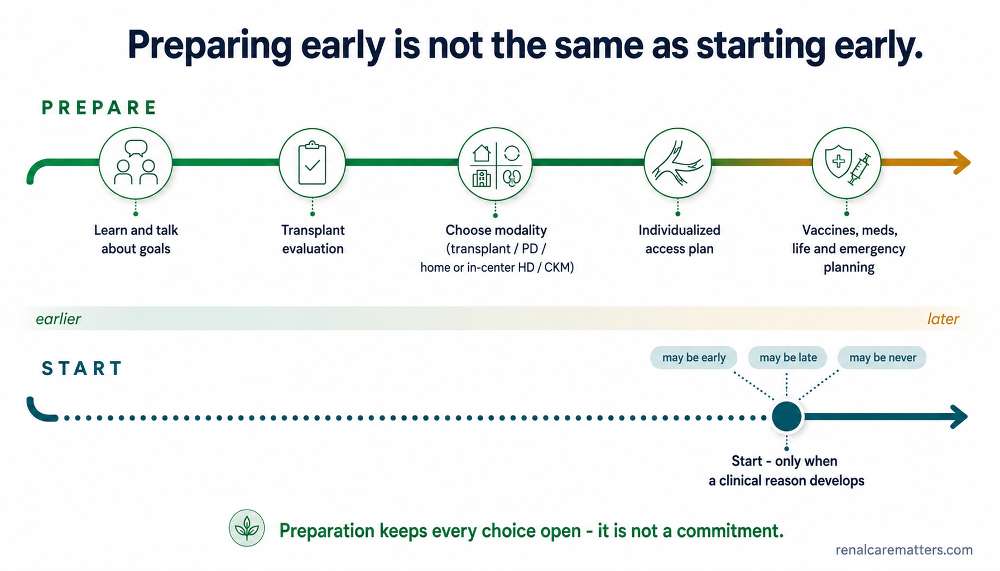
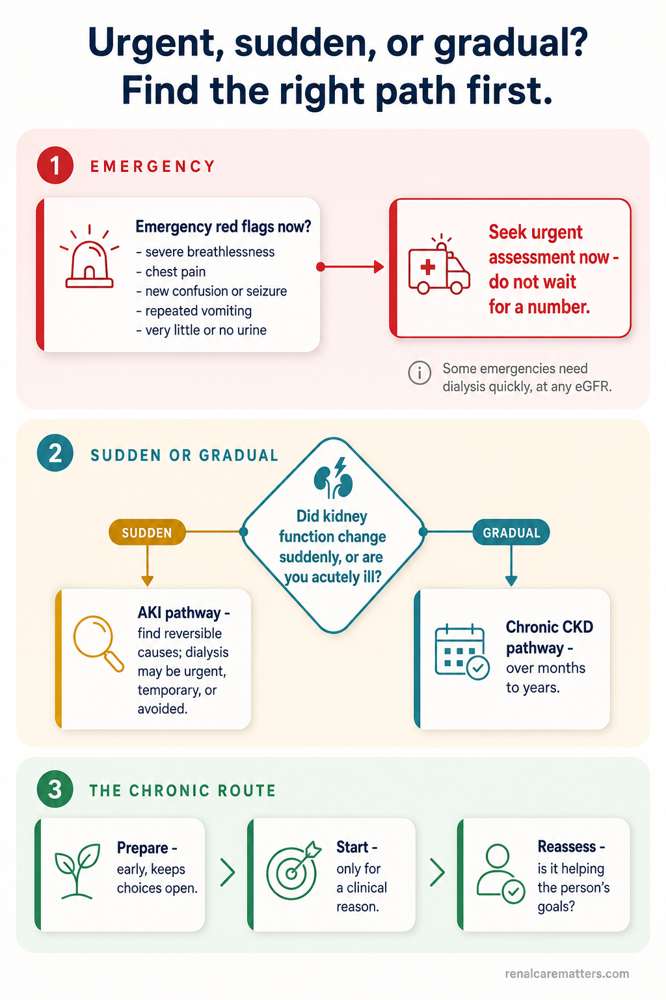
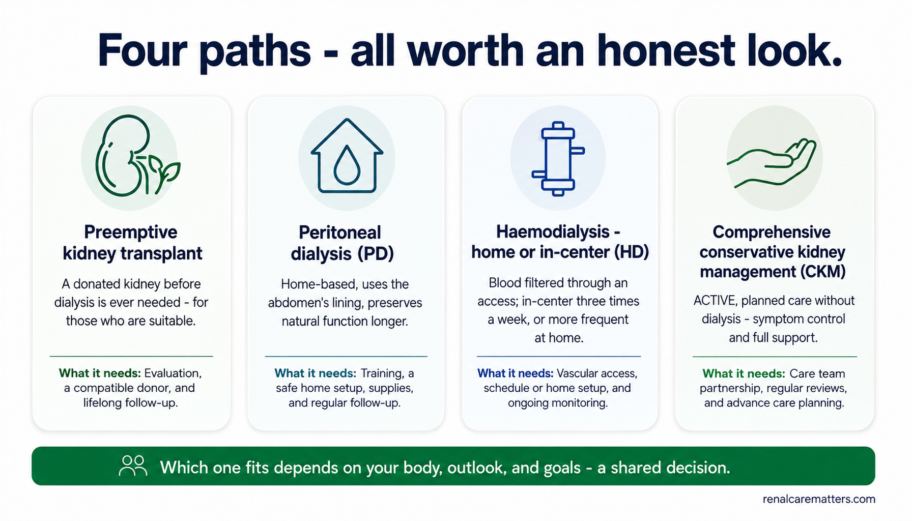
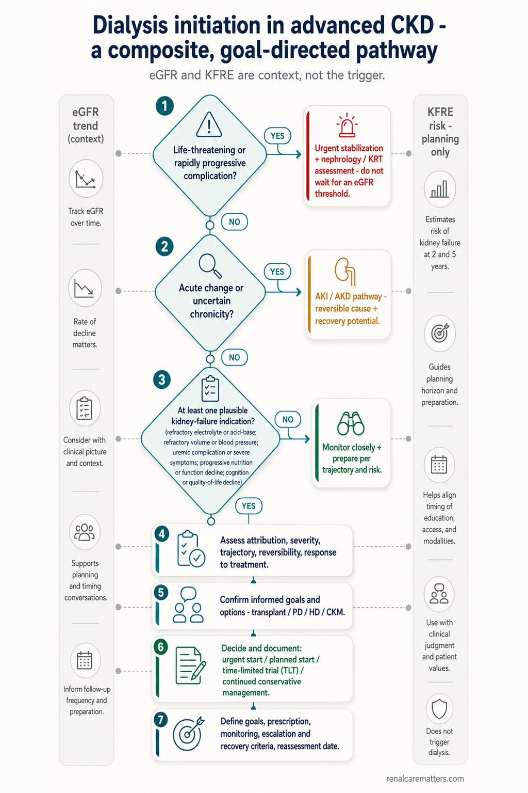
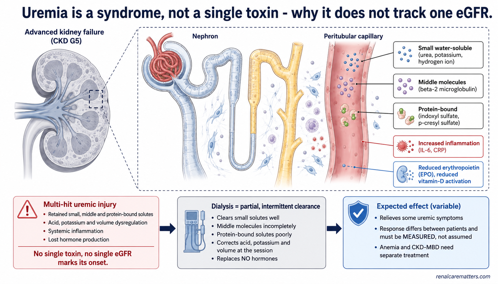

# Image Plan — *When Should Dialysis Start?* (`when-should-dialysis-start.html`)

**Guide:** Timing of dialysis initiation in advanced CKD — dual patient/clinician, with a separate AKI pathway
**Prepared:** 2026-08-10 · **Pipeline:** Stage 1 (prompt authoring). Paste each `PROMPT` block into the
ChatGPT **Image Generator** GPT → https://chatgpt.com/g/g-pmuQfob8d-image-generator
**Skills used:** `williamriveromd-hero-vignette` · `williamriveromd-infographic-skill` ·
`williamriveromd-algorithm-generator-skill` · `williamriveromd-biomedical-mechanism-figure`

---

## House rules baked into every prompt
- **Light backgrounds only** (white / off-white / soft gray / pale teal `#eef6f7`). Never navy / charcoal / black.
- **Fonts:** on-image type is one of **Inter · Nunito Sans · IBM Plex Sans · Manrope** — no serif, no decorative.
- **Palette:** navy `#0f1e2e` (text/accents), clinical teal `#1a6b72`, renal green `#1f7a4d` (safe/plan),
  amber `#b8860b` (caution/prepare), red `#b91c1c` (urgent) — used *only* as text/accents on light fills.
- **Attribution:** small semi-transparent `renalcarematters.com` bottom-right on every image **except the
  wordless vignette hero** (which carries no text at all).
- **Save each asset** as `.png` **and** a matching `.webp` twin under `images/`, using the exact FILE NAME below.

### Clinical guardrails for THIS guide (must hold in every graphic — see guide §3)
- **No magic number.** Never render a bare eGFR/creatinine/BUN value as the thing that *triggers* dialysis, and
  never a red "eGFR gauge" hitting a start line. Where GFR 5–10 appears, it is labeled **context, not a threshold**,
  and must sit beside the phrase **"often but not invariably."**
- **Preparing ≠ starting.** In the timeline, preparation begins *earlier* and initiation happens *only when a
  clinical reason appears* — **no countdown clock, no "dialysis in N months."**
- **Equal dignity for all four pathways** — preemptive transplant, PD, home/in-center HD, and **comprehensive
  conservative kidney management (CKM)**. CKM is drawn as *active care*, never "no treatment," never smaller.
- **AKI is a separate path**, clearly split from chronic CKD; never imply the CKD timing logic applies to a sudden change.
- **No fear imagery.** No machines dominating the frame, no needles in the hero, no countdown clocks, no neon,
  no distressed patients. Calm, warm, **Filipino clinical context.**
- **The website organizes care; it never makes the decision** — graphics prompt a conversation, never output a verdict.

## Asset roster

| # | File (`images/…`) | Status in guide | Skill | Size | Blueprint brief |
|---|---|---|---|---|---|
| 1 | `when-should-dialysis-start-vignette-hero.png` | ✅ wired (patient hero disc) | hero-vignette | 2048×2048 | — |
| 2 | `when-should-dialysis-start-og.png` | ✅ wired (`og:image`) | infographic | 1200×630 | #1 |
| 3 | `when-should-dialysis-start-01-composite-compass.png` | ➕ add (§ No magic eGFR) | infographic | 2048×2048 | #4 |
| 4 | `when-should-dialysis-start-02-four-kidney-jobs.png` | ➕ add (§ Physiology / clinician) | infographic | 1792×1024 | #2 |
| 5 | `when-should-dialysis-start-03-prepare-vs-start.png` | ➕ add (§ Prepare early) | infographic | 1792×1024 | #3 |
| 6 | `when-should-dialysis-start-04-urgent-vs-planned.png` | ➕ add (§ Fork / near urgent) | algorithm (House C) | 1024×1536 | #5 |
| 7 | `when-should-dialysis-start-05-treatment-options.png` | ➕ add (§ Your options) | infographic | 1792×1024 | #6 |
| 8 | `when-should-dialysis-start-06-tlt-loop.png` | ➕ add (§ Incremental & TLT / clinician) | infographic | 2048×2048 | #7 |
| 9 | `when-should-dialysis-start-md-01-initiation-algorithm.png` | ➕ recommended (§ Algorithm / clinician) | algorithm (House C) | 1024×1536 | — |
| 10 | `when-should-dialysis-start-md-02-uremic-syndrome-mechanism.png` | ➕ add (§ Physiology / clinician) | biomedical-mechanism | 1792×1024 | §8.2 |

> **Wiring status.** Assets **1–2 are already referenced** in the guide (hero `<figure>` + `og:image`) — dropping
> the files "lights them up." Assets **3–10 are not yet placed inline**; the exact `<figure>` HTML to insert is given
> under each (with a rule-11 `figcaption`). After adding any inline figure, re-run
> `python3 patch_hero_fetchpriority.py`, `patch_hero_fullwidth.py`, `patch_hero_maxwidth.py`, and
> `patch_image_lightbox.py`, then `patch_hero_meta.py` (ref/again count is unaffected).
>
> **Derived asset (no separate prompt):** `when-should-dialysis-start-rg-thumb.webp` — a 1:1 center-crop of the
> **OG card (#2)** (or the hero), used by the Related-guides cards on sibling guides. Export it when #2 is final.

---

## 1 · Circular vignette hero  *(wired — patient hero disc)*

```
FILE NAME: when-should-dialysis-start-vignette-hero.png
IMAGE TYPE: Circular vignette hero v3 — Scaffold A clinical people scene
ASPECT RATIO: 1:1 (square — displayed inside an 85–90% inscribed circle with white margin)
PIXEL DIMENSIONS: 2048 × 2048
COMPOSITION ARCHETYPE: H — Clinical (one shared-decision consultation, minimal supporting imagery)
CAMERA: environmental portrait, slightly low-angle over the table, shallow depth of field
HUMAN VARIATION (vs. previous guide): mid-40s Filipino woman nephrologist (short natural bob, warm brown skin,
  round face, soft jawline, glasses, teal blouse, no white coat) seated beside — not across from — an early-70s
  Filipino man patient (grey close-cropped hair, lean build, checked barong-style shirt, reading glasses in hand)
  and his adult son (early-40s, fuller build, short fade, polo shirt); three distinct faces, three ages, mixed
  sexes, seated collaborative posture, calm engaged expressions — ≥12 traits differ from any prior guide's cast.
AUDIENCE: mixed (patients + families + clinicians)
VISUAL GOAL: "This is a shared decision, made together and unhurried" — a warm Filipino clinic conversation, wordless.

PROMPT:
Square 1:1 photorealistic editorial photograph on a 2048×2048 canvas, composed to be displayed inside a CIRCULAR
vignette occupying 85–90% of the canvas diameter with a visible WHITE BORDER around the full circle (the circle
must never touch the canvas edges). Composition archetype: Clinical consultation. Camera: environmental portrait,
gentle low angle across a light wooden table, soft shallow depth of field.

Subject: a calm, unhurried shared-decision conversation in a bright, airy modern Philippine nephrology clinic — a
mid-40s Filipino woman nephrologist in a teal blouse (no white coat) sitting beside an early-70s Filipino man
patient and his adult son, all leaning slightly in, an open notebook and a glass of water on the table between
them, warm natural daylight from a window, clean pale walls. Their expressions are attentive and reassured, not
worried. No dialysis machine, no needles, no monitors, no clocks in view.

Visual hierarchy: the three people and the table occupy 60–70% of the circle; 2–3 supporting context cues
(window light, a potted plant, the notebook) fill 20–30%; reserve a 20–25% TITLE SAFE ZONE of soft out-of-focus
wall / gentle daylight gradient in the upper-left (no faces, hands, text, or objects inside that zone) so the HTML
title can sit beside the disc. Calm, documentary-realistic colour grade harmonizing with clinical teal #1a6b72
and navy #0f1e2e on a light background; soft edge falloff toward a slightly deeper neutral at the rim. Full-bleed
within the inscribed circle, no rectangular borders, frames, or banners.

Absolutely NO text of any kind: no title, subtitle, caption, label, logo, or renalcarematters.com watermark.

NEGATIVE INSTRUCTIONS:
Avoid busy layouts, collage overload, more than four supporting scenes, dozens of icons, tiny unreadable labels,
infographic clutter, duplicated people, repeated compositions, cropped circle, cropped objects/anatomy, edge
clipping, objects touching the circular border, important content inside the title-safe zone, baked-in text/titles/
captions/logos/watermarks, rectangular borders/frames/banners, dark/charcoal/black backgrounds, cartoon style,
neon, HDR, over-saturation, distorted hands or faces, implausible anatomy. No dialysis machine, needles, or
countdown clock.

QUALITY CHECK:
Square 2048×2048. Circle occupies 85–90% of canvas with a visible white margin — never cropped. ONE dominant
subject (the three-person conversation) at 60–70% of the circle, 2–3 supporting elements, 20–25% empty upper-left
title-safe zone. Filipino clinical context, three visibly distinct individuals (≥12 traits differ from the last
guide's cast). Crops cleanly inside the circle with nothing lost at the edges. Wordless.
```

---

## 2 · OG / social share card  *(wired — `og:image`)* — blueprint brief #1

```
FILE NAME: when-should-dialysis-start-og.png
IMAGE TYPE: Editorial hero + title OG card (Archetype 1, with baked title text)
ASPECT RATIO: 1.91:1
PIXEL DIMENSIONS: 1200 × 630  (FIXED — never any other size for an OG card)
AUDIENCE: mixed (patients, families, clinicians)
VISUAL GOAL: One glance says "plan early, start for a reason" — a calm Filipino conversation + a simple decision-path motif, no machine spectacle.

PROMPT:
Photorealistic medical editorial OG / social share card, exactly 1200×630 px, for a nephrology education guide,
on a clean WHITE / off-white background. Split composition: on the LEFT ~55%, a bright, calm, naturally lit
photorealistic scene of a Filipino nephrologist and an older Filipino patient with a family member in unhurried
conversation across a light clinic table (no dialysis machine, no needles, no clocks) — warm, reassuring,
documentary-realistic. On the RIGHT ~45%, a clean off-white panel carrying the title text and a simple flat
line motif of a branching decision path / signpost (three gentle diverging routes) in teal #1a6b72 and renal
green #1f7a4d — suggesting choice, not a countdown.

Title text, in bold Inter (navy #0f1e2e), large and mobile-legible:  "When should dialysis start?"
Sub-line, medium weight teal #1a6b72:  "Plan early. Start for a reason."
Do NOT print any eGFR number, gauge, or threshold anywhere on the card.

Strong hierarchy, generous negative space, rounded soft panel edges, publication-grade nephrology editorial look.
Small semi-transparent navy "renalcarematters.com" attribution in the bottom-right corner.

NEGATIVE INSTRUCTIONS:
Avoid cartoon style, clutter, tiny unreadable labels, AI-gibberish text, unrealistic anatomy, overprocessed HDR,
generic stock-photo look, excessive saturation. NEVER use dark/navy/charcoal/black backgrounds — light only. Use
ONLY Inter/Nunito Sans/IBM Plex Sans/Manrope — no serif, no decorative type. No eGFR number, no red gauge, no
countdown clock, no machine dominating the frame. Never omit the renalcarematters.com attribution.

QUALITY CHECK:
Exactly 1200×630. Mobile-legible title, calm Filipino scene, light background, decision-path motif reads as
"choice." No magic-number imagery. renalcarematters.com visible bottom-right. Pair with og:image:width="1200"
og:image:height="630".
```

---

## 3 · Composite decision compass  *(add — § "There is no magic eGFR")* — blueprint brief #4

**Insert this `<figure>` at the end of `<section id="no-magic">`, just before `</section>`:**

```html
<figure style="margin:28px 0 0;">
  <picture>
    <source srcset="../images/when-should-dialysis-start-01-composite-compass.webp" type="image/webp">
    
  </picture>
  <figcaption>
    <p class="fig-desc">The decision to start dialysis is a composite one. Eight inputs sit at equal weight around one central question — "Is dialysis likely to help now?" — so that no single number, including the GFR trend, decides on its own.</p>
    <dl class="fig-abbrevs">
      <dt>GFR</dt><dd>Glomerular filtration rate — the kidney's filtering rate; here it is one input among many, shown as a trend, not a threshold.</dd>
      <dt>QoL</dt><dd>Quality of life.</dd>
    </dl>
  </figcaption>
</figure>
```

```
FILE NAME: when-should-dialysis-start-01-composite-compass.png
IMAGE TYPE: Circular workflow / radial "compass" infographic (Archetype 8)
ASPECT RATIO: 1:1
PIXEL DIMENSIONS: 2048 × 2048
AUDIENCE: mixed (patients + clinicians)
VISUAL GOAL: The initiation decision is composite — eight inputs of EQUAL visual weight ring one central question; no segment dominates, and GFR is just one of them.

PROMPT:
Clean publication-grade circular "decision compass" infographic on a WHITE background, 2048×2048, in the
renalcarematters.com house style. At the exact center, a single calm rounded teal #1a6b72 disc holds the question,
in bold Inter navy #0f1e2e:  "Is dialysis likely to help now?"

Around the center, arrange EIGHT equal wedge/segment cards in a balanced ring — all the SAME size, radius, and
emphasis (no wedge larger, brighter, or arrowed toward the center more than the others), each a soft rounded card
with a small flat line icon and a short label in Inter:
1) Symptoms   2) Signs   3) Quality of life   4) Patient preferences   5) GFR trend   6) Laboratory results
7) Reversible causes   8) Feasibility & goals.
Beside the "GFR trend" wedge only, add a small muted-gray caption in Nunito Sans: "context, not a threshold —
often but not invariably 5–10". Do NOT draw any gauge, dial needle, or red zone; GFR is a small trend spark-line
icon, never a meter hitting a limit.

Thin teal connector rings, generous white negative space, restrained navy/teal/green/amber accents used only as
line and text colour on the light cards. Balanced, symmetrical, mobile-legible. Small semi-transparent navy
"renalcarematters.com" attribution in the bottom-right corner.

NEGATIVE INSTRUCTIONS:
Avoid cartoon style, clutter, tiny unreadable labels, AI-gibberish text, HDR, generic stock look, excessive
saturation. No dark/navy/charcoal/black background — light only. Use ONLY Inter/Nunito Sans/IBM Plex Sans/
Manrope. Do NOT make any one segment dominant; do NOT draw an eGFR gauge, dial, needle, red danger zone, or a
number that "triggers" dialysis. No countdown clock. Never omit the renalcarematters.com attribution.

QUALITY CHECK:
1:1, 2048×2048, white background. Eight equal segments around one central question; GFR is one small equal input
labeled "context, not a threshold." No dominant wedge, no gauge/needle. Mobile-legible. renalcarematters.com
bottom-right.
```

---

## 4 · Four kidney jobs — and what dialysis does to each  *(add — § Physiology, clinician)* — blueprint brief #2

**Insert this `<figure>` near the top of `<section id="md-physiology">` (after the intro `<p>`):**

```html
<figure style="margin:24px 0;">
  <picture>
    <source srcset="../images/when-should-dialysis-start-02-four-kidney-jobs.webp" type="image/webp">
    
  </picture>
  <figcaption>
    <p class="fig-desc">The kidney does four jobs. Dialysis partly and intermittently replaces the first three and does not replace the fourth (hormones), which is why "the machine does everything the kidney did" is not true.</p>
    <dl class="fig-abbrevs">
      <dt>CKD-MBD</dt><dd>CKD–mineral and bone disorder — a consequence of lost endocrine/metabolic kidney function.</dd>
      <dt>EPO</dt><dd>Erythropoietin — the hormone signalling red-blood-cell production; not replaced by dialysis.</dd>
    </dl>
  </figcaption>
</figure>
```

```
FILE NAME: when-should-dialysis-start-02-four-kidney-jobs.png
IMAGE TYPE: Multi-panel educational infographic + 3D component (Archetype 4)
ASPECT RATIO: 16:9
PIXEL DIMENSIONS: 1792 × 1024
AUDIENCE: mixed (patients + clinicians)
VISUAL GOAL: Show the kidney's four jobs and, beneath each, honestly split what dialysis replaces (partly, intermittently) from what still needs separate treatment.

PROMPT:
Clean publication-grade nephrology education infographic, landscape 16:9, 1792×1024, on a WHITE / soft-gray
background, AJKD/NEJM graphical-abstract clarity. Title bar in bold Inter navy #0f1e2e: "Four kidney jobs — and
what dialysis does to each." A small semi-photorealistic 3D pair of human kidneys sits at the top-left as an
anchor.

TOP ROW — four equal rounded cards, each with a simple flat line icon and short Inter label:
1) "Clear waste solutes"  2) "Balance salt & water"  3) "Regulate potassium & acid"  4) "Hormones (endocrine/
metabolic)". Under each top card, a thin arrow drops to a matching BOTTOM ROW card in two colours:
- teal #1a6b72 "Dialysis helps (partly, in sessions)" for jobs 1–3, with a one-line note each: removes some
  solutes / removes salt & water / corrects potassium & acid at the session.
- amber #b8860b "Needs separate treatment" for job 4, note: erythropoietin (EPO) and vitamin-D activation are
  NOT replaced (anemia, CKD-MBD managed separately).
Add a small renal-green #1f7a4d footer strip: "Dialysis is partial and intermittent — not a full replacement."

Modular rounded cards, generous whitespace, mobile-legible labels, restrained navy/teal/green/amber accents on
light fills. Small semi-transparent navy "renalcarematters.com" attribution bottom-right.

NEGATIVE INSTRUCTIONS:
Avoid cartoon style, clutter, tiny unreadable labels, AI-gibberish text, unrealistic anatomy, HDR, stock-photo
look, over-saturation. No dark background — light only. Use ONLY Inter/Nunito Sans/IBM Plex Sans/Manrope. Do not
overstate dialysis (it is partial + intermittent, never "replaces everything"). Never omit the renalcarematters.com
attribution.

QUALITY CHECK:
16:9, 1792×1024, light background. Four top jobs each mapped to an honest bottom row (3 "dialysis helps partly",
1 "needs separate treatment"). Anatomically plausible kidneys. Mobile-legible. renalcarematters.com bottom-right.
```

---

## 5 · Prepare vs Start — two parallel tracks  *(add — § Prepare early)* — blueprint brief #3

**Insert this `<figure>` inside `<section id="prepare">` (after the `.timeline` block):**

```html
<figure style="margin:24px 0 0;">
  <picture>
    <source srcset="../images/when-should-dialysis-start-03-prepare-vs-start.webp" type="image/webp">
    
  </picture>
  <figcaption>
    <p class="fig-desc">Preparation and initiation run on different clocks. The Prepare track starts early and continuously; the Start point appears only when a clinical reason develops — which may be early, late, or never. There is no fixed countdown.</p>
    <dl class="fig-abbrevs">
      <dt>PD</dt><dd>Peritoneal dialysis.</dd>
      <dt>HD</dt><dd>Haemodialysis.</dd>
      <dt>CKM</dt><dd>Conservative kidney management — active care without dialysis.</dd>
    </dl>
  </figcaption>
</figure>
```

```
FILE NAME: when-should-dialysis-start-03-prepare-vs-start.png
IMAGE TYPE: Journey / timeline infographic — two parallel tracks (Archetype 4 / journey)
ASPECT RATIO: 16:9
PIXEL DIMENSIONS: 1792 × 1024
AUDIENCE: mixed (patients + clinicians)
VISUAL GOAL: "Preparing early is not the same as starting early" — preparation begins earlier and runs continuously; the start point appears only when a clinical reason develops. No countdown.

PROMPT:
Clean publication-grade nephrology infographic, landscape 16:9, 1792×1024, on a WHITE background, house style.
Title in bold Inter navy #0f1e2e: "Preparing early is not the same as starting early." Two horizontal parallel
tracks run left-to-right across the canvas, separated by generous whitespace, with a soft left-to-right time
gradient labelled only "earlier → later" (NO dates, NO eGFR numbers, NO countdown clock).

UPPER TRACK — amber/renal-green "PREPARE" lane, a continuous rounded ribbon beginning near the LEFT edge with
4–5 evenly spaced milestone dots, each a small flat icon + short Inter label: "Learn & talk about goals" ·
"Transplant evaluation" · "Choose modality (transplant / PD / home or in-center HD / CKM)" · "Individualized
access plan" · "Vaccines, meds, life & emergency planning". This lane clearly starts FIRST and keeps going.

LOWER TRACK — a teal "START" lane that stays quiet/dotted for most of its length and shows a SINGLE clear
"Start — only when a clinical reason develops" marker placed WELL TO THE RIGHT, with three small branch labels
above it: "may be early · may be late · may be never". A short renal-green note: "Preparation keeps every choice
open — it is not a commitment."

Balanced, calm, mobile-legible; rounded cards, restrained navy/teal/green/amber accents on light fills. Small
semi-transparent navy "renalcarematters.com" attribution bottom-right.

NEGATIVE INSTRUCTIONS:
Avoid clutter, tiny labels, AI-gibberish text, cartoon style, HDR, over-saturation. No dark background — light
only. Use ONLY Inter/Nunito Sans/IBM Plex Sans/Manrope. Absolutely NO countdown clock, NO "dialysis in N months",
NO eGFR number or gauge, NO implication that reaching a number starts dialysis. Keep the four modalities equal.
Never omit the renalcarematters.com attribution.

QUALITY CHECK:
16:9, 1792×1024, light background. Prepare lane visibly begins first and runs continuously; Start marker sits far
right and reads "only when a clinical reason develops (may be early/late/never)". No countdown, no eGFR trigger.
Mobile-legible. renalcarematters.com bottom-right.
```

---

## 6 · Urgent vs planned pathway  *(add — § Fork / near urgent panel)* — blueprint brief #5

**Insert this `<figure>` inside `<section id="fork">` (after the `.fork-grid`):**

```html
<figure style="margin:24px 0 0;">
  <picture>
    <source srcset="../images/when-should-dialysis-start-04-urgent-vs-planned.webp" type="image/webp">
    
  </picture>
  <figcaption>
    <p class="fig-desc">A safety-first map: emergencies are handled first, a sudden change is separated from a gradual one, and only the gradual (chronic) route follows the prepare → start-for-a-reason → reassess logic.</p>
    <dl class="fig-abbrevs">
      <dt>AKI</dt><dd>Acute kidney injury — a rapid change over hours to days, assessed on a separate pathway.</dd>
      <dt>CKD</dt><dd>Chronic kidney disease — slow decline over months to years.</dd>
    </dl>
  </figcaption>
</figure>
```

```
FILE NAME: when-should-dialysis-start-04-urgent-vs-planned.png
IMAGE TYPE: renalcarematters.com House-Style clinical algorithm (Algorithm Skill — Style Mode C)
ASPECT RATIO: 2:3 (portrait)
PIXEL DIMENSIONS: 1024 × 1536
AUDIENCE: mixed (patients + clinicians)
VISUAL GOAL: Safety first — emergencies triage out, sudden vs gradual splits next, and only the chronic route runs prepare → start → reassess.

PROMPT:
Create a clean publication-ready clinical algorithm flowchart in the renalcarematters.com house style, portrait
1024×1536, on a white / very light off-white background, centered and symmetrical, with generous margins and
restrained navy and teal typography set in Inter (never a serif font) and thin teal connector arrows. Title at
top in navy #0f1e2e: "Urgent, sudden, or gradual? Find the right path first." Three stacked tiers, top to bottom:

TIER 1 (top) — a red #b91c1c rounded node: "Emergency red flags now? (severe breathlessness, chest pain, new
confusion/seizure, repeated vomiting, very little/no urine)" → arrow to a red endpoint: "Seek urgent assessment
now — do not wait for a number." A short gray side note: "Some emergencies need dialysis quickly, at any eGFR."

TIER 2 (middle) — a teal #1a6b72 decision diamond: "Did kidney function change suddenly / are you acutely ill?"
→ LEFT branch (amber #b8860b) "Sudden → AKI pathway: find reversible causes; dialysis may be urgent, temporary,
or avoided." → RIGHT branch (teal) "Gradual over months–years → chronic CKD pathway."

TIER 3 (bottom) — the chronic route as three linked renal-green #1f7a4d rounded nodes left-to-right:
"Prepare (early, keeps choices open)" → "Start — only for a clinical reason" → "Reassess (is it helping the
person's goals?)".

Rounded rectangles for actions/endpoints, a diamond for the decision, consistent node widths, thin teal arrows,
no photorealistic people, no dark background, no clutter. Include a small professional footer reading
"© renalcarematters.com" at the bottom-right corner in subtle gray medical-publication styling.

NEGATIVE INSTRUCTIONS:
No serif fonts, no dark background, no clutter, no cartoons, no 3D, no photorealistic people, no decorative icons,
no eGFR number that "triggers" dialysis, no countdown clock. Keep AKI and CKD clearly separate. Legible at
thumbnail and full size.

QUALITY CHECK:
Portrait 1024×1536, white background, Inter. Three tiers: emergency → sudden/gradual split → chronic
prepare/start/reassess. AKI and CKD distinct. Diamond for the one decision. © renalcarematters.com bottom-right.
```

---

## 7 · Treatment options — equal dignity  *(add — § Your options)* — blueprint brief #6

**Insert this `<figure>` near the top of `<section id="pathways">` (after the intro `<p>`, before `.path-grid`):**

```html
<figure style="margin:24px 0;">
  <picture>
    <source srcset="../images/when-should-dialysis-start-05-treatment-options.webp" type="image/webp">
    
  </picture>
  <figcaption>
    <p class="fig-desc">Four paths at equal weight when kidney failure needs treatment. Conservative kidney management is drawn the same size and dignity as the others — it is active, planned care, not "no treatment."</p>
    <dl class="fig-abbrevs">
      <dt>PD</dt><dd>Peritoneal dialysis — home dialysis using the abdominal lining.</dd>
      <dt>HD</dt><dd>Haemodialysis — machine filtering of the blood, at home or in-center.</dd>
      <dt>CKM</dt><dd>Comprehensive conservative kidney management — active care without dialysis.</dd>
    </dl>
  </figcaption>
</figure>
```

```
FILE NAME: when-should-dialysis-start-05-treatment-options.png
IMAGE TYPE: Multi-panel educational infographic — equal-weight option landscape (Archetype 4)
ASPECT RATIO: 16:9
PIXEL DIMENSIONS: 1792 × 1024
AUDIENCE: mixed (patients + families + clinicians)
VISUAL GOAL: Four treatment paths presented with EQUAL visual dignity — including conservative kidney management as active care, never a lesser "no treatment" box.

PROMPT:
Clean publication-grade patient-education infographic, landscape 16:9, 1792×1024, on a WHITE background, house
style. Title in bold Inter navy #0f1e2e: "Four paths — all worth an honest look." Below it, FOUR rounded cards of
the EXACTLY SAME size, height, and emphasis, side by side (equal columns, no card larger, brighter, or centered
over the others):

1) "Preemptive kidney transplant" — small flat icon (kidney with a leaf/renewal mark); one line: "A donated
kidney before dialysis is ever needed — for those who are suitable."
2) "Peritoneal dialysis (PD)" — icon (home + gentle fluid drop); one line: "Home-based, uses the abdomen's
lining, preserves natural function longer."
3) "Haemodialysis — home or in-center (HD)" — icon (simple filter, NOT a looming machine); one line: "Blood
filtered through an access; in-center 3×/week or more frequent at home."
4) "Comprehensive conservative kidney management (CKM)" — icon (open hand / supportive care); one line: "ACTIVE,
planned care without dialysis — symptom control and full support." Give this card the same size, colour weight,
and warmth as the other three.

Under each card, a small uniform "What it needs" line. A calm renal-green #1f7a4d footer: "Which one fits depends
on your body, outlook, and goals — a shared decision." Restrained navy/teal/green accents on light fills, rounded
cards, generous whitespace, mobile-legible. Small semi-transparent navy "renalcarematters.com" attribution
bottom-right.

NEGATIVE INSTRUCTIONS:
Avoid clutter, tiny labels, AI-gibberish text, cartoon style, HDR, over-saturation. No dark background — light
only. Use ONLY Inter/Nunito Sans/IBM Plex Sans/Manrope. Do NOT shrink, grey-out, or de-emphasize the CKM card;
do NOT label CKM "no treatment"; do NOT make any single option dominant; no looming dialysis machine, no needles,
no fear imagery. Never omit the renalcarematters.com attribution.

QUALITY CHECK:
16:9, 1792×1024, light background. Four equal-size cards; CKM equal in size/warmth and labeled "active, planned
care." No dominant option, no machine spectacle. Mobile-legible. renalcarematters.com bottom-right.
```

---

## 8 · Time-limited trial (TLT) loop  *(add — § Incremental & time-limited trial, clinician)* — blueprint brief #7

**Insert this `<figure>` inside `<section id="md-incremental">` (after the TLT `<p>`):**

```html
<figure style="margin:24px 0 0;">
  <picture>
    <source srcset="../images/when-should-dialysis-start-06-tlt-loop.webp" type="image/webp">
    
  </picture>
  <figcaption>
    <p class="fig-desc">A time-limited trial is a structured loop, not a one-way door: goals are agreed, dialysis is tried for a defined period, benefit is weighed against burden at a scheduled review, and the outcome may be to continue, modify, change modality, or stop with active symptom-focused care.</p>
    <dl class="fig-abbrevs">
      <dt>TLT</dt><dd>Time-limited trial — an agreed period of treatment with defined goals and a scheduled review.</dd>
    </dl>
  </figcaption>
</figure>
```

```
FILE NAME: when-should-dialysis-start-06-tlt-loop.png
IMAGE TYPE: Circular workflow / cycle infographic (Archetype 8)
ASPECT RATIO: 1:1
PIXEL DIMENSIONS: 2048 × 2048
AUDIENCE: clinicians (also readable by families)
VISUAL GOAL: A time-limited trial is a review loop with an explicit, non-punitive exit — continue, modify, change modality, or stop with active symptom-focused care.

PROMPT:
Clean publication-grade circular clinical workflow infographic on a WHITE background, 2048×2048, house style.
Title (top, bold Inter navy #0f1e2e): "Time-limited trial of dialysis — a review loop, not a one-way door."
A smooth circular flow of four rounded teal #1a6b72 nodes connected by thin teal arrows going clockwise:
1) "Agree goals meaningful to the patient (why benefit is uncertain)"
2) "Defined trial of dialysis (modality, prescription, assessment period)"
3) "Measure benefit vs burden (objective + patient-reported)"
4) "Scheduled review".
From node 4, FOUR short branch arrows fan OUT to four equal rounded endpoint cards — three renal-green
#1f7a4d and one calm amber #b8860b, all the same size and dignity:
"Continue" · "Modify prescription" · "Change modality" · "Stop, with active symptom-focused care".
Add a small gray note near the amber "Stop" card: "Stopping after an agreed trial is a planned, supported choice
— not abandonment."

Balanced, symmetrical, generous whitespace, mobile-legible, restrained navy/teal/green/amber accents on light
fills. Small semi-transparent navy "renalcarematters.com" attribution bottom-right.

NEGATIVE INSTRUCTIONS:
Avoid clutter, tiny labels, AI-gibberish text, cartoon style, HDR, over-saturation. No dark background — light
only. Use ONLY Inter/Nunito Sans/IBM Plex Sans/Manrope. Do NOT depict "Stop" as failure, red danger, or a
downward/negative motif — it is one calm, dignified outcome among four. No countdown clock. Never omit the
renalcarematters.com attribution.

QUALITY CHECK:
1:1, 2048×2048, white background. Clockwise 4-step loop with four equal, non-punitive exit outcomes; "Stop"
framed as supported care, not failure. Mobile-legible. renalcarematters.com bottom-right.
```

---

## 9 · Clinician initiation algorithm  *(recommended — § Algorithm, clinician; HTML already present)*

> The guide already renders this algorithm as accessible HTML (`#md-algorithm`). This graphic is the optional
> figure companion the blueprint allows *after* the HTML version exists. eGFR and KFRE appear only as **context
> rails**, never as the decision trunk.

**Insert this `<figure>` inside `<section id="md-algorithm">` (after the `.algo-card`):**

```html
<figure style="margin:24px 0 0;">
  <picture>
    <source srcset="../images/when-should-dialysis-start-md-01-initiation-algorithm.webp" type="image/webp">
    
  </picture>
  <figcaption>
    <p class="fig-desc">The initiation decision as a vertical algorithm. The trunk is clinical — complication, chronicity, indication, attribution, goals, decision, monitoring — while eGFR and KFRE sit to the side as context rails that inform planning but never trigger dialysis.</p>
    <dl class="fig-abbrevs">
      <dt>KRT</dt><dd>Kidney replacement therapy — dialysis or transplant.</dd>
      <dt>KFRE</dt><dd>Kidney Failure Risk Equation — informs referral and preparation, never a start trigger.</dd>
      <dt>TLT</dt><dd>Time-limited trial.</dd>
    </dl>
  </figcaption>
</figure>
```

```
FILE NAME: when-should-dialysis-start-md-01-initiation-algorithm.png
IMAGE TYPE: renalcarematters.com House-Style clinical algorithm (Algorithm Skill — Style Mode C)
ASPECT RATIO: 2:3 (portrait)
PIXEL DIMENSIONS: 1024 × 1536
AUDIENCE: clinicians
VISUAL GOAL: A composite, goal-directed initiation algorithm whose trunk is clinical — with eGFR and KFRE shown only as side "context rails," never the decision trunk.

PROMPT:
Create a clean publication-ready clinical algorithm flowchart in the renalcarematters.com house style, portrait
1024×1536, on a white / very light off-white background, centered and symmetrical, generous margins, restrained
navy and teal typography set in Inter (never a serif font), thin teal connector arrows. Title (navy #0f1e2e):
"Dialysis initiation in advanced CKD — a composite, goal-directed pathway." A short subtitle in gray:
"eGFR and KFRE are context, not the trigger."

Central vertical TRUNK, top to bottom, alternating teal decision diamonds and rounded action nodes:
1) Diamond (teal #1a6b72): "Life-threatening or rapidly progressive complication?" → YES branch to a red
#b91c1c node "Urgent stabilization + nephrology/KRT assessment — do not wait for an eGFR threshold."
2) Diamond: "Acute change or uncertain chronicity?" → YES branch (amber #b8860b) "AKI/AKD pathway — reversible
cause + recovery potential."
3) Diamond: "≥1 plausible kidney-failure indication? (refractory electrolyte/acid–base · refractory volume/BP ·
uremic complication/severe symptoms · progressive nutrition/function decline · cognition/QoL decline)" →
NO branch (renal-green #1f7a4d) "Monitor closely + prepare per trajectory/risk."
4) Action: "Assess attribution, severity, trajectory, reversibility, response to treatment."
5) Action: "Confirm informed goals + options — transplant / PD / HD / CKM."
6) Action (renal-green): "Decide & document: urgent start / planned start / time-limited trial (TLT) / continued
conservative management."
7) Endpoint: "Define goals, prescription, monitoring, escalation/recovery criteria, reassessment date."

To the LEFT and RIGHT of the trunk, draw two thin, muted, clearly SUBORDINATE vertical "context rail" strips
(soft gray, smaller, set back) labelled "eGFR trend (context)" and "KFRE risk → planning only", connected to the
trunk with faint dashed lines — visibly informing, never branching the decision.

Rounded rectangles for actions/endpoints, diamonds for decisions, consistent widths, thin teal arrows, no
photorealistic people, no dark background, no clutter. Include a small professional footer reading
"© renalcarematters.com" at the bottom-right corner in subtle gray medical-publication styling.

NEGATIVE INSTRUCTIONS:
No serif fonts, no dark background, no clutter, no cartoons, no 3D, no photorealistic people. eGFR and KFRE must
be visibly subordinate side rails, NEVER a trunk node or a value that triggers dialysis; no countdown clock. Keep
AKI and CKD distinct. Legible at thumbnail and full size.

QUALITY CHECK:
Portrait 1024×1536, white, Inter. Clinical trunk with eGFR/KFRE as subordinate side rails (dashed, muted). Seven
trunk steps present; decisions are diamonds. © renalcarematters.com bottom-right.
```

---

## 10 · Uremic syndrome — a multi-hit mechanism  *(add — § Physiology, clinician)* — supports guide §8.2

> This is the review-article **mechanism** figure (organ → magnified functional unit → injury → intervention →
> benefit), authored with `williamriveromd-biomedical-mechanism-figure` so it matches the house mechanism style.
> It is the physiologic backbone of the guide's core claim: uremia is a *syndrome* of many retained solutes +
> inflammation + hormonal loss, so **no single toxin and no single eGFR marks its onset** — and dialysis clears
> those classes *unequally*, which is why symptom response is variable and must be measured.

**Insert this `<figure>` inside `<section id="md-physiology">` (after the "two corollaries" paragraph):**

```html
<figure style="margin:24px 0 0;">
  <picture>
    <source srcset="../images/when-should-dialysis-start-md-02-uremic-syndrome-mechanism.webp" type="image/webp">
    
  </picture>
  <figcaption>
    <p class="fig-desc">Uremia is a multi-hit syndrome, not one toxin: advanced kidney failure lets small water-soluble solutes, middle molecules, and protein-bound solutes accumulate together with inflammation and lost hormone production. Dialysis clears these classes unequally — well for small solutes, incompletely for middle molecules, poorly for protein-bound ones — and replaces no hormones, which is why symptom relief is real but variable and must be measured rather than assumed.</p>
    <dl class="fig-abbrevs">
      <dt>β2-M</dt><dd>Beta-2 microglobulin — a "middle molecule" cleared only incompletely by conventional haemodialysis.</dd>
      <dt>IS / pCS</dt><dd>Indoxyl sulfate / p-cresyl sulfate — protein-bound uremic solutes that dialysis removes poorly.</dd>
      <dt>EPO</dt><dd>Erythropoietin — a kidney hormone not replaced by dialysis.</dd>
      <dt>CKD-MBD</dt><dd>CKD–mineral and bone disorder.</dd>
    </dl>
  </figcaption>
</figure>
```

```
FILE NAME: when-should-dialysis-start-md-02-uremic-syndrome-mechanism.png
IMAGE TYPE: Biomedical mechanism schematic (review-article style — organ → magnified unit → injury/intervention/benefit)
ASPECT RATIO: 16:9
PIXEL DIMENSIONS: 1792 × 1024
AUDIENCE: clinicians (also readable by informed patients)
VISUAL GOAL: Uremia is a multi-hit syndrome (many solute classes + inflammation + hormone loss), so no single toxin or eGFR marks its onset — and dialysis clears those classes unequally, making symptom response variable and worth measuring.

PROMPT:
Create a publication-grade biomedical mechanism schematic in a clean scientific review-article style, landscape
16:9, 1792×1024, on a WHITE background — flat vector illustration with soft semi-3D shading, muted clinical
palette (light gray-blue anatomy, soft yellow highlighted tubular segment, red for injury/inflammation, blue for
therapeutic/beneficial effects, pale-pink pathology box, pale-blue benefit box), thin dashed connector boxes,
generous whitespace, and clean sans-serif labels set in Inter (never a serif font). Title in navy #0f1e2e:
"Uremia is a syndrome, not a single toxin — why it does not track one eGFR."

LEFT — ORGAN-LEVEL PANEL:
A simplified cross-section of a failing kidney in light gray-blue, labeled "Advanced kidney failure (CKD G5)",
with reduced functional nephron mass suggested and a small dashed connector box pointing right to the magnified
panel.

CENTER/RIGHT — MAGNIFIED FUNCTIONAL UNIT (inside a dashed border):
A single nephron with an adjacent peritubular blood vessel. In the bloodstream, show THREE clearly separated,
accumulating solute classes as small labeled dot-clusters, each with a concise callout:
- "Small water-soluble" (urea, potassium, hydrogen ion / acid) — many small dots
- "Middle molecules" (β2-microglobulin, β2-M) — medium dots
- "Protein-bound" (indoxyl sulfate IS, p-cresyl sulfate pCS) — dots bound to a small albumin carrier
Add two more red callouts near the vessel/interstitium: "↑ Inflammation (IL-6, CRP)" and a blue-outlined loss
callout "↓ Erythropoietin (EPO), ↓ vitamin-D activation". Keep every label short and medically precise.

BOTTOM — SUMMARY FLOW (left → center → right, connected by arrows):
- LEFT pale-pink PATHOLOGY box, header "Multi-hit uremic injury": retained small + middle + protein-bound solutes;
  acid / potassium / volume dysregulation; systemic inflammation; lost hormone production. Bold bottom line:
  "No single toxin, no single eGFR marks its onset."
- CENTER pale-gray INTERVENTION box, header "Dialysis = partial, intermittent clearance": clears small solutes
  well; middle molecules incompletely; protein-bound solutes poorly; corrects acid/potassium/volume at the
  session; replaces NO hormones. (Established physiology.)
- RIGHT pale-blue BENEFIT box, header "Expected effect (variable)": relieves some uremic symptoms — response
  differs between patients and must be MEASURED, not assumed; anemia and CKD-MBD need separate treatment.

Restrained, uncluttered, mobile-legible, review-figure look. Small semi-transparent navy "© renalcarematters.com"
attribution in the bottom-right corner.

NEGATIVE INSTRUCTIONS:
Avoid photorealism, dark backgrounds, decorative effects, drop shadows, cartoonish styling, clutter, tiny
unreadable labels, and AI-gibberish text. No serif fonts — Inter only. Do NOT invent numeric thresholds
(no mg/dL, no eGFR cutoff that "triggers" dialysis). Do NOT imply dialysis clears all solute classes equally or
replaces hormones. Keep the three solute classes visually distinct. Never omit the © renalcarematters.com
attribution.

QUALITY CHECK:
16:9, 1792×1024, white background, Inter. Organ panel → dashed magnified nephron/vessel inset with three distinct
solute classes + inflammation + hormone loss → bottom injury→intervention→benefit flow. Dialysis shown as
partial/unequal clearance replacing no hormones; benefit labeled "variable, must be measured." No fabricated
numbers, no eGFR trigger. © renalcarematters.com bottom-right.
```

---

## Production checklist (after generating in GPT)
1. For **every** asset, export both `.png` and a `.webp` twin into `images/` using the exact FILE NAME above.
2. Export `when-should-dialysis-start-rg-thumb.webp` as a 1:1 center-crop of asset #2 (OG) for sibling related-cards.
3. Insert the `<figure>` blocks (assets 3–10) at the marked section anchors, then run:
   `python3 patch_hero_fetchpriority.py --guide when-should-dialysis-start.html` ·
   `patch_hero_fullwidth.py` · `patch_hero_maxwidth.py` · `patch_image_lightbox.py` (all `--guide …`).
4. Confirm each new `<figure>` has a `<figcaption><p class="fig-desc">…</p>` (+ `<dl class="fig-abbrevs">` where an
   acronym is shown) — the lightbox reads these (guide rule 11).
5. Re-open the guide in **dark mode** and at **360 px** to confirm figures scale and captions stay legible.

## Verify-before-ship (clinical, per medical-teaching-standard)
- No graphic renders a bare eGFR/creatinine/BUN as a dialysis *trigger*; GFR 5–10 (where shown) reads
  "often but not invariably / context, not a threshold."
- The Prepare-vs-Start graphic has **no countdown clock** and no "dialysis in N months."
- All four pathways (transplant / PD / HD / CKM) are equal size and weight; CKM is "active care," never smaller.
- AKI and CKD pathways are visibly separate.
- eGFR and KFRE appear only as context/planning rails in the clinician algorithm — never the decision trunk.
